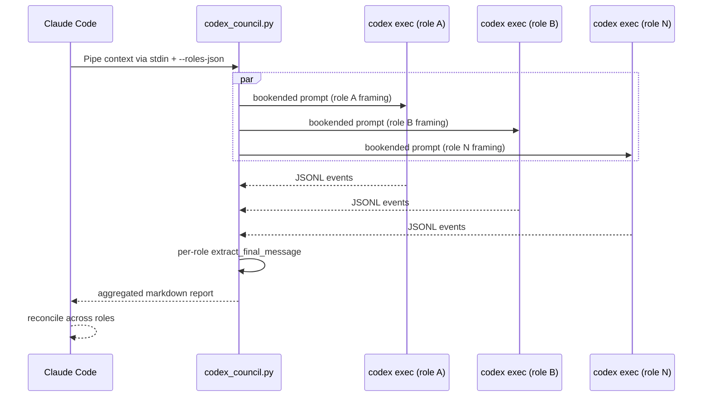

# codex-council internals

Implementation details for contributors. User-facing docs live in
[README.md](README.md).

## No catalog, no defaults

The script accepts roles **only** via `--roles-json` (a list of
`{id, label, instruction}` objects). There is no built-in role
catalog, no positional shortcuts, and no `--list-roles` flag — they
were removed in v0.2.0. Bare invocation exits 2 — the script's way
of telling Claude to go compose a panel.

The reasoning: every hardcoded catalog is a bias. The original 6
coding roles biased Claude toward coding panels. A later expansion to
15 roles across four thematic groups (coding/writing/data/research)
helped non-coding work but still biased Claude toward
"pick-from-this-shelf" rather than "compose-from-context." Pulling
the catalog out entirely forces Claude (the orchestrator) to
ultrathink about the user's task, design role ids/labels/instructions
on-the-fly, confirm via AskUserQuestion, and only then fan out. The
script's job is fan-out, retry, and reconciliation — not role
opinions.

Practical consequence: every invocation requires Claude to compose
the full role JSON. That's more tokens per panel proposal, but it
matches the actual design intent (adaptive in-context selection) and
removes any pull toward formulaic coding-flavored panels.

Codex itself has an in-process multi-agent capability behind the
`multi_agent_v2` feature flag (verified live: `--enable multi_agent_v2`
opens up `spawn_agent`/`wait_agent`/`close_agent` tools). The council
deliberately does **not** use it — its v1 stage is "under
development" and its v1 surface is gated behind `tool_search` deferral
plus prose discouragement. External fan-out gives us failure
isolation, distinct thread_ids on disk, and ~20% the dependency
surface.

## Resume footgun mitigation

Per Codex source, `codex exec resume <bogus_or_invalid_uuid>` silently
falls through to creating a **new** thread instead of erroring. Without
a check, we'd persist an unrelated thread ID under the role's state
key. After every resume the council script extracts
`thread.started.thread_id` from the JSONL stream; if it doesn't equal
the requested ID, it adopts the new ID and warns. It does **not**
re-run — the turn has already completed on the new thread; re-running
burns tokens for no benefit.

## Failure-class tagging

Per-role errors are tagged before they hit the report:

| Tag | Behavior |
|---|---|
| `[auth]` | Never clears state, never retries — caller must fix auth then re-run |
| `[retriable:rate-limit]` / `[retriable:5xx]` | One retry after a 5s backoff (MAX_RETRY_ATTEMPTS=2; bumping that adds 10s, 20s, … via `backoff *= 2`) |
| `[orchestrator-exception]` | A role's coroutine raised — siblings still complete via `gather(..., return_exceptions=True)` |
| (untagged stale) | Detected via `STALE_RESUME_MARKERS`; that role's state is cleared and a fresh thread is started for it only |

No wall-clock cap is applied to roles or to the council as a whole —
each role runs as long as Codex takes. `start_new_session=True` on
each `codex exec` puts it in its own process group, so a Ctrl+C (or
any other cancellation) sends SIGTERM (then SIGKILL) to the group and
any shell commands codex itself spawned for tool calls are also
reaped. POSIX-only.
