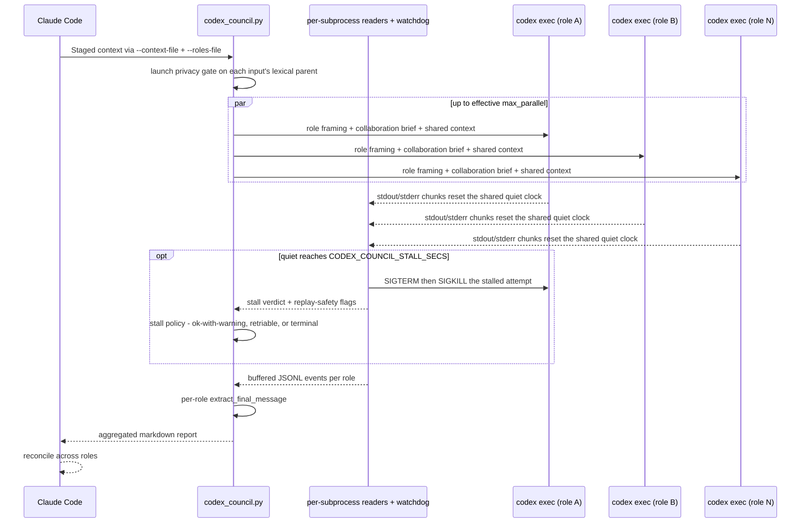
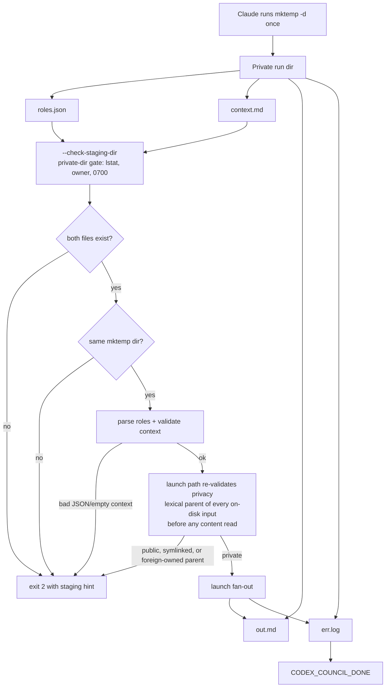
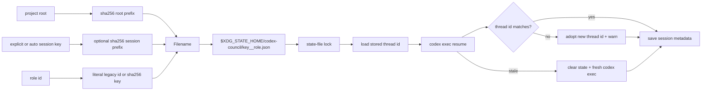

# codex-council internals

Implementation details for contributors. User-facing docs live in
[README.md](README.md).

## No catalog, no defaults

The script accepts roles **only** via `--roles-file` (a path to a JSON
file holding the list of `{id, label, instruction}` objects), and the
preferred launch path supplies context via `--context-file` in the same
private staging directory. `instruction` is a **list of sentence-sized
strings** — the only accepted form — that the script
whitespace-normalizes and joins into the single paragraph Codex sees.
The list form exists because the
only production writer of roles.json is an LLM file-Write: multi-KB
single-line JSON string literals are where its writes corrupt.
For the same reason, unknown keys in a role object are **rejected**
with a rewrite-the-whole-file message — stray filler fields like
`"_": ""` are the signature of a glitched write, not harmless extras.
Every roles-file validation defect carries the same uniform recovery:
rewrite the entire file in one complete Write operation, never patch a
substring of a file that already glitched once.
The staging-dir gate (`--check-staging-dir`) lstats the directory:
symlinks, non-dirs, foreign-owned dirs, and group/other-accessible
modes are all rejected with an action-first recovery hint that forbids
chmod/mkdir/reuse of the rejected path and demands a fresh `mktemp -d`
(a recovery hint satisfiable by chmod/mkdir on the same predictable
path would defeat the privacy the gate exists for). The **launch path
re-validates the same privacy contract**: each on-disk input's lexical
parent directory (`dirname(abspath(...))`, never realpath-first, so a
symlink parent cannot launder into its target) must pass the identical
private-dir check before any content is read, in both staged and
stdin-context modes. The staged input files themselves must
be regular non-symlinks, preventing a private directory from redirecting
validation or reads to an external path. Keeping the panel and context in files
also keeps a large role array and multiline context out of the shell, where a
stray quote, brace, or missing redirection target would otherwise break the
call before the runner can diagnose it. There is no
built-in role catalog, no positional shortcuts, and no `--list-roles`
flag. Bare invocation (no `--roles-file`, with context piped or staged)
exits 2 — the script's way of telling Claude to go compose a panel.

The orchestrator deliberately has no plugin-imposed content-size or panel-count
ceiling: role count, role IDs, labels, instructions, staged context, stdin, and
composed prompts are accepted without truncation. Active role concurrency is
bounded separately, so a large panel queues instead of spawning every process
at once. The active model/provider and available memory are still real
downstream constraints; their failures are surfaced rather than guessed at by
an arbitrary content cap.

The reasoning: every hardcoded catalog is a bias. A fixed set of coding
roles biases Claude toward coding panels, and even a broad thematic
shelf still biases Claude toward "pick-from-this-shelf" rather than
"compose-from-context." Leaving the catalog out entirely forces Claude
(the orchestrator) to
ultrathink about the user's task, design role ids/labels/instructions
on-the-fly, announce the composed panel, and then fan out. The
script's job is fan-out, retry, and aggregation — Claude owns reconciliation
into the user's shared goal rather than relaying disconnected role opinions.

Context-derived roles do not mean context-light roles. Before panel synthesis,
Claude reconstructs the user's live task model: the larger problem and project
implementation, current trajectory, in-flight files/modules/tests/artifacts,
bugs and errors under investigation, hypotheses and research evidence, known
unknowns and plausible blind spots, and unstated or possibly wrong assumptions.
Claude asks and answers those working questions from the conversation and live
workspace, asking the user only when a missing choice materially changes the
authorized outcome.

Practical consequence: every invocation requires Claude to compose
the full role JSON. That's more tokens per panel proposal, but it
matches the actual design intent (adaptive in-context selection) and
removes any pull toward formulaic coding-flavored panels.

The intended product shape is an adaptive, general-purpose, AGI-style
collaboration pattern, not a claim that the active model is proven AGI. Claude
derives roles from the current goal and orchestrates them through shared
context, workspace access, persisted role threads, and final reconciliation.
The same machinery can support implementation, diagnosis, creation, planning,
research, review, or other domains as far as the active model and tools allow.
It deliberately leans toward programmatic problem-solving—computer science,
software and ML/AI engineering, DevSecOps, platform/security automation,
debugging/testing, project implementation, and evidence-based technical
research—without reinstating a domain catalog or fixed role shelf.

Codex itself now has a stable in-process `multi_agent` capability and a
separate under-development `multi_agent_v2` feature. The council deliberately
uses external `codex exec` fan-out because each role needs an independently
persisted thread id and process-level failure/cancellation isolation. Codex's
documented `agents.max_threads` setting (default 6) is still used as a
conservative concurrency signal; it is not treated as proof of provider
capacity because these are separate processes.

A single fan-out is parallel contribution, not direct peer messaging. Claude
mediates collaboration by giving every role the same situational context,
reconciling the report, and staging material findings into selective follow-up
rounds. Because all subprocesses share the working directory, implementation
panels assign one write-owning executor/integrator by default; multiple writers
must use isolated worktrees or serialized phases. This also limits duplicate
side effects when a transient failure causes a role retry.

## End-to-end fan-out

## Context working set

Claude, not the Python runner, decides what conversation context to stage. For
long host sessions it constructs a decision-complete working set: the current
problem/project and goal-directed or exploratory trajectory; in-flight modules,
files, objects, drafts, queries, experiments, tests, deployments, and research;
active bugs/errors, symptoms, attempted fixes, hypotheses, and evidence; recent
working context at high fidelity; live primary evidence from disk; known
unknowns, blind spots, assumptions, and provenance; and older still-relevant
decisions, invariants, and rejected approaches as a faithful summary.
Conversation age alone never controls inclusion. Superseded state, duplicate
discussion, and irrelevant history are omitted. A compacted host summary is an
index that must be reconciled with current live state before launch.

The runner accepts that staged context without a byte cap or truncation. It
does not attempt token counting because the active model/provider owns the real
context window and can change independently of this plugin. `_compose_prompt`
keeps the shared context intact, labels it, adds a compact collaboration brief
that tells each role how to interpret the situational map, and bookends it with
the role-specific instruction.

## Adaptive concurrency and progress

Panels have no count cap, but `run_council` wraps role execution in an
`asyncio.Semaphore`. The active limit resolves in this order:

1. positive `CODEX_COUNCIL_MAX_PARALLEL` override;
2. positive user-level Codex `agents.max_threads` from
   `$CODEX_HOME/config.toml` (or `~/.codex/config.toml`);
3. `DEFAULT_MAX_PARALLEL=6`, matching Codex's current documented default.

Each queued role makes a nonblocking continuity-lock probe while it briefly
holds a subprocess permit. If another council owns the same persisted thread,
the probe closes its file descriptor, releases the permit immediately, sleeps
outside the permit (doubling from 0.1s to a 2s cap, since the lock holder has
no run-level deadline), and retries; unrelated roles can run, and arbitrarily
large panels do not accumulate one open lock file per queued role. Only a role that
holds both its continuity lock and permit appears active or launches Codex.

Progress is stderr-only and best-effort: one shared diagnostics helper writes
the dispatch line, per-attempt start lines
(`<role>: started (fresh|resume) attempt=K/N watchdog=…`), retry/adoption
notices, stall diagnostics, the heartbeat, and the `CODEX_COUNCIL_DONE`
sentinel. A dead stderr permanently redirects diagnostics to a no-op sink and
never changes role results or the exit code. The heartbeat cadence adapts to
the watchdog — `min(1800, stall_secs // 3)` with a 300s floor while enabled
(600s at the default threshold), 1800s when disabled — and each line records
completed/active/queued counts, per-active-role `quiet=Ns` (or `retry-wait`
during backoff), the `watchdog=` threshold, and the plugin `version=`.
Claude Code redirects it to `err.log` and uses native task notifications plus
a one-shot session cron when available.

## Staging validation

## State key and locking

## Resume footgun mitigation

`codex exec resume <id>` parses `<id>` as a UUID first (UUIDs take
precedence if it parses). Verified against the installed codex-cli: a
valid-but-unknown UUID **errors** (`no rollout found for thread id ...
(code -32600)`, exit 1) and is handled by the stale-resume path (clear
state + restart fresh); only a value that is **not** a valid UUID is
treated as a thread *name* and silently starts a **new** thread (rc==0,
fresh `thread.started`). The council only ever stores real UUIDs emitted
by `thread.started`, so the silent-spawn case is unreachable via normal
state — the mismatch check is **defense-in-depth** against a
corrupt/hand-edited state file or future CLI drift. After every resume
the script extracts `thread.started.thread_id`; if it doesn't equal the
requested ID, it adopts the new ID and warns. It does **not** re-run —
the turn has already completed on the new thread; re-running burns
tokens for no benefit.

Per-role state is protected by a POSIX advisory lock keyed by
`(project, session key, role)`. Role IDs longer than the formerly accepted
32-character range use a deterministic SHA-256 filename component, avoiding
the operating system's filename-length limit while preserving the full role ID
in memory, reports, prompts, and state metadata. Short-role state filenames
remain unchanged for thread-continuity compatibility. The session key is explicit when
`CODEX_COUNCIL_SESSION_KEY` is set; otherwise the runner auto-detects common
host-session identifiers such as Claude session ids, `CODEX_THREAD_ID`,
`TERM_SESSION_ID`, `TMUX_PANE`, `STY`, and `VSCODE_PID`. That gives normal
multi-terminal isolation without requiring the user to export anything, while
calls from the same terminal/session keep continuity. `VSCODE_PID` is the
lowest-priority fallback and is **window-scoped**, not tab-scoped: multiple
integrated terminals in one VS Code window share it and therefore share role
threads — set `CODEX_COUNCIL_SESSION_KEY` (or rely on a finer identifier such as
`TERM_SESSION_ID`) to isolate those. The lock is held across
the whole load/resume-or-fresh/save retry loop, not just individual file reads
or writes, so two council processes cannot concurrently resume the same role
thread and then last-writer-wins the state file. Different roles still run in
parallel.

## Failure-class tagging

Recognized failure classes are tagged before they hit the report;
unrecognized failures carry the raw stderr untagged:

| Tag | Behavior |
|---|---|
| `[auth]` | Never clears state, never retries — caller must fix auth then re-run |
| `[retriable:rate-limit]` / `[retriable:5xx]` | One retry after a 5s backoff (MAX_RETRY_ATTEMPTS=2; bumping that adds 10s, 20s, … via `backoff *= 2`) |
| `[retriable:stall]` | Output-inactivity watchdog fired before any side-effect-capable tool work began; replay is safe, so it retries through the same shared budget as rate-limit/5xx |
| `[stall]` | Watchdog fired after tool work began — terminal, because an automatic replay could duplicate side effects; a buffered agent_message without turn completion is quoted but never auto-promoted to success |
| `[orchestrator-exception]` | A role's coroutine raised — siblings still complete via `gather(..., return_exceptions=True)` |
| (untagged stale) | Detected via `STALE_RESUME_MARKERS`; that role's state is cleared and a fresh thread is started for it only |

A stall verdict is structured (from the watchdog), not text-sniffed, and is
handled before auth/stale/retriable classification: partial stale- or
auth-looking stderr in a killed run must neither classify the failure nor
clear resume state. A stalled attempt whose turn had already completed (final
agent_message buffered plus turn completion) is not a failure at all — the
kill hit a wedged shutdown, so the reply is kept as success with the warning
"codex wedged after completing its turn; process terminated" and state is
saved best-effort.

Classification uses stderr plus structured Codex JSONL stdout error
events (`type:error`, `turn.failed`). The **primary** retriable signal
is the numeric HTTP status parsed out of the JSONL error body
(`_extract_statuses`), recognized in any *anchored* form — the JSON
`"status"` key, a `HTTP NNN` / `status NNN` keyword, or a canonical
reason phrase like `NNN Too Many Requests` — but never a bare digit run
(so a `429` inside a thread id is ignored): status `429` → rate-limit,
`500–599` → 5xx (so a `529` "overloaded" is retried even though it is
not in the literal marker list). An anchored retriable status is trusted
ahead of the stale-resume check, so a transient `HTTP 429 … thread not
found` on resume backs off and retries instead of discarding the thread. A structured status is authoritative — when a
non-retriable status (e.g. `400`) is present, the looser substring
markers are **suppressed**, so a bare `429` or `service unavailable`
echoed inside a 400 body no longer forces a wrong retry. A non-retriable
error *type* (`invalid_request_error`) suppresses the fallback the same
way, covering the 4xx bodies codex sometimes surfaces without a numeric
status. The substring
markers (`RATE_LIMIT_MARKERS` / `TRANSIENT_5XX_MARKERS`) are a
**fallback** for failures that carry no parseable status — covering the
current codex-cli code-less rewrites such as `experiencing high demand`,
`server overloaded`, `selected model is at capacity`, and
`request was throttled` (`backend overloaded` is retained as a legacy
fallback for older codex/provider text). That coverage is deliberately
scoped: an echoed status phrase inside an `error.message` has no
provenance and remains a known limit, not something the markers try to
guess at. Usage/quota
limits are **not** retriable: a plan cap does not clear within a 5s
backoff, so it is surfaced terminal rather than retried. JSONL parsing
intentionally skips malformed and non-object events while preserving
later valid agent messages.

## Liveness: no run-level deadline, output-inactivity watchdog

The council has no total elapsed-time or run-level deadline. A role may run
indefinitely while its codex subprocess continues producing output bytes —
hours or days is fine — and `codex exec` itself imposes no run-level timeout
either. Separately, each codex subprocess has an **output-inactivity
watchdog** based only on the time since its most recent stdout/stderr byte.
Incremental readers pump both pipes in fixed-size chunks (never
line-buffered reads, which would cap unrestricted JSONL line sizes) and stamp
a shared last-activity clock; raw bytes are buffered per stream and decoded
once after the pumps join, so a UTF-8 sequence split across chunks survives.
After `CODEX_COUNCIL_STALL_SECS` seconds of council-visible silence
(default 1800; positive integer override; 0 disables; anything else is a
usage error, exit 2), the watchdog terminates that attempt — SIGTERM, a short
grace, then SIGKILL to the process group, with every termination path
converging on a single idempotent owner so watchdog, cancellation, and error
teardowns never race — and the stall policy in the table above decides the
outcome. Setting 0 may again permit an indefinitely silent role.

The watchdog measures **bytes, not progress**: current codex `exec --json`
suppresses agent-message/reasoning `item.started` events and all
token/exec-output deltas, so a healthy role can be byte-silent for long
stretches — the claim is output-inactivity recovery only, never semantic
wedge detection. Codex's per-provider stream-idle timeout
(`model_providers.<id>.stream_idle_timeout_ms`, 5 min default, bounded
retries) is a separate provider-side control left to the user's
`~/.codex/config.toml`: it is provider-scoped and the active provider id
varies, so the council cannot target it portably. `start_new_session=True` on
each `codex exec` puts it in its own process group, so a Ctrl+C (or any
other cancellation) sends SIGTERM, waits briefly, then sends SIGKILL
to the group; any shell commands codex itself spawned for tool calls
are also reaped. SIGINT/SIGTERM/SIGHUP to the council process cancel
the fan-out first, then exit without emitting the final
`CODEX_COUNCIL_DONE` sentinel.
POSIX-only.
