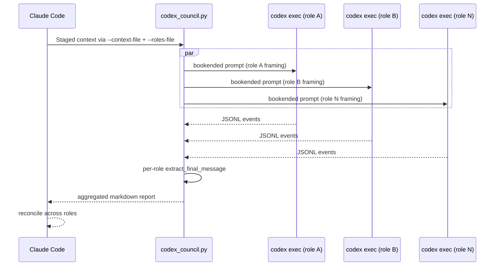
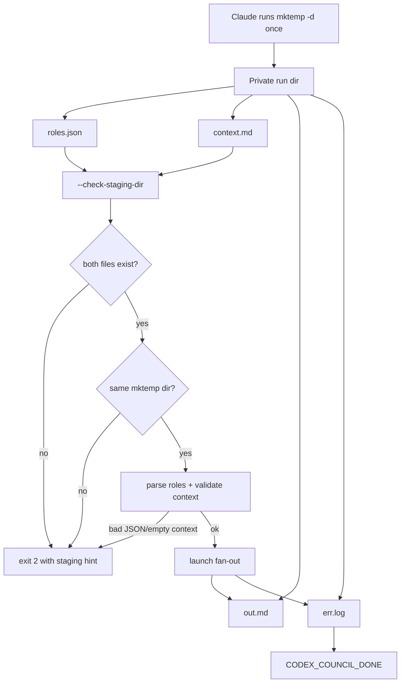
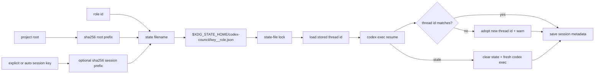

# codex-council internals

Implementation details for contributors. User-facing docs live in
[README.md](README.md).

## No catalog, no defaults

The script accepts roles **only** via `--roles-file` (a path to a JSON
file holding the list of `{id, label, instruction}` objects), and the
preferred launch path supplies context via `--context-file` in the same
private staging directory. `instruction` is preferably a **list of
sentence-sized strings** that the script whitespace-normalizes and joins
into the single paragraph Codex sees (a legacy single-string paragraph
is still accepted, strict no-newline). The list form exists because the
only production writer of roles.json is an LLM file-Write: multi-KB
single-line JSON string literals are where its writes corrupt (GH issue
#2). For the same reason, unknown keys in a role object are **rejected**
with a rewrite-the-whole-file message — stray filler fields like
`"_": ""` are the signature of a glitched write, not harmless extras.
The staging-dir gate (`--check-staging-dir`) lstats the directory:
symlinks, non-dirs, foreign-owned dirs, and group/other-accessible
modes are all rejected with an action-first recovery hint that forbids
chmod/mkdir/reuse of the rejected path and demands a fresh `mktemp -d`
(GH issue #1: the old "Create it with mktemp -d" hint was satisfiable
by chmod on the same predictable path). Keeping the panel and context in files keeps
a large role array and multiline context out of the shell, where a
stray quote, brace, or missing redirection target would otherwise break
the call before the runner can diagnose it. There is no
built-in role catalog, no positional shortcuts, and no `--list-roles`
flag. Bare invocation (no `--roles-file`, with context piped or staged)
exits 2 — the script's way of telling Claude to go compose a panel.

The reasoning: every hardcoded catalog is a bias. The original 6
coding roles biased Claude toward coding panels. A later expansion to
15 roles across four thematic groups (coding/writing/data/research)
helped non-coding work but still biased Claude toward
"pick-from-this-shelf" rather than "compose-from-context." Pulling
the catalog out entirely forces Claude (the orchestrator) to
ultrathink about the user's task, design role ids/labels/instructions
on-the-fly, announce the composed panel, and then fan out. The
script's job is fan-out, retry, and reconciliation — not role
opinions.

Practical consequence: every invocation requires Claude to compose
the full role JSON. That's more tokens per panel proposal, but it
matches the actual design intent (adaptive in-context selection) and
removes any pull toward formulaic coding-flavored panels.

Codex itself has an in-process multi-agent capability behind the
`multi_agent_v2` feature flag (verified live: `--enable multi_agent_v2`
opens up `spawn_agent`/`wait_agent`/`close_agent` tools). The council
deliberately does **not** use it — its v1 stage is "under
development" and its v1 surface is gated behind `tool_search` deferral
plus prose discouragement. External fan-out gives us failure
isolation, distinct thread_ids on disk, and ~20% the dependency
surface.

## End-to-end fan-out

## Staging validation

## State key and locking

## Resume footgun mitigation

`codex exec resume <id>` parses `<id>` as a UUID first (UUIDs take
precedence if it parses). Verified against the installed codex-cli: a
valid-but-unknown UUID **errors** (`no rollout found for thread id ...
(code -32600)`, exit 1) and is handled by the stale-resume path (clear
state + restart fresh); only a value that is **not** a valid UUID is
treated as a thread *name* and silently starts a **new** thread (rc==0,
fresh `thread.started`). The council only ever stores real UUIDs emitted
by `thread.started`, so the silent-spawn case is unreachable via normal
state — the mismatch check is **defense-in-depth** against a
corrupt/hand-edited state file or future CLI drift. After every resume
the script extracts `thread.started.thread_id`; if it doesn't equal the
requested ID, it adopts the new ID and warns. It does **not** re-run —
the turn has already completed on the new thread; re-running burns
tokens for no benefit.

Per-role state is protected by a POSIX advisory lock keyed by
`(project, session key, role)`. The session key is explicit when
`CODEX_COUNCIL_SESSION_KEY` is set; otherwise the runner auto-detects common
host-session identifiers such as Claude session ids, `CODEX_THREAD_ID`,
`TERM_SESSION_ID`, `TMUX_PANE`, `STY`, and `VSCODE_PID`. That gives normal
multi-terminal isolation without requiring the user to export anything, while
calls from the same terminal/session keep continuity. `VSCODE_PID` is the
lowest-priority fallback and is **window-scoped**, not tab-scoped: multiple
integrated terminals in one VS Code window share it and therefore share role
threads — set `CODEX_COUNCIL_SESSION_KEY` (or rely on a finer identifier such as
`TERM_SESSION_ID`) to isolate those. The lock is held across
the whole load/resume-or-fresh/save retry loop, not just individual file reads
or writes, so two council processes cannot concurrently resume the same role
thread and then last-writer-wins the state file. Different roles still run in
parallel.

## Failure-class tagging

Per-role errors are tagged before they hit the report:

| Tag | Behavior |
|---|---|
| `[auth]` | Never clears state, never retries — caller must fix auth then re-run |
| `[retriable:rate-limit]` / `[retriable:5xx]` | One retry after a 5s backoff (MAX_RETRY_ATTEMPTS=2; bumping that adds 10s, 20s, … via `backoff *= 2`) |
| `[orchestrator-exception]` | A role's coroutine raised — siblings still complete via `gather(..., return_exceptions=True)` |
| (untagged stale) | Detected via `STALE_RESUME_MARKERS`; that role's state is cleared and a fresh thread is started for it only |

Classification uses stderr plus structured Codex JSONL stdout error
events (`type:error`, `turn.failed`). The **primary** retriable signal
is the numeric HTTP status parsed out of the JSONL error body
(`_extract_statuses`), recognized in any *anchored* form — the JSON
`"status"` key, a `HTTP NNN` / `status NNN` keyword, or a canonical
reason phrase like `NNN Too Many Requests` — but never a bare digit run
(so a `429` inside a thread id is ignored): status `429` → rate-limit,
`500–599` → 5xx (so a `529` "overloaded" is retried even though it is
not in the literal marker list). An anchored retriable status is trusted
ahead of the stale-resume check, so a transient `HTTP 429 … thread not
found` on resume backs off and retries instead of discarding the thread. A structured status is authoritative — when a
non-retriable status (e.g. `400`) is present, the looser substring
markers are **suppressed**, so a bare `429` or `service unavailable`
echoed inside a 400 body no longer forces a wrong retry. A non-retriable
error *type* (`invalid_request_error`) suppresses the fallback the same
way, covering the 4xx bodies codex sometimes surfaces without a numeric
status. The substring
markers (`RATE_LIMIT_MARKERS` / `TRANSIENT_5XX_MARKERS`) are a
**fallback** for failures that carry no parseable status — including the
current codex-cli code-less prose `experiencing high demand` and
`server overloaded` (`backend overloaded` is retained as a legacy
fallback for older codex/provider text). Usage/quota
limits are **not** retriable: a plan cap does not clear within a 5s
backoff, so it is surfaced terminal rather than retried. JSONL parsing
intentionally skips malformed and non-object events while preserving
later valid agent messages.

No wall-clock cap is applied to roles or to the council as a whole —
each role runs as long as Codex takes (hours or days is fine).
`codex exec` itself has no run-level timeout. Its only default that
could end a long-*quiet* run is the per-provider stream-idle timeout
(`model_providers.<id>.stream_idle_timeout_ms`, 5 min, then a bounded
retry count), which an actively-streaming role never trips. Widening
it is left to the user's `~/.codex/config.toml` rather than overridden
here: it is provider-scoped and the active provider id varies, so the
council cannot target it portably. `start_new_session=True` on each
`codex exec` puts it in its own process group, so a Ctrl+C (or any
other cancellation) sends SIGTERM, waits briefly, then sends SIGKILL
to the group; any shell commands codex itself spawned for tool calls
are also reaped. SIGINT/SIGTERM/SIGHUP to the council process cancel
the fan-out first, then exit without emitting the final
`CODEX_COUNCIL_DONE` sentinel.
POSIX-only.
