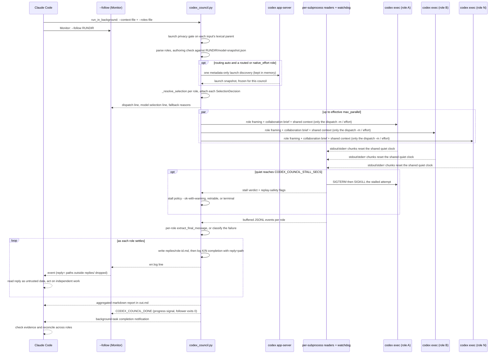
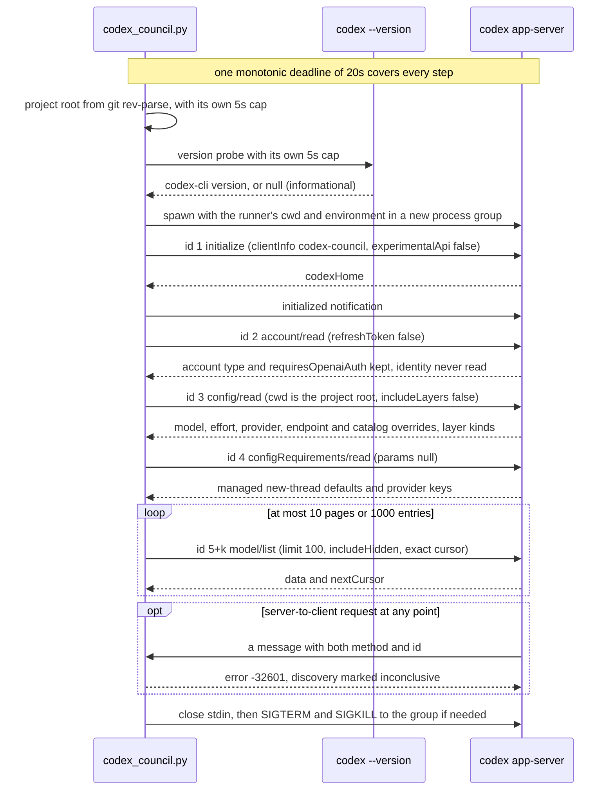
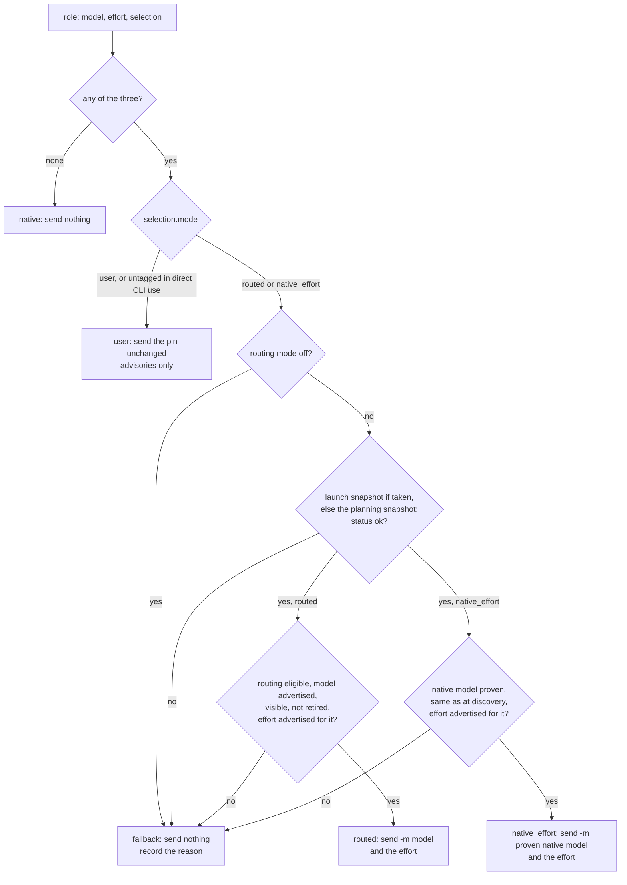
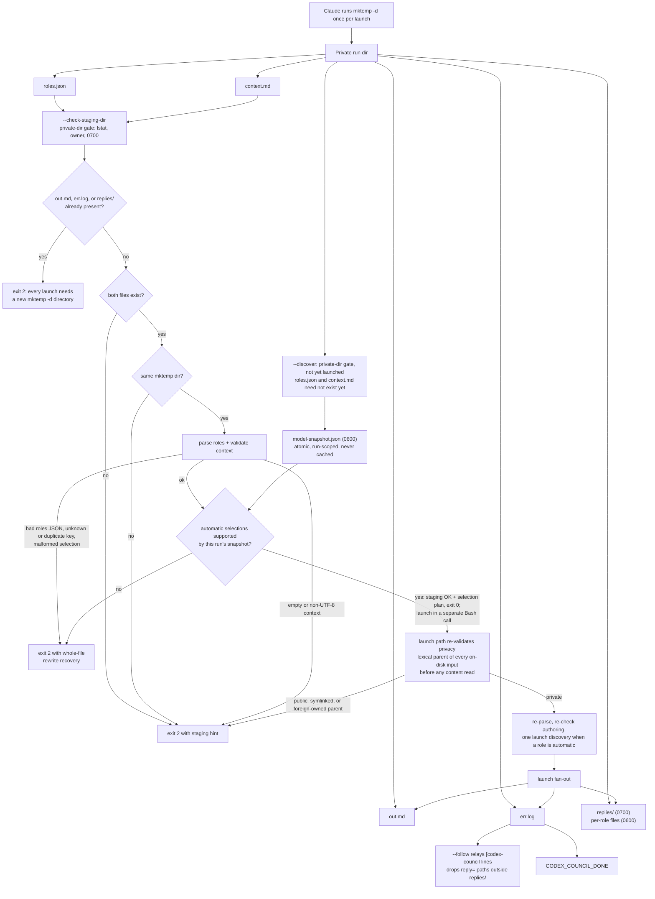
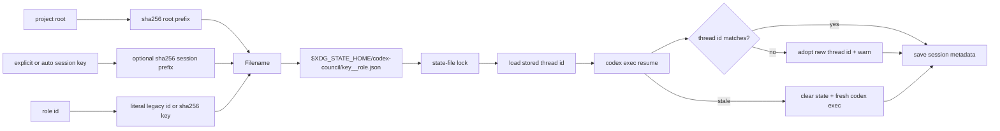

# codex-council internals

Implementation details for contributors. User-facing docs live in
[README.md](README.md).

## Module layout

The runner is standard-library Python in
`plugins/codex-council/skills/codex-council/scripts/`. `codex_council.py` is
the only entry point; it imports four sibling modules, and nothing imports
it:

| Module | Owns |
|---|---|
| `codex_council.py` | CLI parsing and `main`, the staging and launch privacy gates, roles-file parsing, continuity state and locks, the `codex exec` runner with its output-inactivity watchdog and retries, fan-out, the report and reply files, and the `--follow` follower |
| `council_common.py` | Shared primitives: `_report_inline` (escapes the `LINEBREAK_CHARS` set and every other non-printable character) and `_log_inline` (also escapes ` reply=` in err.log diagnostics), the advisory stderr sink (`_diag`), `_print_stdout` (a dead stdout exits 1 quietly), `_usage_exit` and `_roles_usage_exit` with the uniform recovery texts, `_private_stat_problem` (the one private-path policy behind the staging and follow gate, the replies directory, and the snapshot reader) and `_check_private_dir`, `_usage_exit_if_launched` (the one-launch-per-directory gate over `LAUNCH_OUTPUTS`, which `--discover` and the preflight share), `_atomic_write_private`, strict JSON loading, JSONL record iteration, `_utc_iso` (the one UTC timestamp format), `_project_root` (a capped, cached `git rev-parse` that discovery also charges to its deadline), and `_plugin_version` |
| `council_discovery.py` | The discovery adapter: execution context, app-server transport, the `_normalize_*` helpers, building, writing, and reading the snapshot, the `--discover` summary and command, and `CODEX_COUNCIL_MODEL_ROUTING` |
| `council_selection.py` | `Role` with its `Selection` and `SelectionDecision`, the `selection` grammar, authoring validation, the pure `_resolve_selection`, `_resolve_run_selections` (the one orchestration behind the preflight plan and the launch), and the selection text in reports and the preflight plan |
| `council_failures.py` | Failure records from `error` and `turn.failed` events, the marker lists, `_failure_verdict` (whose `FailureVerdict.retriable` is the retry decision), and the failure tags |

Imports point one way: `council_discovery` uses `council_common`,
`council_selection` uses both, `council_failures` uses `council_common` and
`council_selection`, and only `codex_council.py` imports all four. Module
state has one owner and is used through it: the diagnostics sink and the
cached project root live in `council_common`, per-role liveness and
`STATE_DIR` in `codex_council.py`. Siblings import names directly, so a test
patches the module whose global the calling code reads (for example
`council_discovery._project_root` for discovery's `config/read` cwd).
`codex_council.py` puts its own directory first on `sys.path` before it
imports the siblings, because `python3 -P` and `PYTHONSAFEPATH=1` leave that
directory off. It imports them with bytecode writes off, so, like the
single-file runner (Python never caches bytecode for the script it runs), a
run writes no `__pycache__` into the plugin directory; the interpreter's
setting is restored right after the sibling imports.

## No catalog, no defaults

The script accepts roles **only** via `--roles-file` (a path to a JSON
file holding the list of `{id, label, instruction}` objects, each with
optional `model`, `effort`, and `selection`), and the
preferred launch path supplies context via `--context-file` in the same
private staging directory. `instruction` is a **list of sentence-sized
strings** — the only accepted form — that the script
whitespace-normalizes and joins into the single paragraph Codex sees; the
required scope phrase ("nothing material", any case) and closing sentence
("Thoroughness beats speed.") are checked on that joined paragraph, not on
individual items.
The list form exists because the
only production writer of roles.json is an LLM file-Write: multi-KB
single-line JSON string literals are where its writes corrupt.
For the same reason, unknown keys in a role object are **rejected**
with a rewrite-the-whole-file message — stray filler fields like
`"_": ""` are the signature of a glitched write, not harmless extras —
and so is a key repeated at any object level, which would silently hide
one value behind another.
Every roles-file validation defect carries the same uniform recovery:
rewrite the entire file in one complete Write operation, never patch a
substring of a file that already glitched once (at a staged launch, the
whole file is written in a new directory; see below).
The staging-dir gate (`--check-staging-dir`) lstats the directory:
symlinks, non-dirs, foreign-owned dirs, and group/other-accessible
modes are all rejected with an action-first recovery hint that forbids
chmod/mkdir/reuse of the rejected path and demands a fresh `mktemp -d`
(a recovery hint satisfiable by chmod/mkdir on the same predictable
path would defeat the privacy the gate exists for), then names the whole
sequence the new directory needs: `--discover` there, both files re-Written
with the new `snapshot_id` in every automatic selection, and the pre-flight
(`STAGING_DIR_RECOVERY`). A run directory also
holds **exactly one launch**: `--discover` and the pre-flight exit 2 when
`out.md`, `err.log`, or `replies/` already exists
(`_usage_exit_if_launched`), with a recovery that demands a new
`mktemp -d` directory. The launch command's shell redirections truncate
`out.md` and `err.log` before the runner starts, so relaunching into a
directory whose council is still running (the natural move for a
`[model-rejected]` re-run, which fails in under a second while siblings
run) would tear that council's report, log, and follower apart, and a
relaunch after it finished would replace its report and mix two runs in
`replies/`. Only a step that runs before the launch command can refuse in
time; the launch itself keeps accepting an existing `replies/`, so direct
CLI use is unchanged. The rule is therefore enforced by `--discover` and
the pre-flight, not atomically at launch (see Known limits): SKILL.md makes
the pre-flight its own Bash call and the launch a separate one made only
after the pre-flight exits 0, because in one combined call a refused
pre-flight would not stop the launch's redirections. For the same reason a
staged launch refused before dispatch never asks for a pre-flight re-run in
its own directory, which that re-run would refuse: its input and path
checks (a missing, unreadable, or misplaced `roles.json` or `context.md`,
`STAGED_LAUNCH_PATH_HINT`), roles, `context.md`, and missing-`codex`
recoveries start over in a new directory with its own `--discover`
(`STAGED_LAUNCH_RESTART`; for roles, `STAGED_LAUNCH_ROLES_RECOVERY`, scoped in
with `_roles_recovery`). The direct stdin mode keeps the plain staging hint.
The **launch path
re-validates the same privacy contract**: each on-disk input's lexical
parent directory (`dirname(abspath(...))`, never realpath-first, so a
symlink parent cannot launder into its target) must pass the identical
private-dir check before any content is read, in both staged and
stdin-context modes. The staged input files themselves must
be regular non-symlinks, preventing a private directory from redirecting
validation or reads to an external path. Keeping the panel and context in files
also keeps a large role array and multiline context out of the shell, where a
stray quote, brace, or missing redirection target would otherwise break the
call before the runner can diagnose it. There is no
built-in role catalog, no positional shortcuts, and no `--list-roles`
flag. Bare invocation (no `--roles-file`, with context piped or staged)
exits 2 — the script's way of telling Claude to go compose a panel.

The orchestrator deliberately has no plugin-imposed content-size or panel-count
ceiling: role count, role IDs, labels, instructions, staged context, stdin, and
composed prompts are accepted without truncation. Active role concurrency is
bounded separately, so a large panel queues instead of spawning every process
at once. The active model/provider and available memory are still real
downstream constraints; their failures are surfaced rather than guessed at by
an arbitrary content cap.

The reasoning: every hardcoded catalog is a bias. A fixed set of coding
roles biases Claude toward coding panels, and even a broad thematic
shelf still biases Claude toward "pick-from-this-shelf" rather than
"compose-from-context." Leaving the catalog out entirely makes Claude (the orchestrator) read the
user's task, design role ids/labels/instructions on the fly, announce the
composed panel, and then fan out. The
script's job is fan-out, retry, and aggregation — Claude owns reconciliation
into the user's shared goal rather than relaying disconnected role opinions.
The same reasoning applies to models: the runner carries no model roster and
no effort table, because every such list goes stale with the next model
generation, subscription change, or provider. Capability comes from runtime
discovery, and the fallback is always the user's own native configuration
(see [Model selection architecture](#model-selection-architecture)).

Context-derived roles do not mean context-light roles. Before panel synthesis,
Claude reconstructs the user's live task model: the larger problem and project
implementation, current trajectory, in-flight files/modules/tests/artifacts,
bugs and errors under investigation, hypotheses and research evidence, known
unknowns and plausible blind spots, and unstated or possibly wrong assumptions.
Claude asks and answers those working questions from the conversation and live
workspace, asking the user only when a missing choice materially changes the
authorized outcome.

Practical consequence: every invocation requires Claude to compose
the full role JSON. That's more tokens per panel proposal, but it
matches the actual design intent (adaptive in-context selection) and
removes any pull toward formulaic coding-flavored panels.

The intended product shape is an adaptive, general-purpose verification and
collaboration pattern. Claude identifies the claims, decisions, and results
worth checking, derives roles from the current goal, and orchestrates them
through shared context, workspace access, persisted role threads, and final
reconciliation; Claude stays responsible for the result.
The same machinery can support implementation, diagnosis, creation, planning,
research, review, or other domains as far as the active model and tools allow.
It deliberately leans toward programmatic problem-solving—computer science,
software and ML/AI engineering, DevSecOps, platform/security automation,
debugging/testing, project implementation, and evidence-based technical
research—without reinstating a domain catalog or fixed role shelf.

There is also no default role count. The runner accepts a panel of one, and
the skill sizes panels to the work: one role for a focused bug, review, or
question; more only when each added role brings a lens the others would not.
Every role costs a full Codex run and reconciliation effort, and the council
waits on its slowest role, so over-composed panels are slower without being
better. The collaboration brief the runner adds to each prompt is
count-neutral for the same reason ("you may be the only role, or one of
several").

Per-role `model`, `effort`, and `selection` keys are described in
[Model selection architecture](#model-selection-architecture). In short, the
runner validates their shape with one grammar, checks automatic choices only
against this run's discovered data, and passes what it decides to send as
parent `codex exec` options, `-m <model>` and
`-c model_reasoning_effort="<effort>"`, ahead of `resume` so fresh and resumed
attempts carry the same values. A role that omits all three inherits Codex's
native configuration in the worker's execution context, and its commands are
byte-identical to those of earlier releases.

Codex itself has a stable in-process `multi_agent` capability (on by
default) and a `multi_agent_v2` feature (stable but off by default, as of
codex-cli 0.156.1). The council deliberately
uses external `codex exec` fan-out because each role needs an independently
persisted thread id and process-level failure/cancellation isolation. A
positive user-level `agents.max_threads` is still used as a conservative
concurrency signal; it is not treated as proof of provider capacity because
these are separate processes.

A single fan-out is parallel contribution, not direct peer messaging. Claude
mediates collaboration by giving every role the same situational context,
reconciling the report, and staging material findings into selective follow-up
rounds. Because all subprocesses share the working directory, implementation
panels with several roles assign one write-owning role; multiple writers must
use serialized phases (the runner does not yet use Codex's `--worktree`). This
also limits duplicate side effects when a transient failure causes a role
retry.

## End-to-end fan-out

```mermaid
sequenceDiagram
    participant C as Claude Code
    participant F as --follow (Monitor)
    participant T as codex_council.py
    participant D as codex app-server
    participant R as per-subprocess readers + watchdog
    participant A as codex exec (role A)
    participant B as codex exec (role B)
    participant N as codex exec (role N)

    C->>T: run_in_background: --context-file + --roles-file
    C->>F: Monitor: --follow RUNDIR
    T->>T: launch privacy gate on each input's lexical parent
    T->>T: parse roles, authoring check against RUNDIR/model-snapshot.json
    opt routing auto and a routed or native_effort role
        T->>D: one metadata-only launch discovery (kept in memory)
        D-->>T: launch snapshot, frozen for this council
    end
    T->>T: _resolve_selection per role, attach each SelectionDecision
    T-->>F: dispatch line, model selection line, fallback reasons
    par up to effective max_parallel
        T->>A: role framing + collaboration brief + shared context (only the dispatch -m / effort)
        T->>B: role framing + collaboration brief + shared context (only the dispatch -m / effort)
        T->>N: role framing + collaboration brief + shared context (only the dispatch -m / effort)
    end
    A-->>R: stdout/stderr chunks reset the shared quiet clock
    B-->>R: stdout/stderr chunks reset the shared quiet clock
    N-->>R: stdout/stderr chunks reset the shared quiet clock
    opt quiet reaches CODEX_COUNCIL_STALL_SECS
        R->>A: SIGTERM then SIGKILL the stalled attempt
        R-->>T: stall verdict + replay-safety flags
        T->>T: stall policy - ok-with-warning, retriable, or terminal
    end
    R-->>T: buffered JSONL events per role
    T->>T: per-role extract_final_message, or classify the failure
    loop as each role settles
        T->>T: write replies/role-id.md, then log K/N completion with reply=path
        T-->>F: err.log line
        F-->>C: event (reply= paths outside replies/ dropped)
        C-->>C: read reply as untrusted data, act on independent work
    end
    T-->>C: aggregated markdown report in out.md
    T-->>F: CODEX_COUNCIL_DONE (progress signal, follower exits 0)
    T-->>C: background-task completion notification
    C-->>C: check evidence and reconcile across roles
```

## Context working set

Claude, not the Python runner, decides what conversation context to stage. For
long host sessions it constructs a decision-complete working set that leads
with the objective, the acceptance criteria, and the question to verify, and
labels Claude's own conclusions as claims, with the evidence against them.
The rest is the current problem/project and goal-directed or exploratory
trajectory; in-flight modules, files, objects, drafts, queries, experiments,
tests, deployments, and research; active bugs/errors, symptoms, attempted
fixes, hypotheses, and evidence; recent working context at high fidelity; live
primary evidence from disk; known unknowns, blind spots, assumptions, and
provenance; and older still-relevant decisions, invariants, and rejected
approaches as a faithful summary.
Conversation age alone never controls inclusion. Superseded state, duplicate
discussion, and irrelevant history are omitted. A compacted host summary is an
index that must be reconciled with current live state before launch.

The runner accepts that staged context without a byte cap or truncation. It
does not attempt token counting because the active model/provider owns the real
context window and can change independently of this plugin. `_compose_prompt`
keeps the shared context intact, labels it, adds a compact collaboration brief
that tells each role how to interpret the situational map, and bookends it with
the role-specific instruction.

The brief frames each role as an independent cross-model check on Claude
Code's work. The user's goal, requirements, and constraints are authoritative.
Claude's account of the project state, its conclusions, and what has been
tried are claims to verify against the workspace, not facts to accept. The
brief also says the run is non-interactive, so assumptions are stated and
decisions that need the user become open questions. It tells roles not to
spawn subagents unless their instruction asks for them, to stay within their
lens and stop when its deliverable is complete, to keep verified evidence
separate from inference, to size testing to the change, and to finish with
plain paragraphs Claude can reconcile.

## Adaptive concurrency and progress

Panels have no count cap, but `run_council` wraps role execution in an
`asyncio.Semaphore`. The active limit resolves in this order:

1. positive `CODEX_COUNCIL_MAX_PARALLEL` override;
2. positive user-level Codex `agents.max_threads` from
   `$CODEX_HOME/config.toml` (or `~/.codex/config.toml`); current Codex
   documentation lists it as a legacy alias of
   `agents.max_concurrent_threads_per_session`, which the runner does not
   read;
3. `DEFAULT_MAX_PARALLEL=6`, the default Codex documented for
   `agents.max_threads` when the runner adopted it (current documentation
   leaves the default to Codex).

Each queued role makes a nonblocking continuity-lock probe while it briefly
holds a subprocess permit. If another council owns the same persisted thread,
the probe closes its file descriptor, releases the permit immediately, sleeps
outside the permit (doubling from 0.1s to a 2s cap, since the lock holder has
no run-level deadline), and retries; unrelated roles can run, and arbitrarily
large panels do not accumulate one open lock file per queued role. Only a role that
holds both its continuity lock and permit appears active or launches Codex.

Progress is stderr-only and best-effort: one shared diagnostics helper writes
the dispatch line, the model selection summary and fallback lines that follow
it, per-attempt start lines
(`<role>: started (fresh|resume) attempt=K/N watchdog=…`), retry/adoption
notices, stall diagnostics, the heartbeat, and the `CODEX_COUNCIL_DONE`
sentinel. A dead stderr permanently redirects diagnostics to a no-op sink and
never changes role results or the exit code. The heartbeat cadence adapts to
the watchdog — `min(1800, stall_secs // 3)` with a 300s floor while enabled
(600s at the default threshold), 1800s when disabled — and each line records
completed/active/queued counts, per-active-role `quiet=Ns` (or `retry-wait`
during backoff), the `watchdog=` threshold, and the plugin `version=`.
Claude Code redirects it to `err.log`. Per-role completion lines keep the
`[codex-council] K/N <id>: ok|FAILED (<secs>s)` prefix and append
` reply=<abs path>` when the reply file was written.

## Per-role reply files and the follower

Before v0.10.0 no reply reached disk until every role finished, so Claude
waited on the slowest role and an interrupted run lost all finished work.
Now, as each role settles (ok, failed, or crashed), the runner writes
`<RUNDIR>/replies/<key>.md`, where `RUNDIR` is the directory of
`--context-file` (or of `--roles-file` in stdin mode), both already
privacy-checked at launch. `<key>` reuses the state-file role component: the
literal id when it is a short safe filename, a deterministic SHA-256 key
otherwise. The file body is produced by the same per-role section renderer
as `out.md`, so an early read and the final report cannot drift, preceded by
a one-line status header
(`<!-- codex-council reply id=… status=… elapsed=… attempts=… selection=… -->`,
plus the sent `model=`/`effort=` when a role sends them, the
`requested_model=`/`requested_effort=` of a fallback, and `warning=yes`).
Writes are atomic through the shared `_atomic_write_private` helper: an
`O_CREAT|O_EXCL|O_NOFOLLOW` 0600 temp file in the same directory, fsync, then
`os.replace`. `replies/` is created
0700; if it already exists it must be a real, user-owned, private directory,
otherwise the runner skips reply files with one warning rather than failing
the council. The file is written before the completion line is logged, so a
`reply=` path always points at a complete file, and files survive
SIGINT/SIGTERM even though the sentinel does not.

`--follow DIR` is a read-only companion for Claude Code's Monitor tool. It
validates `DIR` with the same private-dir check, polls `DIR/err.log`, prints
every `[codex-council` line with a flush per line, and exits 0 after the
`CODEX_COUNCIL_DONE` sentinel, an interruption line, or a `runner aborted`
line (the runner logs one when stdout is dead at report time or an unhandled
exception escapes). It exits 3 with a `[codex-council-follow] no council
activity` line when, 120s after it starts, `err.log` is absent or has no
dispatch line, so a monitor on a mistyped path or a launch that failed
validation does not sit silent. It exits 4 (`runner presumed gone`) when a
dispatched run's `err.log` stays byte-silent for 2 x `PROGRESS_HEARTBEAT_SECS`
+ 60s, measured from the file mtime so the check survives a re-arm; a
wall-clock jump well beyond the monotonic advance between polls is treated as
a suspend and restarts the count, because the runner's heartbeat sleeps on
the monotonic clock. Monitors expire after at most 30 minutes (10 in
`claude -p`) and are re-armed while the council's task is still running;
the restarted follower replays earlier lines, which Claude de-duplicates. The follower never writes, so it cannot forge the sentinel or
alter a run. Roles can, though: they run unsandboxed as the same user and can
append to `err.log`, and no same-uid check can authenticate those lines. So the
follower drops completion lines whose `reply=` path is not directly inside
`RUNDIR/replies/` (the only shape the runner prints; a diagnostic line that
embeds foreign text escapes ` reply=` as ` reply\x3d`, so the filter never
hides one), SKILL.md treats reply
content as untrusted data, and the final reconciliation waits for the
`run_in_background` completion notification, which only Claude Code emits.
Without Monitor, the fallback depends on the host. An interactive session
uses a one-shot session-cron wake-up, which fires between turns. In
`claude -p` or a subagent, the final response ends the council's background
shell (about five seconds later in `-p`), no cron fires inside a turn, and no
notification can arrive afterwards, so the skill keeps the turn open by
running `--follow` as a foreground Bash call at the maximum timeout and
re-running it while the task is still running (a timed-out foreground
command moves to the background rather than stopping). There is no blocking
wait on a background task to fall back to.

Early replies change what Claude may do, not how the council ends: Claude
may read a settled role, tell the user, and act on independent work, but the
final verdict, cross-role conflicts, and writes that overlap a running writer
role wait for the full report. The runner has no partial-cancellation
feature.

The SKILL templates depend on `--follow` and reply files (epoch 2) and on
`--discover` and the `selection` contract (epoch 3), so the skill contract
epoch is 3. `--skill-contract` also marks the skill path for the selection
rules below.

## Model selection architecture

Model selection has three parts: an optional discovery adapter that turns the
installed Codex's metadata into a run-scoped snapshot, one pure resolver that
decides what each role sends, and the unchanged `codex exec` runner, which
sends only the resolver's dispatch values. A few rules shape all three:

- **Native configuration is the baseline and the universal fallback.**
  Inheritance is omission: no `-m`, no `-c model_reasoning_effort`, and never
  an `inherit` or `default` placeholder. Codex then resolves its own effective
  configuration in the worker's execution context — CLI overrides, trusted
  project `.codex/config.toml` layers, the user's `$CODEX_HOME/config.toml`,
  cloud, system, and managed layers, and any managed new-thread defaults.
- **Routing is the skill's default, and explicit pins always win.** Invoking
  the skill authorizes its documented routing policy;
  `CODEX_COUNCIL_MODEL_ROUTING=off` disables automatic selection. A pin the
  user asked for is forwarded unchanged and never replaced.
- **Claude chooses, the runner validates.** Claude walks a fallback ladder
  per role — a routed pair grounded in this run's snapshot, else the proven
  native model with only the effort adjusted, else inheritance of both — and
  matches roles to catalog descriptions. The runner never ranks models or
  efforts; every check is exact membership in discovered data.
- **Discovery is optional, bounded, run-scoped, and never an inference
  turn.** Any discovery failure means inheritance, never a blocked run.
- **Never claim a model ran.** `codex exec --json` reports neither the model
  nor the effort that served a turn, so reports describe what was sent.
- **Authoring defects and evidence changes are different.** A malformed or
  unsupported choice exits 2 with the whole-file rewrite recovery; evidence
  that stops supporting a valid choice between planning and launch resolves
  that role to inheritance with a recorded reason.
- **The host keeps its own settings.** Claude keeps the host session's model
  and effort (the skill's frontmatter pins neither); council routing controls
  only the external Codex workers.

### The discovery adapter

`--discover RUNDIR` validates RUNDIR with the same private-directory check as
preflight (prefix `--discover: `; `roles.json` and `context.md` need not exist
yet), refuses a directory that already holds a launch (its planning snapshot
is that council's evidence), reads `CODEX_COUNCIL_MODEL_ROUTING`, runs
`_discover()`, writes the snapshot, and prints a summary. It cannot be
combined with `--roles-file`, `--context-file`, `--check-staging-dir`, or
`--follow`, and it exits 0 whenever RUNDIR and `CODEX_COUNCIL_MODEL_ROUTING`
are valid, even when discovery is unavailable or `codex` is missing, because
inheritance is always a valid outcome. Like the follower, it never ends in a
traceback: Ctrl+C exits 130 after teardown without writing a snapshot,
SIGTERM or SIGHUP does the same with exit 128 + the signal number and
`[codex-council] --discover interrupted by SIGTERM` (or `SIGHUP`), and a
closed stdout exits 1 quietly (`_print_stdout`, shared with `--follow`).

The adapter speaks newline-delimited JSON-RPC to
`codex app-server --listen stdio://` and matches responses by id while
unsolicited messages interleave:

```mermaid
sequenceDiagram
    participant R as codex_council.py
    participant V as codex --version
    participant A as codex app-server

    Note over R,A: one monotonic deadline of 20s covers every step
    R->>R: project root from git rev-parse, with its own 5s cap
    R->>V: version probe with its own 5s cap
    V-->>R: codex-cli version, or null (informational)
    R->>A: spawn with the runner's cwd and environment in a new process group
    R->>A: id 1 initialize (clientInfo codex-council, experimentalApi false)
    A-->>R: codexHome
    R->>A: initialized notification
    R->>A: id 2 account/read (refreshToken false)
    A-->>R: account type and requiresOpenaiAuth kept, identity never read
    R->>A: id 3 config/read (cwd is the project root, includeLayers false)
    A-->>R: model, effort, provider, endpoint and catalog overrides, layer kinds
    R->>A: id 4 configRequirements/read (params null)
    A-->>R: managed new-thread defaults and provider keys
    loop at most 10 pages or 1000 entries
        R->>A: id 5+k model/list (limit 100, includeHidden, exact cursor)
        A-->>R: data and nextCursor
    end
    opt server-to-client request at any point
        A->>R: a message with both method and id
        R-->>A: error -32601, discovery marked inconclusive
    end
    R->>A: close stdin, then SIGTERM and SIGKILL to the group if needed
```

Only those methods are ever sent — never `thread/start`, `thread/resume`,
`turn/start`, or any login or account-changing method — and the tests assert
that the fake server sees nothing else. Notifications and other unsolicited
messages are counted and dropped (more than 10,000 fails the session). A
server-to-client request is answered with JSON-RPC `-32601`, recorded as
`server_request:<method>`, and makes discovery inconclusive.

One monotonic deadline, `DISCOVERY_TIMEOUT_SECS = 20`, covers the project
root lookup (`git rev-parse --show-toplevel`, capped at
`PROJECT_ROOT_TIMEOUT_SECS = 5` and at the time left; a timeout on its own
cap falls back to the launch directory exactly as a Git failure does, while
running out of discovery's budget caches nothing and ends discovery as
`timeout:project_root` before Codex starts), the `codex --version` probe
(itself capped at 5s; an unparsable version is recorded, never fatal), the
spawn, the handshake, and every request; notifications never extend it.
Lines are capped at 8 MiB and total stdout at 32 MiB. Pagination echoes the
exact opaque cursor with a fresh id and stops at 10 pages or 1,000 entries;
a repeated cursor is a cycle. Reaching a bound with pages outstanding marks
the catalog incomplete — it never implies an omitted model is unavailable.
stderr is drained concurrently and only a 4 KiB tail is kept. None of its
text ever leaves the adapter, because a server's stderr is free-form and can
carry account ids, plan names, or tokens: when the server exits early, only
a fixed category is recorded after `server_exited:<method>`, as
`server_stderr:usage_error` (the command line was refused, as by a Codex
without `app-server --listen`), `server_stderr:panic`, or
`server_stderr:other`.

Teardown runs in `finally`: close stdin, wait 0.5s for the whole process
group, SIGTERM the group, wait 0.5s, SIGKILL, reap. Neither a SIGTERM-ignoring
server nor a grandchild holding a pipe outlives discovery. The adapter is
synchronous (`selectors` on raw fds) and runs before `asyncio.run`, so it
never blocks the council's event loop. Ctrl+C during `--discover` or launch
discovery still tears the version-probe and app-server groups down and exits
130. The council's own SIGTERM and SIGHUP handlers belong to that event
loop and do not exist yet, so `main` wraps both discovery paths in
`_termination_raises`, which turns SIGTERM and SIGHUP into an exception that
unwinds through the same `finally` teardown, then exits 128 + the signal
number with one interruption line (`[codex-council] --discover interrupted
by SIGTERM`, or the launch's `[codex-council] interrupted by SIGTERM`, which
the follower treats as terminal). Only the first signal raises, so a second
cannot cut the teardown short, a signal already ignored (SIGHUP under
`nohup`) stays ignored, and an interruption inside a teardown wait SIGKILLs
the group before it propagates.

`_discover()` never raises (Ctrl+C and those termination signals aside). A
missing `codex`, a spawn error, a timeout, a protocol violation, an RPC
error, or even an internal bug yields a snapshot with status `unavailable`
and machine-safe problem codes:
`codex_missing`, `spawn_failed:<errno>`, `timeout:<method>`,
`timeout:project_root`, `server_exited:<method>` with
`server_stderr:<category>`, `protocol_error:<kind>`,
`rpc_error:<method>:<code>`, `schema_unsupported:<method>:<field>`,
`server_request:<method>`, `catalog_incomplete:<why>`, `catalog_conflict`,
and `internal_error:<type>`. The catalog-level codes are the exception:
`catalog_incomplete:<why>`, `catalog_conflict`, and a malformed entry's
`schema_unsupported:model/list:<field>` keep status `ok` and only mark the
catalog incomplete (below). `codex_version_unavailable` is informational.

The pure `_normalize_*` helpers are the only code that reads response wire
names; everything downstream reads the snapshot. They tolerate additive
fields and reject wrong types without coercing them: `hidden: "false"` or a boolean
`retirementAt` makes an entry unusable. The dispatch identity is an entry's
`model` field, which is what `-m` receives. The picker `id` is kept distinct
and recorded as `catalog_id`, because the two need not be equal. Effort values
are an open vocabulary (any non-empty string). A malformed entry, or a
duplicate `model` with conflicting content, makes that model unusable and the
catalog incomplete while the rest stays readable; identical duplicates
collapse. A malformed page (`data` not a list, a non-string cursor, a missing
`result`) makes discovery unavailable.

### Execution-context parity

Discovery has to describe the context workers actually run in, so both are
launched the same way:

- the `codex` that `PATH` resolves (`shutil.which`, recorded as an absolute
  path);
- the runner's own working directory and environment, with no override, so a
  relative `CODEX_HOME` resolves identically for both (the fake app-server
  records the `CODEX_HOME` and working directory it saw, and the tests
  assert both match the runner's, a relative `CODEX_HOME` included);
- no `--profile`.

Project config layers are selected by `config/read`'s `cwd` parameter, not by
the server's spawn directory. That was verified on codex-cli 0.157.1: the
spawn directory is irrelevant, and omitting `cwd` drops every project layer.
Discovery therefore passes `_project_root()`, the same root workers get as
`codex exec -C` (the Git top level of the launch directory, else the launch
directory). A `.codex/config.toml` below that root is not part of the
council's discovered baseline. That workers ignore it too rests on
`codex exec -C <root>` stopping project layers at its `-C` working root
rather than at the inherited process directory, which Codex's documentation
implies (`-C` sets the agent's working directory) but which was not verified
live; a fake-codex end-to-end test pins the plugin side by launching from a
Git subdirectory and asserting that `config/read`'s `cwd`, every worker's
`-C`, and the Git top level are one path. `initialize` reports the
`codexHome` the server selected.

The runner forwards no profile, and the app-server refuses `--profile` anyway
("--profile only applies to runtime commands and `codex mcp`"), so
`context.profile` is always null. A profile selected in some other Codex
process never applies to the council. `CODEX_API_KEY` is recorded as presence
only: `codex exec` honors it but the app-server does not. When it is set, the
catalog may describe a different auth context than the workers', so neither
routing nor native-model effort adjustment is offered.

### The snapshot

`RUNDIR/model-snapshot.json` (schema `codex-council/model-snapshot@1`) is
written through `_atomic_write_private`, the reply files' pattern. If the
write fails, any older snapshot is removed and `--discover` prints only a
line telling Claude to write no automatic selections (explicit user pins
still apply), because evidence from an earlier discovery must never be read
back as this run's.

The snapshot records:

- a random 16-hex `snapshot_id`, the UTC creation time, and the plugin
  version;
- `status` (`ok` or `unavailable`) and its `problems`;
- the execution `context`: project root, launch cwd, executable, CLI
  version, codex home, profile, and API-key presence;
- the `account` projection;
- the `configured` model, effort, and provider, with the kind of layer
  (`user`, `project`, `system`, `mdm`, ...) that supplied the model and the
  effort, the names of any endpoint keys a layer set
  (`endpoint_overrides`), and whether `model_catalog_json` replaces the
  catalog (`catalog_override`), but never a file path, a URL, or layer
  contents;
- the `managed_defaults` observation (`present`, `absent`, or `unknown`);
- the `native` resolution and the `routing` verdict;
- the normalized `catalog`: each entry's dispatch `model`, `catalog_id`,
  display name, description, `hidden`, `recommended`, default effort,
  advertised efforts with their descriptions, and upgrade target with
  retirement time.

The account projection reads exactly two fields, `type` and
`requires_openai_auth`. Email, plan, account ids, workspace routing, and
tokens are never read, so they cannot reach the snapshot, stdout, or stderr;
the tests plant sentinel values in every one of those fields and assert they
never appear. The app-server's own stderr gets the same guarantee: only a
fixed `server_stderr:<category>` leaves the adapter, and the tests write the
same sentinels to the fake server's stderr, on `--discover` and on launch
discovery, and assert they reach no snapshot, summary, err.log, report, or
reply file.

`_read_snapshot` accepts only the private regular file `--discover` writes.
lstat refuses a symlink, special file, foreign owner, or group/other mode
bits, and the open adds `O_NOFOLLOW|O_NONBLOCK`. The content must be strict
JSON (no duplicate keys, no `NaN` or `Infinity`, at most 64 MiB) that matches
the schema field by field, with unique catalog models and a proven native
model present in the catalog.

The `--discover` summary is what Claude reads to choose selections. It holds
the status line with the `snapshot_id` and the plugin `version=` (the
unavailable and snapshot-not-written lines carry the version too, since those
are the cases where knowing which plugin ran matters most), the native
configuration with its origins and managed defaults, the routing verdict with
every reason, the native-effort verdict, each visible model with its
JSON-quoted display name (when it differs from the execution id), JSON-quoted
description, advertised efforts, and recommended, retirement, and upgrade
notes, and the hidden models by name. A retirement at or before the snapshot's
`created_at` reads `retired <time> (not routable)` rather than `retires
<time>`, so the summary never offers a pair the preflight refuses; the entry
stays listed (not moved to the hidden line, which means catalog-hidden) so a
user who names it can still pin it. The display name lets Claude map a model
the user named as the picker shows it to the execution id `-m` receives. Every
line passes through `_report_inline`, which escapes line breaks and every
other non-printable character (ESC, BEL, C1 controls, DEL, bidirectional
overrides), because catalog and configuration text is untrusted data and must
not drive a terminal.

### Eligibility and native proof

`_build_snapshot` decides both verdicts once, so the summary, preflight, and
launch read the same answers and reasons.

`status` is `ok` only when `initialize` and all four sources answered with a
valid shape and no server request arrived. `routing.eligible` requires all of
these, and each failed condition adds one human-readable reason:

- routing mode `auto`;
- status `ok`;
- a complete, well-formed catalog;
- a signed-in account. An unauthenticated app-server still lists models, so a
  catalog alone is not entitlement evidence;
- a corresponding provider: the configured provider is unset or `openai`,
  no config layer set `openai_base_url` or `chatgpt_base_url` (an `origins`
  entry, or any `openai_base_url` value, since it has no built-in default),
  no `model_catalog_json` is set (it has no built-in default, so any value
  counts, whichever layer set it), and no managed `modelProvider`,
  `modelProviders`, `modelCatalogJson`, or `chatgptBaseUrl` is set. Probes
  showed a custom provider's `config/read` answer is correct while
  `model/list` still returns OpenAI's catalog, and with `openai_base_url`
  pointed at a dead endpoint `model/list` still returned a complete catalog,
  so neither the catalog nor the sign-in proves what a redirected endpoint
  serves. A `model_catalog_json` file replaces what `model/list` returns
  with entries someone wrote; a trusted project's `.codex/config.toml` can
  set it, so the repository under review could otherwise write the
  descriptions that choose its reviewers. Only the key names are recorded,
  never a URL or path;
- no `CODEX_API_KEY`;
- managed new-thread defaults `absent`;
- neither the configured model nor the effort from a layer that outranks CLI
  overrides. `config/read` names the `ConfigLayerSource` type that supplied
  each (`origins`), and three of them take precedence even over `-m` and
  `-c`: `mdm` (macOS managed preferences), `legacyManagedConfigTomlFromFile`,
  and `legacyManagedConfigTomlFromMdm` (the legacy `managed_config.toml`).
  A value one of them supplies would silently replace what the council
  sends, so the reason reads `managed layer overrides CLI flags (model
  origin mdm)`. Cloud-managed (`enterpriseManaged`), system, user, project,
  and packaged-default layers rank below CLI overrides and do not count.

`native.resolution` is `proven` only when status is `ok`, the account is
signed in (the same rule as routing: an unauthenticated app-server still
lists models, so its catalog does not show what the account can run),
managed new-thread defaults are `absent`, no layer that outranks CLI
overrides supplied the model or effort, the provider corresponds (an
endpoint or catalog override blocks it, as for routing, because the
catalog's efforts for the native model are then unverified),
`CODEX_API_KEY` is unset, a model is configured, and a well-formed catalog
entry exists whose `model` is exactly that configured model. A hidden entry
counts. The entry is needed so the model's advertised efforts are known. Otherwise the resolution is
`unknown`, with the reason. A configured model is never filled in from the
catalog's recommendation, and a missing effort is never filled in from its
default.

Managed new-thread defaults block both verdicts because of a documented
coupling. An explicit override of either the model or the reasoning effort
makes Codex ignore both managed defaults, so an effort-only override could
silently change the model the user expected to inherit. `native_effort` also
sends the proven native model with the effort (`-m <native model>`) rather
than the effort alone, so the effort always travels with the exact model it
was validated against. Neither verdict consults the catalog's `isDefault`
marker (recorded as `recommended` for display), catalog order, or the shape
of ids.

### The roles.json selection contract

Role objects take `id`, `label`, `instruction`, and optionally `model`,
`effort`, and `selection`. `selection` has one of three shapes:

- `{"mode": "user"}`, optionally with a single-line `reason`. It needs
  `model` and/or `effort` and forbids `snapshot_id`.
- `{"mode": "routed", "snapshot_id", "reason"}`, which needs both `model`
  and `effort`.
- `{"mode": "native_effort", "snapshot_id", "reason"}`, which needs `effort`
  and forbids `model`, because the runner pins the proven native model.

`snapshot_id` must be the 16-hex id `--discover` printed. `reason` is a
non-empty single line with no length cap; its meaning is not validated, and
`mode: "user"` is the orchestrator's own label (see Known limits).
Inheritance is omission of all three keys.

`--skill-contract` marks the skill path, where a `model` or `effort` without
`selection` exits 2. That check runs before the value grammar, so a malformed
untagged pin is first asked for its provenance, not told how to inherit.
Direct CLI use without it reads such an untagged pin as `{"mode": "user"}`,
which keeps earlier role files working, and a malformed value there gets the
same repair-the-pin hint as a `mode: user` pin.

Both values share
`SELECTION_VALUE_PATTERN = ^[A-Za-z0-9][A-Za-z0-9._:/@+-]*\Z`: no leading `-`,
and no whitespace, control characters, quotes, backslashes, or angle
brackets. That makes every consumer safe by construction. `-m <model>` stays
one argv item. The TOML basic string in `-c model_reasoning_effort="<effort>"`
needs no escaping and cannot be broken out of. Report lines and reply-file
headers stay single-line. Case is preserved, never folded, and no list of
valid values exists anywhere in code. `inherit` and `default`, in any case,
are refused as model values, since Codex would receive them as literal model
ids. The roles file goes through a strict JSON loader that also rejects
`NaN` and `Infinity`.

### Authoring versus evidence validation

Authoring validation (`_validate_selection_authoring`) asks whether an
automatic choice is supported by this run's planning snapshot,
`RUNDIR/model-snapshot.json`, where RUNDIR is the directory of the staged
inputs. It runs in preflight and again at launch, before any worker. A
violation exits 2 with the rewrite recovery. The violations are:

- a snapshot that is absent, unreadable, malformed, or not the private file
  `--discover` writes;
- a `snapshot_id` that does not match;
- routing ineligible, for a routed pair;
- a model that is not an advertised execution id, with a hint naming the
  execution id when the value is some entry's picker id or display name
  (only an execution id that matches the value grammar is ever suggested,
  so catalog text cannot smuggle spaces or controls into the message);
- a hidden model, or one whose advertised retirement has passed;
- an effort not advertised for that exact model;
- an unproven native model, for `native_effort`.

User pins are never validated against the catalog, since a custom provider's
models are not in it; they only collect advisories. With routing off,
automatic roles are not errors. A value that fails the grammar in a user
pin (a display name with a space, say) gets recovery text that says to write
the execution id the summary lists or ask the user, never to inherit, since
dropping the pin would discard the user's request.

Preflight compares advertised retirements with the current time. The launch
repeats authoring validation as of the planning snapshot's `created_at`, so
a choice already retired at discovery stays an exit 2, while a retirement
that passes after discovery is changed evidence and falls back (below). The
resolver's clock at launch is read after launch discovery finishes, so a
retirement that passes while that discovery runs is already in effect.

Evidence validation happens at launch. When at least one role is automatic
and routing is `auto`, the launch calls `_discover()` once, after the staging,
roles, context, codex-presence, and authoring checks. It freezes that launch
snapshot for the whole council. The launch snapshot lives in memory only and
never overwrites the planning snapshot. Councils of inherited and explicit
roles never pay that latency.

A role whose evidence has changed resolves to native inheritance with a
reason (`selection evidence changed since discovery: …`). That covers
discovery unavailable, routing ineligible for a routed pair, a model no longer
advertised, hidden, or retired, an effort no longer advertised, a native
model no longer proven, and, for `native_effort`, a launch native model that
differs from the planning one (`native model changed from '<a>' to '<b>'`).
The effort was chosen from the planning native model's descriptions, and
the same effort name need not mean the same behavior on another model, so
it is never carried over, even when the new model advertises that spelling.
The launch snapshot is never written anywhere, so a routed model it no
longer advertises is reported as not advertised `in launch discovery`
rather than by an id no reader could look up. The run continues: evidence
never causes an exit 2.

`_resolve_selection(role, planning, launch, routing_mode, now)` is the single
pure resolver for both paths, and `_resolve_run_selections` is the one
orchestration around it: read the planning snapshot, validate authoring,
discover (at launch only), and resolve every role. Preflight passes no launch
snapshot and prints its decisions as the plan. Launch passes the fresh
snapshot, whose evidence wins. The resolver returns a frozen
`SelectionDecision`, which `dataclasses.replace` attaches to each `Role`
before fan-out. `now` is compared with advertised retirement times. Catalog
order and the recommended marker never change a decision; the tests permute
both.

```mermaid
flowchart TD
    Role["role: model, effort, selection"] --> Any{"any of the three?"}
    Any -->|"none"| Native["native: send nothing"]
    Any -->|"yes"| Mode{"selection.mode"}
    Mode -->|"user, or untagged in direct CLI use"| User["user: send the pin unchanged<br/>advisories only"]
    Mode -->|"routed or native_effort"| Off{"routing mode off?"}
    Off -->|"yes"| Fallback["fallback: send nothing<br/>record the reason"]
    Off -->|"no"| Evidence{"launch snapshot if taken,<br/>else the planning snapshot:<br/>status ok?"}
    Evidence -->|"no"| Fallback
    Evidence -->|"yes, routed"| Pair{"routing eligible, model advertised,<br/>visible, not retired,<br/>effort advertised for it?"}
    Evidence -->|"yes, native_effort"| NativeProof{"native model proven,<br/>same as at discovery,<br/>effort advertised for it?"}
    Pair -->|"yes"| Routed["routed: send -m model<br/>and the effort"]
    Pair -->|"no"| Fallback
    NativeProof -->|"yes"| NativeEffort["native_effort: send -m proven native model<br/>and the effort"]
    NativeProof -->|"no"| Fallback
```

### Provenance and reporting

`SelectionDecision` keeps the request and the dispatch apart. Its fields are:

- `mode`, what the role asked for: `inherit`, `user`, `routed`, or
  `native_effort`;
- `provenance`, what the council does: `native`, `user`, `routed`,
  `native_effort`, or `fallback`;
- `requested_model` and `requested_effort`;
- `dispatch_model` and `dispatch_effort`, where None means that override is
  not sent;
- the selection `reason`;
- a `note`, which holds a fallback reason or a user-pin advisory;
- `native_model`, the native model the resolving evidence proves (None
  without proof), recorded on every explicit pin and on every automatic
  choice that is sent as requested. It is never sent; it only tells a
  refusal whether the refused model was the native one.

The command builders receive only the dispatch values. Session state never
stores a selection, so a routed choice cannot become a later run's default.
User-pin advisories are notes, never rejections:

- a model absent from the catalog, plus the execution id it maps to when
  the value is an entry's display name or picker id;
- a pinned model whose advertised retirement has passed at the resolver's
  `now`;
- an effort the catalog does not advertise for the pinned model, or for the
  proven native model when only an effort is pinned;
- for a model-only pin, a configured native effort the pinned model does not
  advertise, when managed defaults are absent (Codex keeps that effort and
  does not validate it on the client; the note says no effort override was
  sent);
- a partial pin while managed new-thread defaults are present or unknown.

Every surface reports what was sent, never what ran:

- **err.log.** After the unchanged dispatch line comes
  `[codex-council] model selection: routing=<auto|off>; discovery=<ok|unavailable|not-run>[ (<reason>)]; native=N user=N routed=N native_effort=N fallback=N`,
  then one `[codex-council:<id>] routing fell back to native inheritance: <reason>`
  line per fallback. The follower's dispatch detection depends on the
  dispatch line's prefix, which is why it stays unchanged.
- **Report Summary.** Each line notes what the role sent: ` (explicit: …)`,
  ` (routed: …)`, ` (routed effort: <e> on native model <m>)`, or
  ` (native inheritance; routing fell back)`. Inherited roles get no note.
- **Model selection paragraph.** After the Summary comes
  `Model selection: <discovery sentence>. codex exec does not report the model or effort that served a turn; …`.
  The discovery sentence is `launch discovery not run (<why>)`,
  `launch discovery ok (codex-cli <v>)`, or
  `launch discovery unavailable: <problems>`.
- **Role sections.** Every section opens with `_Model selection: …_` after
  its heading and before any warning. `_format_role_section` renders it for
  both `out.md` and the reply files, so the two stay byte-identical.
- **Reply-file headers.** They carry `selection=<provenance>`, the sent
  `model=`/`effort=`, and, for a fallback, `requested_model=` and
  `requested_effort=`.
- **Preflight.** It prints one `selection plan:` line per role.

All catalog- or Codex-derived text passes through `_report_inline`, and
err.log lines other than completion lines through `_log_inline`, which also
escapes ` reply=` so the follower's reply-path filter cannot drop them.

Requested, sent, and reported are three different things. The request is
what `roles.json` says. What was sent is the dispatch values. What was
reported is whatever Codex said, and `codex exec --json` names neither the
model nor the effort, so the council never claims one. A resume advisory
("This session was recorded with model `<recorded>` but is resuming with
`<current>`…") arrives as a Codex item-level error on a successful turn. It
is kept verbatim as a role warning (`codex reported: …`) and never parsed
into a stronger claim.

### Failure classification

Model selection adds two failure classes, `[quota]` and `[model-rejected]`.
The full table, and the one classification order `_failure_verdict` applies
on both the fresh and resume paths after the structured stall verdict, are in
[Failure-class tagging](#failure-class-tagging). Two placements in that order
matter here:

- **Quota comes before the anchored parser.** A provider can send a usage
  limit with HTTP 429, which would otherwise be retried as a rate limit.
- **Model rejection comes before stale recovery.** A rejection whose text
  also contains stale-thread words ("thread not found", "no rollout found")
  must never clear a valid saved thread.

A model rejection needs positive evidence. `_failure_records` reads only
`error` and `turn.failed` events, decodes JSON-in-message up to three levels,
and never looks at agent messages, reasoning, or tool output. The evidence
is either a structured `model_not_found` code whose `param` is `model` or
absent, with status 400, 404, or none, or one of Codex's complete sentences
about the model this invocation sent (regex-escaped), found in those records
or in the failure text (stderr plus the same events' messages):

- "The '<m>' model is not supported when using Codex with …" (ChatGPT
  sign-in, observed live on codex-cli 0.157.1 as JSON-in-message);
- "The model '<m>' does not exist or you do not have access to it" (the
  API's `model_not_found` wording, which Codex passes through; not yet
  observed live).

The model may be quoted with single quotes or backticks (the API wording
uses backticks). The sentences are searched per line, so they also match
after codex's `unexpected status NNN …: ` prefix, whether that prefix is
followed by the body's error message or by the raw JSON body.

These never qualify: bare "not found" or "not supported", the "Model
metadata for … not found" advisory, "Selected model is at capacity" (which
stays transient), and a failure about reasoning effort or service tier.
That exclusion is judged per record and only on unambiguous evidence: a
record whose structured `param` is `reasoning.effort`,
`model_reasoning_effort`, or `service_tier` is set aside (with any
failure-text line repeating its message), and unstructured text is set
aside only when it names one of them as a whole token outside the quoted
model id its sentence names. A set-aside record never hides another, so a
definitive rejection wins whatever order Codex emitted the records in, and
a model id that itself contains those words (`future-service_tier-2035`) is
still rejected as a model rather than falling through to stale recovery.

The `[model-rejected]` message names what was rejected (the requested model,
or the natively configured one) and quotes Codex. It says no substitute was
tried; on the resume path it adds that the saved thread was kept. It then
gives one action for the model that was refused, not for the role's
provenance: re-run without `model`, `effort`, and `selection` for a routed
model, change or remove the pin for a user model pin, or ask the user to
update the Codex configuration or name a model to pin for the natively
configured model; the orchestrator never edits Codex configuration or picks
that model itself. That last case covers a native-effort role (it sends the
proven native model with `-m`), an effort-only user pin, native
inheritance, and a routed or pinned model equal to the `native_model` its
decision recorded: in each, an inheriting re-run would send the same native
model again. The message then calls a sent model `the requested model
'<m>', which is also the natively configured model,`. Without that proof a
routed or pinned model keeps its own action, and an inheriting re-run that
meets the same refusal gets the native one. There is no automatic runner
fallback: the host re-runs the role.

A `[quota]` that is codex's usage limit for one model ("You've hit your
usage limit for <label>. Switch to another model now, or try again at
<time>.") stays `[quota]`: terminal, never retried, never clearing state,
at the same place in the order. Its tag appends the same closing action
for the model that was sent, since a routed model that is not the native
one is a choice the council can drop instead of waiting for the reset. The label comes from the
server's limit-name header and is not guaranteed to echo `-m`, so it is
never compared with the model sent. A plan-wide usage limit keeps codex's
text alone.

`_failure_verdict` returns a `FailureVerdict` that carries the class and,
for a rejection, Codex's message, so each attempt is classified and its
rejection parsed once. Both paths pass the verdict they computed to
`_classify_failure`, so the printed tag always matches the branch taken,
and they copy `FailureVerdict.retriable` onto the `RoleResult`, which is
the only thing `_run_role_attempts` consults when deciding a retry.

### Evidence from codex-cli 0.157.1

These probes ran while this was designed (September 2026, macOS, ChatGPT
sign-in). They are historical evidence, not guarantees, and the names below
are placeholders:

- A whole discovery session (spawn, handshake, four requests, close) took
  about 0.65s; a full `--discover` took one to two seconds.
- An unauthenticated `CODEX_HOME` still returned a smaller model list, so a
  catalog is not entitlement evidence.
- A model the account cannot use made `codex exec` exit 1. It printed a
  `Model metadata for … not found` advisory, then an `error`/`turn.failed`
  pair whose message was
  `The '<model>' model is not supported when using Codex with a ChatGPT account.`
- An effort a model does not advertise was accepted (exit 0, normal reply).
  Whether the server honored or clamped it is unknown. Codex does not
  validate effort client-side, so the snapshot's exact-membership check is
  the only effort check for automatic modes, and an explicit pin gets an
  advisory only.
- Parent-placed `-m`/`-c` applied to resumed turns. A resume without them ran
  on the current configured model rather than the thread's recorded one, with
  the advisory
  "This session was recorded with model `<recorded>` but is resuming with `<current>`. Consider switching back to `<recorded>` as it may affect Codex performance."
- `codex --profile <name> app-server` is refused.
- The binary's strings hold codex's own usage-limit wordings, including the
  per-model form "You've hit your usage limit for <label>. Switch to another
  model now, …", and the `unexpected status ` prefix it puts before an HTTP
  failure body. Neither model-rejection sentence is in the binary: both are
  server text that codex passes through.

### Known limits

- **Planning, launch, and exec are not atomic.** Configuration, account, or
  catalog can still change after launch discovery. Separate processes cannot
  make that window atomic, so launch revalidation narrows it without closing
  it.
- **User-pin provenance and semantic grounding rest on the orchestrator.**
  `selection.mode: "user"` is a label the orchestrator writes, not evidence
  that the user asked for the value: the runner cannot authenticate it, and
  a role labeled `user` is forwarded unchanged with advisories only,
  bypassing catalog validation, even with routing off. Likewise `reason` is
  checked only as a non-empty single line, never for meaning: an advertised
  pair is accepted whatever its reason says and whether or not the catalog
  descriptions support it. Both guarantees rest on the trusted orchestrator
  following SKILL.md (pin only what the user named; ground each automatic
  choice in the descriptions; never relabel an automatic choice as a pin),
  not on runner enforcement. Enforcing them would need an authorization
  source the orchestrator does not control, not a model ranking.
- **One launch per directory is not enforced atomically.** `--discover` and
  the pre-flight refuse a directory holding `out.md`, `err.log`, or
  `replies/`, but the launch itself does not check: its own redirections
  created the first two before it starts, and direct CLI use keeps accepting
  an existing `replies/`. The rule rests on the orchestrator running the
  pre-flight as its own call and launching only after it exits 0; a launch
  with no pre-flight, a combined call that ignores the pre-flight's exit,
  or two launches racing into one directory are not prevented.
- **Legacy managed layers can still override an explicit pin.** Per Codex's
  managed configuration documentation, `managed_config.toml` and macOS
  managed preferences take precedence even over CLI `--config` overrides.
  When `config/read`'s origins show one of them supplied the configured
  model or effort, routing is ineligible and the native model unproven, so
  no automatic value is sent. An explicit user pin is still forwarded
  unchanged and may be overridden there, and a layer that supplies neither
  key but outranks CLI flags for some other setting is not inspected.
- **A signed-out discovery proves nothing.** With no account, the catalog
  is not the account's, so both routing and native-model effort adjustment
  stand down; only explicit pins and inheritance remain. An account that is
  signed in is still no guarantee that a listed model will be accepted, which
  is why a rejection is classified rather than predicted.
- **Resume under managed defaults is untested.** The resume evidence above
  covers ordinary configuration. How a resumed thread resolves under managed
  new-thread defaults has not been exercised; those defaults disable both
  automatic modes, so the council claims nothing there beyond sending no
  override.

### Deliberately not done

- **No `codex debug models` fallback.** It is a second, experimental
  raw-catalog format with different field names and completeness semantics
  (`--bundled` even skips the remote refresh). It cannot observe layered
  configuration, managed defaults, or auth context, so it would add weaker
  evidence without closing any gap. When app-server discovery is
  unavailable, no automatic selection is made: explicit pins still apply,
  and every other role inherits.
- **No post-run `thread/read` telemetry.** The protocol's thread model and
  effort fields describe the current configured or latest persisted values
  and state that they are not per-turn execution telemetry. Reading them
  after a run could not tell which model served a turn; it would only add
  another timeout and delay reply files.
- **No runner model-hopping.** After `[model-rejected]`, or a `[quota]` for
  one model's usage limit, the runner neither substitutes a model nor replays
  the role with inheritance. A replay could
  repeat a writer role's side effects, and the choice belongs to the host:
  Claude re-runs only that role, in a new run directory, without `model`,
  `effort`, and `selection` for a refused routed model that is not the
  native one, or asks the user about a refused pin or native model and
  never edits Codex configuration itself.
- **No cross-run cache.** Every run discovers fresh evidence. A cache would
  need invalidation keyed on the executable, configuration layers, account,
  workspace, provider, and CLI version, and it could never use credentials as
  a key. The planning snapshot lives in the run's private directory and is
  revalidated at launch.
- **No profile forwarding.** The runner passes no `--profile`, and the
  app-server refuses one, so discovery could not describe a profiled worker.
  Flattening a profile into `-c` overrides would change provenance and could
  trigger the managed-default coupling.
- **No recommended-default routing.** The catalog's `isDefault` marker is
  recorded as `recommended` for display only. It is never read as the user's
  configured model and never picked automatically.
- **A future native-subagent adapter needs its own tests.** Claude Code
  resolves subagent models differently from Codex workers. Omitting a model,
  an explicit `inherit` (the main conversation's model), and the special
  `default` (which clears an override) are not interchangeable, and an
  environment default such as `CLAUDE_CODE_SUBAGENT_MODEL` can take part.
  Any such adapter must test omission, `inherit`, and `default` separately
  and must not reuse the Codex worker rule that refuses those words as model
  ids.

## Staging validation

```mermaid
flowchart TD
    Mktemp["Claude runs mktemp -d once per launch"] --> Rundir["Private run dir"]
    Rundir --> DiscoverGate["--discover: private-dir gate, not yet launched<br/>roles.json and context.md need not exist yet"]
    DiscoverGate --> Snapshot["model-snapshot.json (0600)<br/>atomic, run-scoped, never cached"]
    Rundir --> Roles["roles.json"]
    Rundir --> Context["context.md"]
    Rundir --> Out["out.md"]
    Rundir --> Err["err.log"]
    Rundir --> Replies["replies/ (0700)<br/>per-role files (0600)"]

    Roles --> Preflight["--check-staging-dir<br/>private-dir gate: lstat, owner, 0700"]
    Context --> Preflight
    Preflight --> Launched{"out.md, err.log, or replies/<br/>already present?"}
    Launched -->|"yes"| NewDir["exit 2: every launch needs<br/>a new mktemp -d directory"]
    Launched -->|"no"| Exists{"both files exist?"}
    Exists -->|"no"| StageError["exit 2 with staging hint"]
    Exists -->|"yes"| SameDir{"same mktemp dir?"}
    SameDir -->|"no"| StageError
    SameDir -->|"yes"| Parse["parse roles + validate context"]
    Parse -->|"empty or non-UTF-8 context"| StageError
    Parse -->|"bad roles JSON, unknown or duplicate key,<br/>malformed selection"| RolesError["exit 2 with whole-file<br/>rewrite recovery"]
    Parse -->|"ok"| Authoring{"automatic selections supported<br/>by this run's snapshot?"}
    Snapshot --> Authoring
    Authoring -->|"no"| RolesError
    Authoring -->|"yes: staging OK + selection plan, exit 0;<br/>launch in a separate Bash call"| LaunchGate["launch path re-validates privacy<br/>lexical parent of every on-disk input<br/>before any content read"]
    LaunchGate -->|"public, symlinked, or foreign-owned parent"| StageError
    LaunchGate -->|"private"| Revalidate["re-parse, re-check authoring,<br/>one launch discovery when a role is automatic"]
    Revalidate --> Launch["launch fan-out"]

    Launch --> Replies
    Launch --> Out
    Launch --> Err
    Err --> Follow["--follow relays [codex-council lines<br/>drops reply= paths outside replies/"]
    Err --> Sentinel["CODEX_COUNCIL_DONE"]
```

## State key and locking

```mermaid
flowchart LR
    Root["project root"] --> RootHash["sha256 root prefix"]
    Env["explicit or auto session key"] --> SessionHash["optional sha256 session prefix"]
    Role["role id"] --> RoleKey["literal legacy id or sha256 key"]

    RootHash --> Filename
    SessionHash --> Filename
    RoleKey --> Filename
    Filename --> State["$XDG_STATE_HOME/codex-council/key__role.json"]
    State --> Lock["state-file lock"]
    Lock --> Load["load stored thread id"]
    Load --> Resume["codex exec resume"]
    Resume --> Match{"thread id matches?"}
    Match -->|yes| Save["save session metadata"]
    Match -->|no| Adopt["adopt new thread id + warn"]
    Adopt --> Save
    Resume -->|stale| Fresh["clear state + fresh codex exec"]
    Fresh --> Save
```

## Resume footgun mitigation

`codex exec resume <id>` parses `<id>` as a UUID first (UUIDs take
precedence if it parses). Verified against the installed codex-cli: a
valid-but-unknown UUID **errors** (`no rollout found for thread id ...
(code -32600)`, exit 1) and is handled by the stale-resume path (clear
state + restart fresh); only a value that is **not** a valid UUID is
treated as a thread *name* and silently starts a **new** thread (rc==0,
fresh `thread.started`). The council only ever stores real UUIDs emitted
by `thread.started`, so the silent-spawn case is unreachable via normal
state — the mismatch check is **defense-in-depth** against a
corrupt/hand-edited state file or future CLI drift. After every resume
the script extracts `thread.started.thread_id`; if it doesn't equal the
requested ID, it adopts the new ID and warns. It does **not** re-run —
the turn has already completed on the new thread; re-running burns
tokens for no benefit.

Model and effort overrides ride on the parent command
(`codex exec -C <root> [-m <model>] [-c model_reasoning_effort="<effort>"] resume <id>`),
so a resumed attempt carries the same dispatch values as a fresh one. A
resumed thread that sends none runs on the current native configuration, and
a `[model-rejected]` failure on resume keeps the stored thread even when its
text also looks stale (see
[Failure classification](#failure-classification)).

Per-role state is protected by a POSIX advisory lock keyed by
`(project, session key, role)`. Role IDs longer than the formerly accepted
32-character range use a deterministic SHA-256 filename component, avoiding
the operating system's filename-length limit while preserving the full role ID
in memory, reports, prompts, and state metadata. Short-role state filenames
remain unchanged for thread-continuity compatibility. The session key is explicit when
`CODEX_COUNCIL_SESSION_KEY` is set; otherwise the runner auto-detects common
host-session identifiers such as Claude session ids, `CODEX_THREAD_ID`,
`TERM_SESSION_ID`, `TMUX_PANE`, `STY`, and `VSCODE_PID`. That gives normal
multi-terminal isolation without requiring the user to export anything, while
calls from the same terminal/session keep continuity. `VSCODE_PID` is the
lowest-priority fallback and is **window-scoped**, not tab-scoped: multiple
integrated terminals in one VS Code window share it and therefore share role
threads — set `CODEX_COUNCIL_SESSION_KEY` (or rely on a finer identifier such as
`TERM_SESSION_ID`) to isolate those. The lock is held across
the whole load/resume-or-fresh/save retry loop, not just individual file reads
or writes, so two council processes cannot concurrently resume the same role
thread and then last-writer-wins the state file. Different roles still run in
parallel. State files are written through the shared `_atomic_write_private`
(a 0600 temp file, fsync, `os.replace`), so a crash or power loss never leaves
a truncated state file that `load_session` would read as no thread.

## Failure-class tagging

Recognized failure classes are tagged before they hit the report;
unrecognized failures carry the raw stderr untagged:

| Tag | Behavior |
|---|---|
| `[auth]` | Never clears state, never retries — caller must fix auth then re-run. Recognized structurally (HTTP 401 on a failure record or as an anchored status, or an `authentication_error` / `invalid_api_key` error type or code) as well as by Codex's sign-in wording, and checked first, so a 401 whose message also looks stale never clears a thread |
| `[quota]` | Terminal: never retried, never clears state. A usage, quota, or credit limit — a structured `error.code` or `error.type` such as `insufficient_quota`, `usage_limit_reached`, or `credit_balance_exhausted`, or codex's "hit your usage limit" prose — even when it carries HTTP 429. A usage limit codex names for one model also ends with the `[model-rejected]` action for the model that was sent |
| `[retriable:rate-limit]` / `[retriable:5xx]` | One retry after a 5s backoff (MAX_RETRY_ATTEMPTS=2; bumping that adds 10s, 20s, … via `backoff *= 2`) |
| `[model-rejected]` | Terminal: never retried, no substitute model, and it never clears saved thread state, even when its text also looks stale. Codex rejected the model this invocation sent (or the natively configured one); the message quotes Codex and names one action for the model that was refused |
| `[retriable:stall]` | Output-inactivity watchdog fired before any side-effect-capable tool work began (only agent_message, reasoning, or Codex `error` notice items such as the resume advisory, or none); replay is safe, so it retries through the same shared budget as rate-limit/5xx |
| `[stall]` | Watchdog fired after tool work began — terminal, because an automatic replay could duplicate side effects; a buffered agent_message without turn completion is quoted but never auto-promoted to success |
| `[orchestrator-exception]` | A role's coroutine raised — siblings still complete via `gather(..., return_exceptions=True)` |
| `[orchestrator-bug]` | A role task returned something other than a `RoleResult`; reported as a failure instead of crashing the report |
| (untagged stale) | Detected via `STALE_RESUME_MARKERS` on the resume path only; that role's state is cleared and a fresh thread is started for it only |

A stall verdict is structured (from the watchdog), not text-sniffed, and is
handled before any text classification: partial stale- or auth-looking stderr
in a killed run must neither classify the failure nor clear resume state. A
stalled attempt whose turn had already completed (final
agent_message buffered plus turn completion) is not a failure at all — the
kill hit a wedged shutdown, so the reply is kept as success with the warning
"codex wedged after completing its turn; process terminated" and state is
saved best-effort. Every other non-zero exit is classified by
`_failure_verdict` in one order, identical on the fresh and resume paths:
auth → quota → anchored 429/5xx → model rejected → stale (resume only) →
substring retriable fallback → untagged. Auth is recognized from structured
evidence (HTTP 401, or an `authentication_error` / `invalid_api_key` type or
code) as well as sign-in prose. Retry eligibility is structured data, like
the stall verdict: `FailureVerdict.retriable` (rate-limit or 5xx) and the
replay-safe stall set `RoleResult.retriable`, and `_run_role_attempts`
reads only that flag. The tag text is for the report; an untagged failure
keeps Codex's own text, which may itself begin with `[retriable:` without
ever causing a retry.

Classification uses stderr plus structured Codex JSONL stdout error
events (`type:error`, `turn.failed`). The **primary** retriable signal
is the numeric HTTP status parsed out of the JSONL error body
(`_extract_statuses`), recognized in any *anchored* form — the JSON
`"status"` key, a `HTTP NNN` / `status NNN` keyword, or a canonical
reason phrase like `NNN Too Many Requests` — but never a bare digit run
(so a `429` inside a thread id is ignored): status `429` → rate-limit,
`500–599` → 5xx (so a `529` "overloaded" is retried even though it is
not in the literal marker list). An anchored retriable status is trusted
ahead of the stale-resume check, so a transient `HTTP 429 … thread not
found` on resume backs off and retries instead of discarding the thread. A structured status is authoritative — when a
non-retriable status (e.g. `400`) is present, the looser substring
markers are **suppressed**, so a bare `429` or `service unavailable`
echoed inside a 400 body no longer forces a wrong retry. A non-retriable
error *type* (`invalid_request_error`) suppresses the fallback the same
way, covering the 4xx bodies codex sometimes surfaces without a numeric
status. The substring
markers (`RATE_LIMIT_MARKERS` / `TRANSIENT_5XX_MARKERS`) are a
**fallback** for failures that carry no parseable status — covering the
current codex-cli code-less rewrites such as `experiencing high demand`,
`server overloaded`, `selected model is at capacity`, and
`request was throttled` (`backend overloaded` is retained as a legacy
fallback for older codex/provider text). That coverage is deliberately
scoped: an echoed status phrase inside an `error.message` has no
provenance and remains a known limit, not something the markers try to
guess at. Usage/quota
limits are **not** retriable: a plan cap does not clear within a 5s
backoff. The recognized forms, structured codes read from the failure
records and codex's usage-limit prose, are tagged `[quota]` ahead of the
anchored parser, because a provider can send them with HTTP 429. JSONL
parsing intentionally skips malformed and non-object events while preserving
later valid agent messages.

## Liveness: no run-level deadline, output-inactivity watchdog

The council has no total elapsed-time or run-level deadline. A role may run
indefinitely while its codex subprocess continues producing output bytes —
the runner never ends it, though the host that launched it (for example a
Claude Code background task) bounds its lifetime — and `codex exec` itself
imposes no run-level timeout either. Separately, each codex subprocess has an
**output-inactivity
watchdog** based only on the time since its most recent stdout/stderr byte.
Incremental readers pump both pipes in fixed-size chunks (never
line-buffered reads, which would cap unrestricted JSONL line sizes) and stamp
a shared last-activity clock; raw bytes are buffered per stream and decoded
once after the pumps join, so a UTF-8 sequence split across chunks survives.
After `CODEX_COUNCIL_STALL_SECS` seconds of council-visible silence
(default 1800; positive integer override; 0 disables; anything else is a
usage error, exit 2), the watchdog terminates that attempt — SIGTERM, a short
grace, then SIGKILL to the process group, with every termination path
converging on a single idempotent owner so watchdog, cancellation, and error
teardowns never race — and the stall policy in the table above decides the
outcome. Setting 0 may again permit an indefinitely silent role.

The watchdog measures **bytes, not progress**: current codex `exec --json`
suppresses agent-message/reasoning `item.started` events and all
token/exec-output deltas, so a healthy role can be byte-silent for long
stretches — the claim is output-inactivity recovery only, never semantic
wedge detection. Codex's per-provider stream-idle timeout
(`model_providers.<id>.stream_idle_timeout_ms`, 5 min default, bounded
retries) is a separate provider-side control left to the user's Codex
configuration: it is provider-scoped and the active provider id
varies, so the council cannot target it portably. `start_new_session=True` on
each `codex exec` puts it in its own process group, so a Ctrl+C (or any
other cancellation) sends SIGTERM, waits briefly, then sends SIGKILL
to the group; any shell commands codex itself spawned for tool calls
are also reaped. SIGINT/SIGTERM/SIGHUP to the council process cancel
the fan-out first, then exit without emitting the final
`CODEX_COUNCIL_DONE` sentinel; reply files already written stay on disk.
POSIX-only.
