# codex-council design

How the plugin works and why, for contributors. Each document has one job:
[README.md](README.md) introduces the plugin; this file explains its
mechanisms and the decisions behind them;
[SKILL.md](plugins/codex-council/skills/codex-council/SKILL.md) is Claude's
complete, compact operating procedure; and its references teach
[panel and selection authoring](plugins/codex-council/skills/codex-council/references/panel-design.md),
[context staging](plugins/codex-council/skills/codex-council/references/context-staging.md),
and [operation, outputs, and recovery](plugins/codex-council/skills/codex-council/references/runtime-behavior.md).

Every diagram has a stable id used for its Mermaid source
(`docs/diagrams/<id>.mmd`), its PNG (`docs/diagrams/<id>.png`), and its
caption here and in `docs/codex-council.pdf`. Each concern below follows
the same template: purpose, how it works, key decisions and why, and
limits.

## Overview

codex-council lets Claude Code commission independent OpenAI Codex workers
to check or extend its work, then reconcile what they report. Claude reads
the live work, composes a task-specific panel of roles, chooses each role's
model and effort from runtime evidence, stages a shared brief, and launches
the council runner. The runner is a pure runner: it records a model snapshot
when asked, validates the staged inputs, fans out one `codex exec` per role,
watches each process, and writes each reply and the final report. Claude
reads the replies as evidence and reconciles one result; the runner never
judges content.

Rules that hold everywhere:

- **No catalog and no default count.** Roles come from the work, never from a
  fixed shelf, and a panel of one is as valid as a panel of ten. The runner
  imposes no size cap on panels, role fields, context, or prompts and never
  truncates them.
- **Native configuration is the baseline and the universal fallback.**
  Inheritance is omission: no `-m`, no `-c model_reasoning_effort`, and never
  an `inherit` or `default` placeholder.
- **Claude chooses, the runner validates.** Claude matches roles to catalog
  descriptions; the runner never ranks models or efforts, and every check it
  makes is exact membership in discovered data.
- **Authoring defects and changed evidence are different.** A malformed or
  unsupported choice exits 2 before any worker starts; evidence that stops
  supporting a valid choice between planning and launch resolves that role
  to inheritance with a recorded reason.
- **Never claim a model ran.** `codex exec --json` reports neither the model
  nor the effort that served a turn, so every surface reports what was sent.
- **The host keeps its own settings.** Claude keeps the host session's model
  and effort (the skill's frontmatter pins neither); council routing
  controls only the external Codex workers.
- **Tolerant readers of external data.** Codex responses, catalog entries,
  and `status.json` are read field by field: unknown fields are ignored, a
  field of the wrong type is unknown, and unknown leads to the safe choice
  (no automatic selection, no liveness claim, no signal).

Trust boundaries: the run directory is private to the user, but roles run
unsandboxed as that same user, so anything a role can reach it can also
write, including `err.log`, `out.md`, and `replies/`. Claude therefore treats
reply content as untrusted evidence, and only Claude Code's own task
notification marks the end of a run.

Supported versions are the current ones only: Claude Code 2.1.x, codex-cli
0.157 or later, and Python 3.12 or later on macOS or Linux.

## Architecture

### Level 0: the council in context

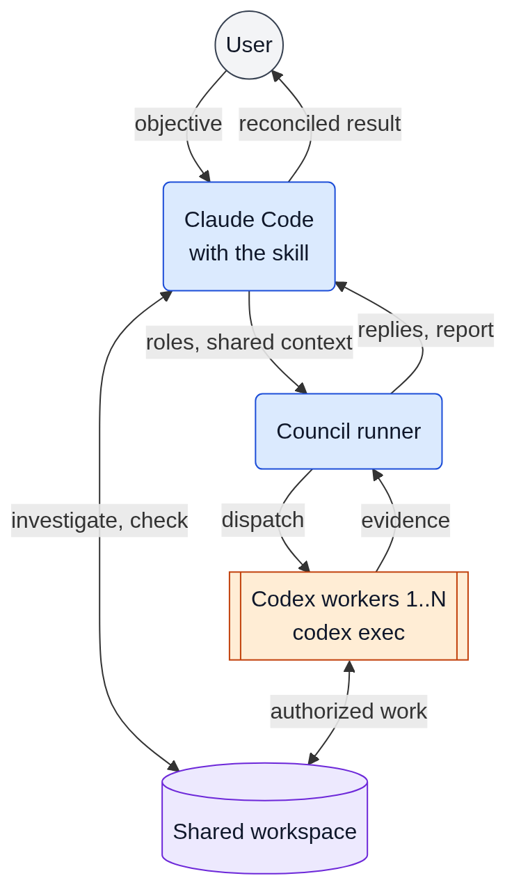

*d00-context — Council in context. Source:
[d00-context.mmd](docs/diagrams/d00-context.mmd).*

The user states an objective; Claude investigates the workspace, briefs the
runner, and the runner dispatches Codex workers that work in the same
workspace. Workers return evidence to the runner, the runner returns replies
and a report to Claude, and Claude reconciles one result for the user.

### Level 1: runtime components

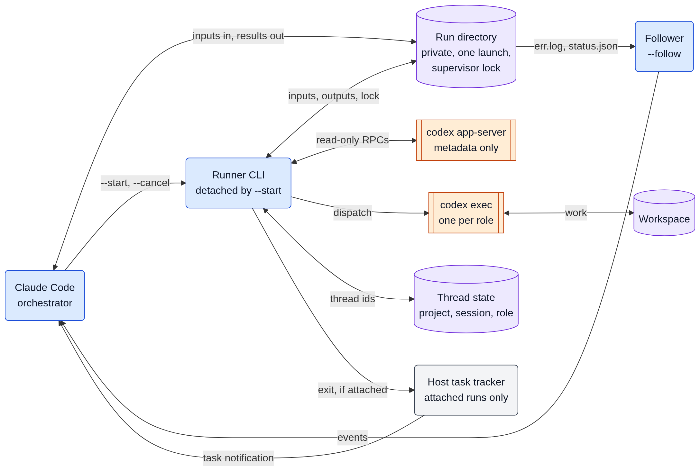

*d10-components — Runtime components and ownership. Source:
[d10-components.mmd](docs/diagrams/d10-components.mmd).*

| Component | Owns | Talks to |
|---|---|---|
| Claude Code with the skill | the panel, `roles.json`, `context.md`, early use of replies, reconciliation | the runner (commands), the run directory, the follower |
| Runner CLI (`codex_council.py`) | validation, selection, fan-out, the watchdog, replies, the report, `status.json` | the run directory, `codex app-server`, `codex exec`, saved threads |
| `codex app-server` | model and configuration metadata only | the runner, over stdio JSON-RPC |
| `codex exec`, one per role | the role's work in the workspace | the runner, over stdin, stdout, and stderr |
| Follower (`--follow`) | relaying actionable progress, noticing a dead or stuck runner | reads `err.log` and `status.json`; writes only its own stdout |
| Host task tracker | the background task's lifetime and its completion notification | Claude |

The launch command's shell, not the runner, creates `out.md` and `err.log`
by redirecting stdout and stderr. Only the host task tracker reports that
the runner's process ended; `out.md`, the `CODEX_COUNCIL_DONE` line, and the
follower's exit are separate signals and none of them is that notification.

The run directory holds exactly one launch:

| Entry | Written by | Read by | Mode |
|---|---|---|---|
| `model-snapshot.json` | `--discover` | the preflight, the launch | 0600 |
| `roles.json`, `context.md` | Claude | the preflight, the launch | Claude's Write |
| `out.md` | the launch's stdout redirect | Claude | the shell's |
| `err.log` | the launch's stderr redirect | the follower, Claude | the shell's |
| `replies/<key>.md` | the runner, as each role settles | Claude | 0600, in a 0700 `replies/` |
| `status.json` | the runner | `--follow`, `--status`, `--reap` | 0600 |

### Level 1: modules

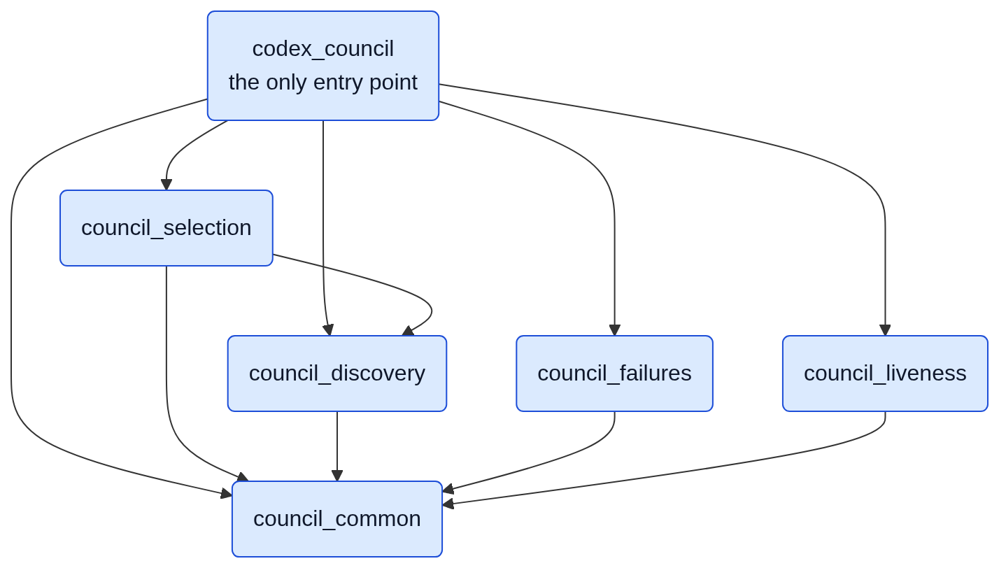

*d11-modules — Module responsibilities and imports, verified from the
import statements. Source: [d11-modules.mmd](docs/diagrams/d11-modules.mmd).*

The runner is standard-library Python in
`plugins/codex-council/skills/codex-council/scripts/`.

| Module | Responsibility |
|---|---|
| `codex_council.py` | the only entry point: CLI parsing, staging and launch gates, roles-file parsing, continuity state and locks, the `codex exec` runner with its watchdog, post-exit drain, and retries, fan-out, reply files, the report, and the run's live state |
| `council_selection.py` | `Role`, the `selection` contract, authoring validation, the pure resolver, and selection text for plans and reports |
| `council_discovery.py` | the `codex app-server` adapter, the snapshot file, the `--discover` command and summary, and `CODEX_COUNCIL_MODEL_ROUTING` |
| `council_failures.py` | failure records, the ordered classifier, and failure tags with their recovery actions |
| `council_liveness.py` | `status.json` (writer and tolerant reader), process identity, and `--follow`, `--status`, and `--reap` |
| `council_common.py` | shared primitives: escaping, the diagnostics sink, the private-path policy and launch gate, atomic private writes, strict JSON, the project root, and the plugin version |

Imports point one way and no production module imports the entry point.
Module state has one owner: the diagnostics sink and the cached project root
live in `council_common`, the run's live state and `STATE_DIR` in
`codex_council.py`. Siblings import names directly, so a test patches the
module whose global the calling code reads (for example
`council_discovery._project_root`). The entry puts its own directory first
on `sys.path`, because `python3 -P` and `PYTHONSAFEPATH=1` leave it off, and
imports its siblings with bytecode writes off, so a run writes no
`__pycache__` into the installed plugin.

### Commands

| Command | Reads | Writes | Exit codes |
|---|---|---|---|
| `--discover RUNDIR` | Codex metadata | `model-snapshot.json`; the summary on stdout | 0 (also when discovery is unavailable), 1 stdout gone, 2 usage or refused directory, 130 or 128 + signal when interrupted |
| `--check-staging-dir RUNDIR` | `roles.json`, `context.md`, the snapshot | `staging OK` and the selection plan on stdout | 0, or 2 with a recovery |
| launch (`--roles-file`, `--context-file`) | the staged inputs, the snapshot, Codex | the report on stdout, progress on stderr, `replies/`, `status.json`, saved threads | 0 some role responded, 1 all failed or aborted, 2 refused before dispatch, 130 or 128 + signal when interrupted |
| `--follow RUNDIR` | `err.log`, `status.json` | relayed lines on stdout | 0, 1, 2, 3, 4, 5 (see [Progress](#progress-replies-and-reconciliation)) |
| `--status RUNDIR` | `status.json`, one `ps` | about ten lines on stdout | 0 (2 for a bad directory) |
| `--reap RUNDIR` | `status.json`, one `ps` | signals to verified groups | 0 done, 1 refused, 2 bad directory |

Every command that SKILL.md shows passes `--skill-contract 3`, the contract
epoch. The epoch changes only when SKILL.md's command contract changes
incompatibly; a mismatch is refused (exit 2) as a stale SKILL/script pair,
with the installed-plugin recovery first and the development-checkout one
second. Without the flag the check is skipped. A `model` or `effort` without
a `selection` object is refused either way.

## Panel and context contract

**Purpose.** Give Claude one strict, simple input format that survives an
LLM file write, and give every role the same situational map.

**How it works.** The runner accepts roles only through `--roles-file`, a
JSON array of objects with `id`, `label`, and `instruction`, plus optional
`model`, `effort`, and `selection`. `instruction` is a list of
sentence-sized strings that the runner whitespace-normalizes and joins into
one paragraph; the joined paragraph must contain "nothing material" (any
case) and end with "Thoroughness beats speed." Role ids match
`^[a-z0-9_-]+$`. Unknown keys, a key repeated at any level, and `NaN` or
`Infinity` are refused, each with the same recovery: rewrite the whole file
in one Write operation. The shared context arrives through `--context-file`
in the same private directory (or on stdin for direct CLI use) and must be
non-empty UTF-8. A bare invocation with no roles exits 2.

The prompt for each role is its instruction, a short collaboration brief,
the shared context unchanged under its own heading, and the instruction
again. The
brief frames the role as an independent cross-model check: the user's goal,
requirements, and constraints are authoritative, while Claude's account of
the state and its conclusions are claims to verify against the workspace. It
says the run is non-interactive, tells the role not to spawn subagents
unless asked, to stay within its lens, to separate verified evidence from
inference, and to finish with plain paragraphs Claude can reconcile. It is
count-neutral ("you may be the only role, or one of several").

**Key decisions and why.**

- *A list of sentences, not one long string.* The only production writer
  of `roles.json` is an LLM file write, and multi-kilobyte single-line
  string literals are where such writes corrupt.
- *Unknown and duplicate keys are refused.* A stray filler field is the
  signature of a glitched write, and a repeated key silently hides one
  value behind another. A whole-file rewrite never patches a file that
  already glitched once.
- *No catalog, no caps.* Every hardcoded role shelf biases Claude toward
  picking from it, and every size cap is a guess about a provider's limits.
  Real model, provider, and memory limits surface as the downstream errors
  they are.
- *External `codex exec` per role, not Codex's in-process agents.* Each role
  needs its own persisted thread id and process-level failure and
  cancellation isolation.
- *Claude mediates collaboration.* Roles share context but not messages;
  Claude reconciles each round and stages findings into selective follow-up
  rounds.

**Limits.** All roles share the working tree, so implementation panels need
one writing role or serialized phases; the runner does not use Codex's
`--worktree`. Context is sent on stdin, so non-text artifacts are named by
path rather than inlined.

## Model discovery

**Purpose.** Learn, for this run only, which models the installed Codex
advertises for this account and how native configuration resolves, without
starting any Codex work.

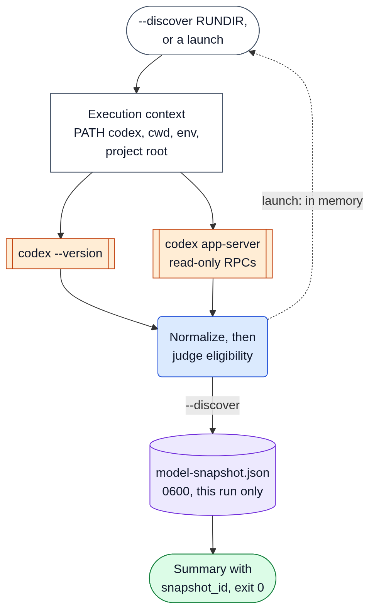

*d20-discovery — Model discovery. `--discover` writes the snapshot and
prints the summary; a launch keeps its fresh evidence in memory. Source:
[d20-discovery.mmd](docs/diagrams/d20-discovery.mmd).*

**How it works.** Discovery runs in the same execution context as the
workers: the `codex` that `PATH` resolves, the runner's working directory
and environment, and no `--profile`. It runs `codex --version`, then starts
`codex app-server --listen stdio://` in its own process group and speaks
newline-delimited JSON-RPC, matching responses by id while notifications
interleave. The only messages it sends, in order:

| Step | Method | What is kept |
|---|---|---|
| 1 | `initialize` (then the `initialized` notification) | `codexHome` |
| 2 | `account/read` | the account type and whether OpenAI sign-in is required |
| 3 | `config/read`, with `cwd` set to the project root | the model, effort, provider, the kind of layer that set the model and effort, endpoint key names, whether a model catalog file is configured |
| 4 | `configRequirements/read` | managed new-thread defaults and managed provider keys |
| 5+ | `model/list`, paged, hidden models included | the normalized catalog |

No thread or turn is ever started, and no login or account-changing method
is ever called; the tests assert the fake server sees nothing else. A
request from the server is answered with JSON-RPC `-32601` and makes the
result inconclusive.

| Bound | Value |
|---|---|
| work budget (project root lookup, version probe, spawn, handshake, every request) | 20 s, monotonic; notifications never extend it |
| project root lookup (`git rev-parse --show-toplevel`) | 5 s, falling back to the launch directory |
| version probe | 5 s; an unparsable version is informational |
| catalog paging | 10 pages or 1,000 entries; a repeated cursor is a cycle |
| one line / all stdout | 8 MiB / 32 MiB |
| unsolicited messages | 10,000 |
| teardown after the budget | close stdin, then SIGTERM and SIGKILL to the group, waiting at most 0.5 s at each step |

The 20 seconds bound discovery's work; teardown adds its own bounded waits,
so no child outlives discovery. Discovery never raises: a missing `codex`,
a spawn error, a timeout, a protocol violation, an RPC error, or an internal
bug gives status `unavailable` with fixed problem codes (`codex_missing`,
`spawn_failed:<errno>`, `timeout:<method>`, `server_exited:<method>` with
`server_stderr:<category>`, `protocol_error:<kind>`,
`rpc_error:<method>:<code>`, `schema_unsupported:<method>:<field>`,
`server_request:<method>`, `internal_error:<type>`). Problems inside the
catalog (a malformed entry, a conflicting duplicate, a paging bound) keep
status `ok` and only mark the catalog incomplete.

The `_normalize_*` helpers are the only code that reads wire names. They
tolerate additional fields, reject wrong types without coercing them, keep
an entry's dispatch id (`model`, what `-m` receives) apart from its picker
`id` (recorded as `catalog_id`), and treat efforts as an open vocabulary.

`--discover` writes `RUNDIR/model-snapshot.json` (schema
`codex-council/model-snapshot@1`) atomically with mode 0600 and prints a
summary: the status with a random `snapshot_id` and the plugin version, the
native configuration with where each value came from, the routing verdict
with every reason, the native-model effort verdict, each visible model with
its quoted display name, description, and efforts, and the hidden models on
a `hidden (not routable)` line. A retirement already passed at discovery
reads `retired <time> (not routable)`. Every summary line passes through
`_report_inline`, which escapes line breaks and every other non-printable
character. The snapshot is read back only if it is the private regular file
`--discover` wrote and it matches the schema field by field.

Discovery decides two verdicts once, so the summary, the preflight, and the
launch share their reasons:

| Condition | Routing (routed pairs) | Native proof (effort on the native model) |
|---|---|---|
| `CODEX_COUNCIL_MODEL_ROUTING` is `auto` | required | required |
| status `ok` | required | required |
| a complete, well-formed catalog | required | not required; the native model's own entry must be usable |
| signed in (an unauthenticated app-server still lists models) | required | required |
| provider unset or `openai`; no `openai_base_url` or `chatgpt_base_url` from any layer; no `model_catalog_json` | required | required |
| in managed requirements: no `modelProvider` other than `openai`, no non-empty `modelProviders`, no `modelCatalogJson`, no `chatgptBaseUrl` | required | required |
| `CODEX_API_KEY` unset (`codex exec` honors it; the app-server does not) | required | required |
| managed new-thread defaults absent | required | required |
| model and effort not set by a layer that outranks CLI flags (`mdm`, `legacyManagedConfigTomlFromFile`, `legacyManagedConfigTomlFromMdm`) | required | required |
| a configured model with a well-formed catalog entry | — | required; a hidden entry counts |

A hidden model can never be routed to, but it can be the proven native
model, so a native-effort choice may use its advertised efforts, and a user
may pin it. Neither verdict reads the catalog's recommended marker, catalog
order, or the shape of ids, and a missing configured model or effort is
never filled in from the catalog.

**Key decisions and why.**

- *`codex app-server`, not `codex debug models`.* Only the app-server
  observes layered configuration, managed requirements, and the account.
- *Same execution context as the workers.* Project layers are selected by
  `config/read`'s `cwd`, not by the spawn directory, so discovery passes the
  same root workers get as `-C`.
- *Only key names, never values.* Endpoint overrides and catalog files are
  recorded by key name only; no URL, path, email, plan, account id, or token
  is ever read into the snapshot, and the tests plant sentinel values to
  prove it.
- *The app-server's stderr never leaves the adapter.* It is free-form and can
  carry identity or tokens, so only a fixed `server_stderr:<category>`
  (`usage_error`, `panic`, or `other`) is recorded.
- *An overridden endpoint or catalog file blocks both verdicts.* The catalog
  `model/list` returns does not describe what a redirected endpoint serves,
  and a catalog file (which a trusted project's `.codex/config.toml` can
  set) would let the repository under review describe its own reviewers.
- *Managed new-thread defaults block both verdicts.* Codex ignores both
  managed defaults when either the model or the effort is overridden, so
  even an effort-only override could change the model.
- *No cache.* Every run discovers fresh evidence into its own directory; a
  cache would need invalidation keyed on credentials it must never store.

**Limits.**

| Claim | Evidence |
|---|---|
| `config/read`'s `cwd` selects project layers, and omitting it drops them | verified live on codex-cli 0.157.1 |
| discovery and every worker get the same root, from a Git subdirectory launch too | pinned by an end-to-end fake-codex test |
| `codex exec -C <root>` also ignores a `.codex/config.toml` below the root | follows from Codex's documentation of `-C`; not verified live |
| the app-server refuses `--profile` | verified live on codex-cli 0.157.1 |
| an unauthenticated app-server still lists models | verified live on codex-cli 0.157.1 |
| a catalog is evidence of what is advertised, not of access | by design: a rejection is classified, not predicted |

If the snapshot cannot be written, an older one is removed on a best-effort
basis (a failed removal is not reported) and `--discover` prints only a
line telling Claude to write no automatic selections. Discovery describes
the process that runs it, so it must run from the directory the council will
launch from.

## Choosing and validating selections

**Purpose.** Let Claude give each role a grounded model and effort while the
runner guarantees that an automatic choice rests on this run's evidence and
that a user's pin is never altered.

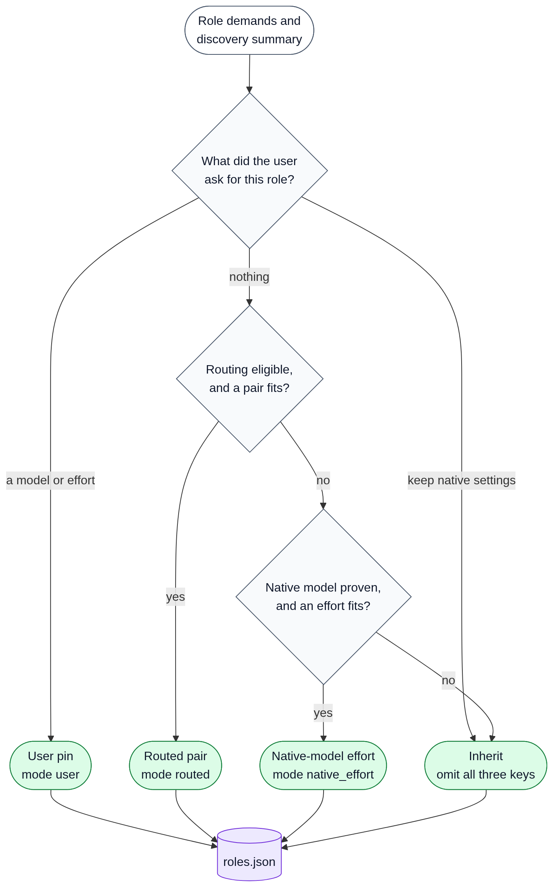

*d21-choose — Claude chooses one role's model and effort. The runner does
none of this reasoning. Source: [d21-choose.mmd](docs/diagrams/d21-choose.mmd).*

**How it works.** Claude walks the ladder once per role before launch. A
user's explicit request wins (and a request to keep native settings means
inheritance). Otherwise a routed pair needs routing to be eligible and the
catalog's descriptions to support both the model and the effort; otherwise
an effort on the proven native model needs one of that model's effort
descriptions to fit; otherwise the role inherits. Descriptions justify a
choice; ids, version-like fragments, catalog order, and the recommended
marker never rank one.

`selection` has three shapes: `{"mode": "user"}` (optionally with a
single-line `reason`), which needs `model` and/or `effort`;
`{"mode": "routed", "snapshot_id", "reason"}`, which needs both; and
`{"mode": "native_effort", "snapshot_id", "reason"}`, which needs `effort`
and forbids `model` because the runner pins the proven native model.
`snapshot_id` is the 16-hex id `--discover` printed, and `reason` is a
non-empty single line. Inheritance is omission of all three keys. Both
values share `SELECTION_VALUE_PATTERN = ^[A-Za-z0-9][A-Za-z0-9._:/@+-]*\Z`:
no leading `-` and no whitespace, control characters, quotes, backslashes,
or angle brackets, so `-m <model>` stays one argument, the TOML string in
`-c model_reasoning_effort="<effort>"` cannot be broken out of, and report
lines stay single-line. Case is preserved, and `inherit` and `default`, in
any case, are refused as model values. A `model` or `effort` without
`selection` is refused before the grammar is checked.

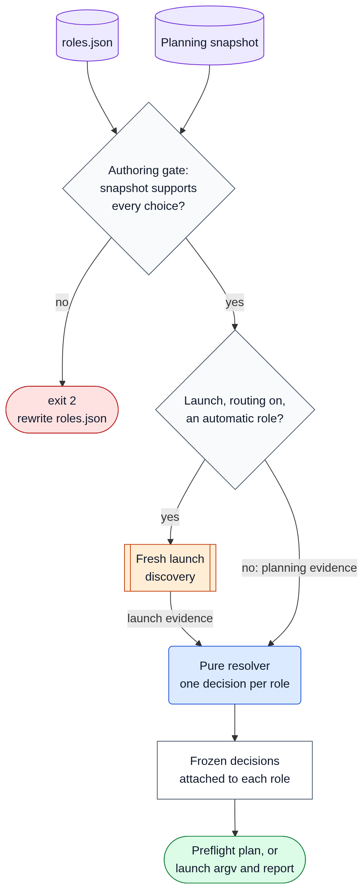

*d22-resolve — Validate authoring, then resolve against the newest
evidence. Source: [d22-resolve.mmd](docs/diagrams/d22-resolve.mmd).*

Authoring validation runs at the preflight and again at launch, before any
worker, whenever routing is on. It refuses (exit 2, whole-file rewrite) an
automatic role whose planning snapshot is absent, unreadable, or not the
private file `--discover` wrote; whose `snapshot_id` does not match; that is
routed while routing is ineligible; whose model is not an advertised
execution id (the message names the right id when the value is a picker id
or display name); whose model is hidden or already retired; whose effort is
not advertised for that model; or that is `native_effort` without a proven
native model. The preflight judges retirement against the current time; the
launch judges authoring as of the snapshot's creation, so a retirement that
passes after discovery is changed evidence rather than a defect.

At launch, when routing is on and at least one role is automatic, the runner
takes one fresh discovery after every input check and freezes it for the
whole council; it lives in memory only and never overwrites the planning
snapshot. `_resolve_selection(role, planning, launch, routing_mode, now)` is
the single pure resolver for both paths; its clock at launch is read after
that discovery finishes. A role whose evidence changed resolves to native
inheritance with a reason (`selection evidence changed since discovery: …`):
discovery now unavailable, routing now ineligible for a routed pair, a
model gone, hidden, or retired, an effort no longer advertised, a native
model no longer proven, or, for `native_effort`, a native model that differs
from the one discovery planned with. Evidence never causes an exit 2.

Each decision is a frozen `SelectionDecision` holding the provenance
(`native`, `user`, `routed`, `native_effort`, or `fallback`), the requested
and the dispatch values, the reason, a note (a fallback reason or a pin
advisory), and the proven native model (never sent; it only tells a refusal
whether the refused model was the native one). Command builders receive only
the dispatch values. Explicit pins are forwarded unchanged and only
annotated: a model absent from the catalog (with the execution id a display
name or picker id maps to), a retired model, an effort the catalog does not
advertise for that model, a model-only pin whose inherited native effort
that model does not advertise, and a partial pin while managed defaults are
present or unknown.

Every surface reports what was sent:

- `err.log`: after the dispatch line,
  `[codex-council] model selection: routing=<auto|off>; discovery=<ok|unavailable|not-run>[ (<reason>)]; native=N user=N routed=N native_effort=N fallback=N`,
  then one `routing fell back to native inheritance: <reason>` line per
  fallback;
- the report's Summary line notes each role's sent values, a
  `Model selection:` paragraph names the launch discovery
  (`launch discovery not run (<why>)`, `launch discovery ok (codex-cli <v>)`,
  or `launch discovery unavailable: <problems>`), and each role section opens
  with `_Model selection: …_`, which carries the `reason` when the choice was
  sent as requested and the fallback reason otherwise;
- each reply header carries `selection=`, the sent `model=` and `effort=`,
  and for a fallback `requested_model=` and `requested_effort=`.

**Key decisions and why.**

- *The runner never ranks.* Every list of models or efforts goes stale with
  the next model generation; the only checks are membership in this run's
  evidence.
- *`native_effort` sends the native model with the effort.* The effort was
  chosen from that model's descriptions and the same spelling need not mean
  the same thing on another model, so it always travels with the model it
  was validated against, and a changed native model falls back instead of
  carrying the effort over.
- *Changed evidence falls back instead of failing.* Separate processes
  cannot make planning and launch atomic; a council that still runs on the
  user's own configuration is better than one that refuses.
- *Pins are never validated against the catalog.* A custom provider's models
  are not in it, and the user asked for exactly that value.
- *Escaping covers metadata, not replies.* Catalog, configuration, and
  Codex-derived text in plans, headers, summary notes, and diagnostics goes
  through `_report_inline`, and `err.log` diagnostics also through
  `_log_inline`, which escapes ` reply=`. A successful role's reply body is
  the multiline Markdown the role returned, which is why Claude treats it as
  untrusted evidence.

**Limits.**

- **User-pin provenance and semantic grounding rest on the orchestrator.**
  `selection.mode: "user"` is a label the orchestrator writes: the runner
  cannot authenticate it, and a role labeled `user` is forwarded unchanged
  with advisories only. Likewise `reason` is checked only as a non-empty
  single line, never for meaning, so an advertised pair is accepted whatever
  its reason says. Both rest on Claude following SKILL.md, not on runner
  enforcement; enforcing them would need an authorization source the
  orchestrator does not control.
- **Planning, launch, and exec are not atomic.** Configuration, account, or
  catalog can still change after launch discovery; launch revalidation
  narrows that window without closing it.
- **Managed layers can still override an explicit pin.** A layer that
  outranks CLI flags blocks automatic choices when it sets the model or
  effort, but an explicit pin is still sent and may be overridden there, and
  a layer that sets neither is not inspected.
- **Resume under managed defaults is untested.** Those defaults disable both
  automatic modes, so the council claims nothing there beyond sending no
  override.

## Staging and preflight

**Purpose.** Refuse every bad input before a worker exists, keep reviewed
content private, and never let a launch damage another launch's files.

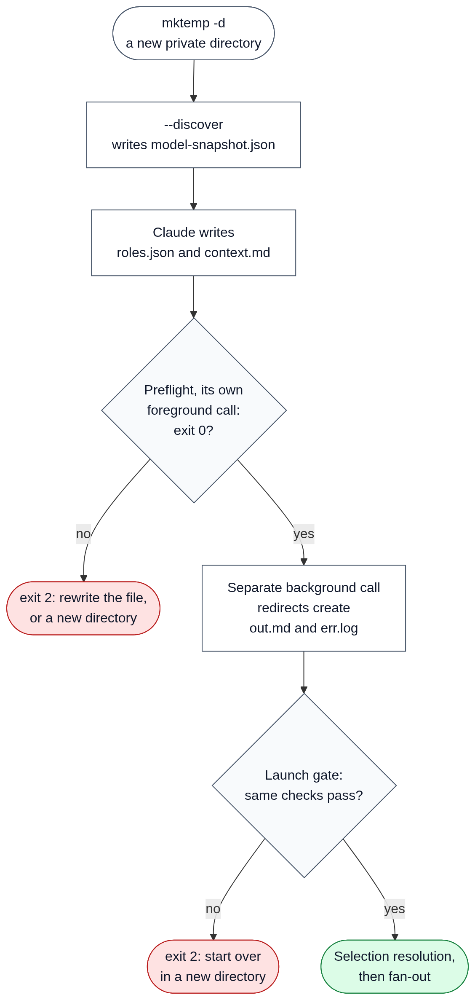

*d23-staging — Stage and pass the gates. Inputs exist before the
preflight; outputs appear only when the separate launch call's redirects
run. Source: [d23-staging.mmd](docs/diagrams/d23-staging.mmd).*

**How it works.** Every launch gets its own `mktemp -d` directory. Claude
runs `--discover` there, writes `roles.json` and `context.md`, and runs
`--check-staging-dir` as its own foreground call. The preflight runs no
discovery and refuses (exit 2) whatever the launch would refuse before
dispatch:

- the directory is not private (below);
- the directory already holds a launch (`out.md`, `err.log`, or
  `replies/`);
- `roles.json` or `context.md` is missing, not a regular non-symlink file, or
  unreadable; `context.md` is empty or not UTF-8;
- a roles defect, including an unsupported automatic selection;
- no `codex` on `PATH`, or an invalid `CODEX_COUNCIL_MAX_PARALLEL`,
  `CODEX_COUNCIL_STALL_SECS`, or `CODEX_COUNCIL_MODEL_ROUTING`;
- a contract epoch mismatch.

On success it prints the plan, one line per role:

```
[codex-council] staging OK: ABS_RUNDIR (4 roles; max parallel 6) version=<plugin version>
[codex-council] selection plan: inherited-lens: native inheritance
[codex-council] selection plan: boundary-checks: routed (model future-vega-2033, effort brisk); revalidated at launch
[codex-council] selection plan: design-judgment: native-model effort (effort adaptive-v2 on native model future-orion-2032); revalidated at launch
[codex-council] selection plan: user-pinned: explicit override (model acme/future-review-2034:rev2); unverified: not in the discovered catalog; forwarded unchanged
```

Only after exit 0 does Claude launch, in a separate background call whose
redirects create `out.md` and `err.log`. The launch repeats the same checks
on each input's lexical parent directory (`dirname(abspath(...))`, never
resolved through symlinks first) before reading any content, then parses,
validates authoring, and resolves selections.

The private-directory predicate, shared with the replies directory and the
snapshot reader, is: not a symlink, the right file type, owned by the
effective user, and no group or other permission bits. `mktemp -d` (mode
0700) is the prescribed way to get one, but the check does not demand exact
owner bits, so an owned 0500 directory passes. A rejected directory is
abandoned, never repaired: the recovery demands a new `mktemp -d`,
`--discover` there, both files re-written with the new `snapshot_id`, and the
preflight. A roles defect found by the preflight is fixed by rewriting the
whole file in the same directory; any refusal at launch starts over in a new
directory, because the launch's redirects have already claimed this one.

**Key decisions and why.**

- *Private directories, not predictable `/tmp` names.* The report and
  context can hold sensitive content, and a predictable name can be
  pre-created or symlinked by another local user who could then read the
  report or plant a fake `CODEX_COUNCIL_DONE` line.
- *Recovery never suggests chmod or mkdir.* A hint that could be satisfied
  on the same predictable path would defeat the privacy the gate exists for.
- *One launch per directory, checked before the launch.* The launch
  command's redirects truncate `out.md` and `err.log` before the runner
  starts, so relaunching into a running council's directory would tear its
  report, log, and follower apart. Only a step that runs before the launch
  command can refuse in time.
- *Preflight and launch are separate calls.* In one combined call a refused
  preflight would not stop the launch's redirects.
- *Inputs live in files.* A large role array and multiline context stay out
  of the shell, where a stray quote would break the call before the runner
  could diagnose it.

**Limits.**

- **One launch per directory is not enforced atomically.** `--discover` and
  the preflight refuse a directory holding `out.md`, `err.log`, or
  `replies/`, but the launch itself does not check: its own redirects create
  the first two before it starts, and direct CLI use accepts an existing
  `replies/`. A launch without a preflight, a combined call that ignores the
  preflight's exit, or two launches racing into one directory are not
  prevented. "A fresh directory per launch" is the required workflow, not a
  one-use token.

## Launch and fan-out

**Purpose.** Run any number of roles with bounded concurrency, without two
councils ever driving the same role thread at once, and deliver each
result as soon as it settles.

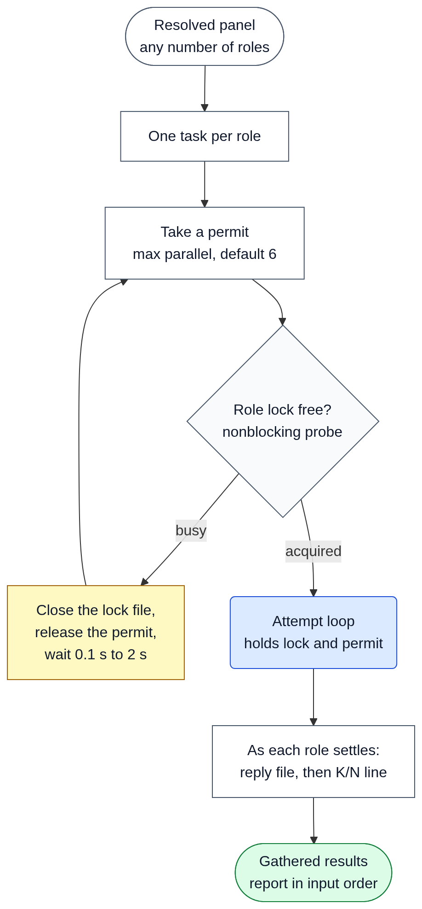

*d24-fanout — Launch and bounded fan-out. Source:
[d24-fanout.mmd](docs/diagrams/d24-fanout.mmd).*

**How it works.** After the dispatch line and the model-selection lines, the
runner starts one task per role behind an `asyncio.Semaphore` of
`CODEX_COUNCIL_MAX_PARALLEL` permits (default 6). A task holding a permit
makes a nonblocking probe for its role's continuity lock. If another
council holds it, the task closes the lock file, releases the permit, and
waits outside it (0.1 s, doubling to 2 s) before trying again, so unrelated
roles run and a large panel never holds one open lock file per queued role.
A task holding both runs the role's attempt loop; a retry's 5-second
backoff keeps both. As each role settles, a completion callback writes its
reply file, then its `K/N` line. `asyncio.gather(..., return_exceptions=True)`
collects every result, so one role's exception never cancels its siblings;
it is reported as `[orchestrator-exception]`. Completion lines arrive in
completion order; the report keeps the input order.

**Key decisions and why.**

- *A local concurrency choice.* The roles are separate processes, so no
  Codex setting describes their concurrency, and the limit is not a promise
  about provider capacity.
- *Probe, don't block, on role locks.* A blocked task would hold a permit
  and a file descriptor while doing nothing.

**Limits.** Lock acquisition is probe-based, not FIFO-fair: a long-waiting
role can lose a race to a newer one. Each role has exactly one lock file.
There is no partial cancellation: a running role cannot be stopped or
steered on its own.

## Thread continuity

**Purpose.** Let a role resume its Codex thread across councils in the same
project and host session, and never let two councils race on one thread.

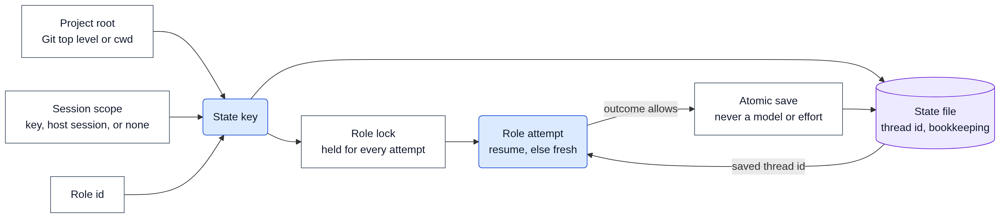

*d25-continuity — Thread identity and persistence. Source:
[d25-continuity.mmd](docs/diagrams/d25-continuity.mmd).*

**How it works.** The state key combines a hash of the project root (the Git
top level, else the launch directory), an optional hash of the session
scope, and the role component: the role id itself when it has 32 characters
or fewer, else a fixed-size SHA-256 key. The scope is
`CODEX_COUNCIL_SESSION_KEY` when set, else the first host session id found
among `CLAUDE_CODE_SESSION_ID`, `CLAUDE_SESSION_ID`, `CODEX_THREAD_ID`,
`TERM_SESSION_ID`, `TMUX_PANE`, `STY`, and `VSCODE_PID`, else none (project-wide
state). State lives in `$XDG_STATE_HOME/codex-council/<key>.json` beside a
POSIX lock file, and the lock is held across the role's whole
load, resume-or-fresh, save, and retry loop. State files are written
atomically (a 0600 temporary file, fsync, rename) and hold the thread id and
bookkeeping (role id, project path, session key, update time), never a
model, effort, or selection.

| Outcome | What happens to saved state |
|---|---|
| no saved thread id | a fresh invocation |
| fresh success with a final message and an emitted thread id | the new id is saved |
| fresh success with a final message but no thread id | the reply is kept; nothing is saved |
| any failed fresh invocation | its new id is not saved |
| resume success whose emitted id is non-empty and different | the new id is adopted and saved, even without a final message, with a warning |
| resume success with no emitted id, or the same id | saved when a final message arrived |
| stale resume (the thread is gone) | the state is cleared best-effort (only if it still holds that id) and a fresh invocation runs in the same attempt |
| a stall after a completed turn (ok with a warning) | the emitted or resumed id is saved best-effort |
| auth, quota, model rejection, rate limit, 5xx, any other stall, or untagged failure | state is left as it was |
| a save that fails | the reply is kept, with a warning |

`codex exec resume <id>` parses `<id>` as a UUID first. A valid but unknown
UUID errors (`no rollout found for thread id … (code -32600)`, exit 1) and
takes the stale path; only a value that is not a UUID is read as a thread
*name* and silently starts a new thread. Codex emits UUIDs, but the runner
stores any non-empty emitted id and does not check its shape, so the
adoption check above is the guard for an unexpected id or a hand-edited
state file. Adoption never re-runs the turn: it already completed on the new
thread.

Model and effort overrides sit on the parent command
(`codex exec -C <root> [-m <model>] [-c model_reasoning_effort="<effort>"] resume <id>`)
and are sent on every invocation, never persisted. On codex-cli 0.157.1 a
resumed thread that sends none runs on the current native configuration,
and Codex's advisory about the changed model is kept verbatim as a role
warning (`codex reported: …`), never parsed into a stronger claim.

**Key decisions and why.**

- *Session-scoped by default.* Separate terminals in one repository should
  not share role threads, and nothing needs to be exported for that.
- *Readable short ids, hashed long ones.* Short ids keep state and reply
  filenames readable; hashing avoids the per-component filename limit
  without limiting id length.
- *No selection in state.* A routed choice must never become a role's
  default for a later council.

**Limits.** `VSCODE_PID` is window-scoped, so integrated terminals in one VS
Code window share role threads unless `CODEX_COUNCIL_SESSION_KEY` separates
them. A role id reused for a different lens resumes a thread built for the
old one; the skill mints a new id instead.

## One attempt and its watchdog

**Purpose.** Run one `codex exec`, notice a silent process without imposing
a run-level deadline, and make sure codex's process group does not outlive
the attempt.

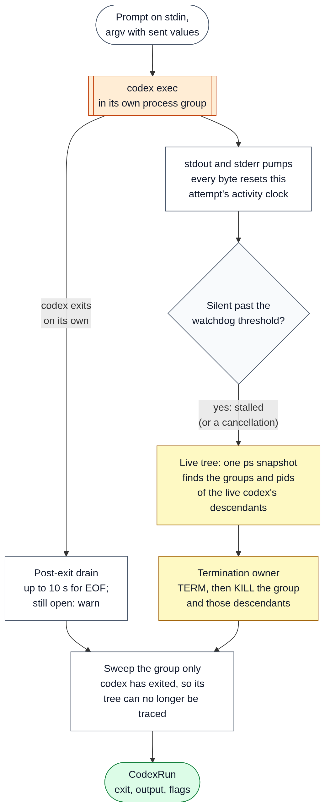

*d26-attempt — One subprocess attempt and its watchdog. Every invocation
has its own copy of all of this. Source:
[d26-attempt.mmd](docs/diagrams/d26-attempt.mmd).*

**How it works.** The runner starts `codex exec` with
`start_new_session=True`, so codex leads a process group that belongs to
this attempt alone. The group signals and the sweep below reach codex and
any child that stays in that group. Current codex starts each tool command
in its own session and each MCP server in its own process group, so
terminating a live codex also signals the groups of its descendants, found
by walking parent links in one bounded `ps` snapshot (see Limits). Both pumps start before the prompt is written
to stdin. They read stdout and stderr in fixed-size chunks (never
line-buffered reads, which would cap JSONL line sizes), buffer the raw bytes,
and decode once at the end, so a UTF-8 sequence split across chunks
survives. Every byte on either stream resets this attempt's activity clock;
another role's output never keeps this one alive. The stdout pump also
scans JSONL events for the stall policy's flags. A non-blank line that is
not a JSON object (it does not decode, is too deeply nested, holds an
out-of-range number, or is another JSON value) could hide an item, so it
counts as unknown work; it never stops a pump.

The council has no total elapsed-time or run-level deadline. The
output-inactivity watchdog fires after `CODEX_COUNCIL_STALL_SECS` seconds of
silence on both streams (default 1800; a positive integer overrides it; 0
disables it; anything else is a usage error). Every termination path, the
watchdog, cancellation, and errors alike, goes through one idempotent owner
that sends SIGTERM to the group, waits briefly, then sends SIGKILL.

The runner watches codex's own exit rather than its pipes, because on some
Python versions `Process.wait()` also waits for the pipes, which a
descendant can hold open forever. After the exit, the pipes get
`POST_EXIT_DRAIN_SECS` (10 s) to reach EOF, counted from the observed exit
and never extended by more output. If they are still open at the bound, the
runner terminates the group and stops the pumps, whoever holds the pipes;
the output already read is kept with the warning `codex exited but its
process group kept its output open; the group was terminated`. When the
attempt ends, whatever is left in the group is swept. A cancellation at any
point, the drain and the sweep included, still tears the group down;
SIGINT, SIGTERM, and SIGHUP cancel the whole fan-out and end the run without
the `CODEX_COUNCIL_DONE` line.

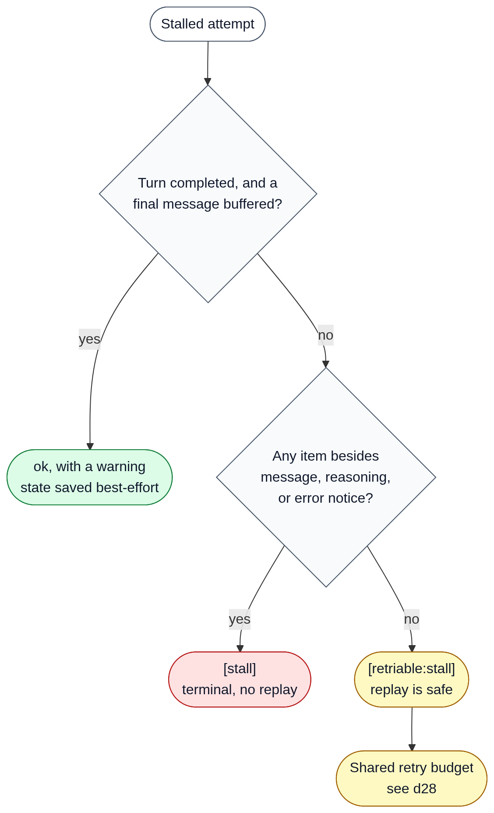

*d27-stall — Classify a stalled attempt. Source:
[d27-stall.mmd](docs/diagrams/d27-stall.mmd).*

A stall is a structured verdict, handled before any text classification, so
stale- or auth-looking stderr from a killed process can neither classify the
failure nor clear saved state. If the turn had completed and a final message
was buffered, the kill hit a wedged shutdown: the reply is kept as success
with the warning "codex wedged after completing its turn; process
terminated" and state is saved best-effort. Otherwise, if every item started
or completed was an agent message, reasoning, or a Codex `error` notice (the
resume advisory, for example), and every non-blank stdout line was a JSON
object, replay is safe and the attempt is `[retriable:stall]`. Any other
item type, known or not, or a line that is not a JSON object, makes it a
terminal `[stall]`, and a buffered message without turn completion is
quoted but never promoted to success.

**Key decisions and why.**

- *Bytes, not progress.* `codex exec --json` suppresses message and
  reasoning deltas, so a working role can be byte-silent for long stretches;
  the watchdog's claim is output-inactivity recovery only, never semantic
  wedge detection. Codex's own provider stream-idle timeout
  (`model_providers.<id>.stream_idle_timeout_ms`) stays a separate control in
  the user's Codex configuration.
- *No run-level deadline.* A long, productive role must not be killed for
  taking long; the host bounds a run's lifetime.
- *Conservative replay.* An unknown item type, or a line that is not a
  JSON object, counts as work, because replaying a turn that did work could
  repeat its side effects.

**Limits.** Terminating a live codex (the watchdog, a cancellation, or
`--reap`) reaches its process group and the groups of its current
descendants. A process that left the tree before that (its parent exited
and it was reparented), or that sits outside the group and still holds
codex's pipes when the drain bound ends after codex exited on its own,
cannot be traced and keeps running until it ends. A process that keeps writing
keepalive bytes resets the clock without making progress. Setting the
watchdog to 0 permits an indefinitely silent role.

## Failure classification and recovery

**Purpose.** Name why a role failed, retry only what a retry can fix, and
never lose a valid saved thread to a misread message.

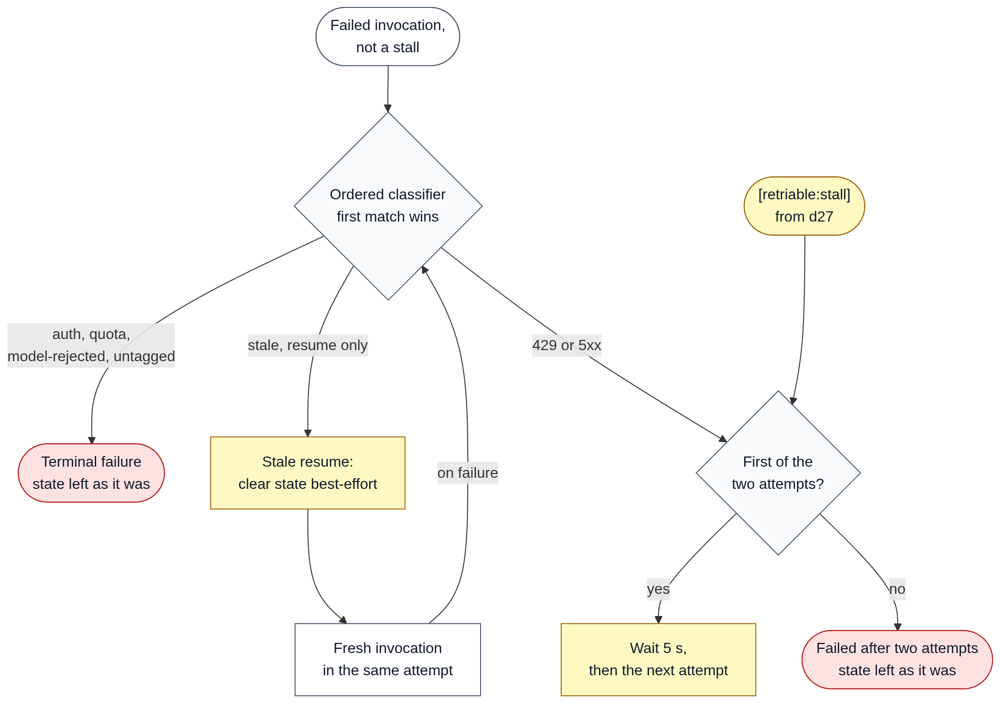

*d28-failures — Failure classification and saved-thread action. Source:
[d28-failures.mmd](docs/diagrams/d28-failures.mmd).*

**How it works.** A failed invocation that is not a stall is classified by
`_failure_verdict` in one order, identical on the fresh and resume paths:

auth → quota → anchored 429/5xx → model rejected → stale (resume only) → substring retriable fallback → untagged

The evidence is the collected failure text (stderr plus the messages of
Codex's JSONL `error` and `turn.failed` events) and those structured
records; agent messages, reasoning, and tool output are never read.

| Tag | Recognized from | Retry | Saved thread |
|---|---|---|---|
| `[auth]` | HTTP 401 on a record or as an anchored status, an `authentication_error` or `invalid_api_key` type or code, or Codex's sign-in wording | never | kept, even when the text also looks stale |
| `[quota]` | a structured code such as `insufficient_quota`, `usage_limit_reached`, or `credit_balance_exhausted`, or Codex's "hit your usage limit" wording, even with HTTP 429 | never | kept |
| `[retriable:rate-limit]`, `[retriable:5xx]` | an anchored status 429 or 500–599, else a code-less substring marker | once, after 5 s | kept |
| `[model-rejected]` | positive evidence that Codex refused the model this invocation sent | never, and no substitute | kept, even when the text also looks stale |
| `[retriable:stall]` | the watchdog, before any side-effect-capable item | once, through the same budget | kept |
| `[stall]` | the watchdog, after tool work began | never | kept |
| `[orchestrator-exception]` | the role's own task raised | never | as it was |
| untagged | anything else, with the collected failure text | never | kept |

Stale resume (`STALE_RESUME_MARKERS`, resume path only) clears that role's
state best-effort and runs a fresh invocation within the same attempt.
A role gets at most `MAX_RETRY_ATTEMPTS = 2` attempts with one
`RETRY_BACKOFF_SECS = 5` wait, shared by rate limits, 5xx, and replay-safe
stalls. Retry eligibility is structured data: `FailureVerdict.retriable` or
the stall verdict sets `RoleResult.retriable`, and `_run_role_attempts`
reads only that flag, so Codex text that merely begins with `[retriable:`
never forces a retry.

The primary retriable signal is a numeric HTTP status parsed by
`_extract_statuses` in an anchored form only: the JSON `"status"` key, an
`HTTP NNN` or `status NNN` keyword, or a canonical reason phrase such as
`NNN Too Many Requests`, never a bare digit run, and with the requested model
id masked first, so a model named `future-status:429` never reads as a
status. A structured non-retriable status (a 400, say) or an
`invalid_request_error` type suppresses the substring markers, so a `429`
echoed inside a 400 body cannot force a retry. The substring markers
(`RATE_LIMIT_MARKERS`, `TRANSIENT_5XX_MARKERS`) are a fallback for failures
with no parseable status, such as Codex's code-less rewrites
(`experiencing high demand`, `server overloaded`,
`selected model is at capacity`, `request was throttled`).

A model rejection needs positive evidence: a structured `model_not_found`
whose `param` is `model` or absent, with status 400, 404, or none, or one of
Codex's complete sentences about the model this invocation sent ("The
'<m>' model is not supported when using Codex with …", observed live on
codex-cli 0.157.1; "The model '<m>' does not exist or you do not have access
to it", the API's wording, not yet observed live), in single quotes or
backticks, bare or after Codex's `unexpected status NNN …: ` prefix. Bare
"not found" or "not supported", the "Model metadata for … not found"
advisory, and "Selected model is at capacity" never qualify, and neither
does a record whose structured `param` is `reasoning.effort`,
`model_reasoning_effort`, or `service_tier`, or unstructured text naming one
of those outside the quoted model id. Such a record is set aside on its own,
never hiding a separate rejection, so a rejected effort alone stays
untagged. The `[model-rejected]` message quotes Codex, says no substitute
was tried, and ends with one action for the model that was refused: re-run
without `model`, `effort`, and `selection` for a routed model; change or
remove the pin for a user model pin; or ask the user to update the Codex
configuration or name a model to pin for the natively configured model.
That last case covers a native-effort role, an effort-only pin, native
inheritance, and a routed or pinned model equal to the `native_model` its
decision recorded, since an inheriting re-run would send the same model
again. A `[quota]` for a usage limit for one model ("You've hit your usage
limit for <label>. Switch to another model now, or try again at <time>.")
ends with the same action for the model that was sent; its label is never
compared with the model.

**Key decisions and why.**

- *Quota before the anchored parser.* A provider can send a usage limit as
  HTTP 429, which would otherwise be retried; a plan cap does not clear in
  5 seconds.
- *Anchored retriable status before stale recovery.* A transient
  `HTTP 429 … thread not found` on resume backs off and retries instead of
  discarding a valid thread.
- *Model rejection before stale recovery.* A rejection whose text also
  mentions a missing thread must never clear a valid saved thread.
- *No automatic model hopping.* A replay could repeat a writer role's side
  effects, and the choice of another model belongs to the user and Claude.
- *One verdict per attempt.* The verdict is computed once and formatted
  as-is, so the printed tag always matches the branch taken.

**Limits.** A status phrase echoed inside an error message has no provenance
and is not guessed at. A usage-limit label is the server's name for the
limit, so an inheriting re-run can meet the same `[quota]`.

## Progress, replies, and reconciliation

**Purpose.** Let Claude use finished work early without ever mistaking an
early signal for the end of the run.

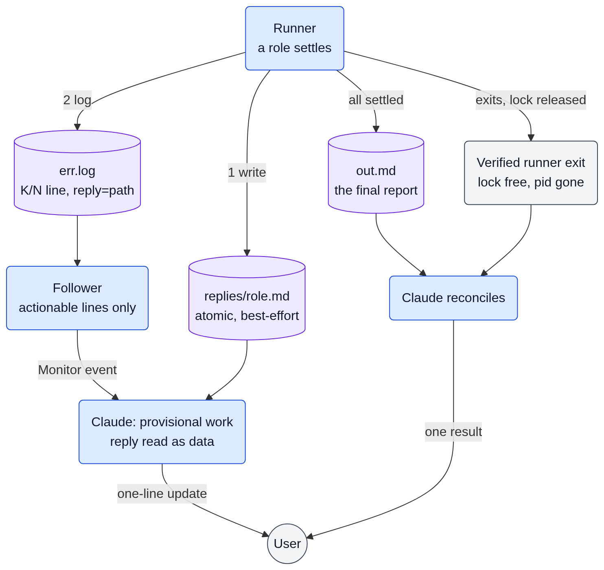

*d29-progress — Progress, replies, follower, and reconciliation. Source:
[d29-progress.mmd](docs/diagrams/d29-progress.mmd).*

**How it works.** stdout carries only the report; everything else is
best-effort stderr through one diagnostics helper: the dispatch line, the
model-selection lines, per-attempt start lines, retry and adoption notices,
stall lines, warnings, the heartbeat, completion lines, and the final
`[codex-council] CODEX_COUNCIL_DONE ok=N total=M elapsed=…s exit=X
version=…` sentinel. A dead stderr switches diagnostics to a no-op sink and
never changes a result. The heartbeat runs every `min(1800, stall_secs //
3)` seconds with a 300-second floor while the watchdog is on (600 s at the
default, 1800 s when disabled) and lists completed, active, and queued
roles, each active role's `quiet=Ns` (or `retry-wait`), the watchdog, and the
plugin version.

As each role settles (ok, failed, or crashed), the runner writes its report
section to `RUNDIR/replies/<key>.md` through the atomic private writer and
only then logs `[codex-council] K/N <id>: ok|FAILED (<secs>s)` with
` reply=<path>` appended. The same renderer produces `out.md`'s section, so
an early read and the final report cannot disagree. A one-line header
records the id, status, elapsed time, attempts, selection, and the sent
values. Reply files are best-effort: if `replies/` is not a private
directory the runner owns, it logs one warning and the completion lines
carry no `reply=`. Finished replies survive an interruption; the
interrupted run has no sentinel, and because the shell opened `out.md`
before the runner started and the report is written at the end, `out.md`
may then be empty or partial.

`--follow RUNDIR` is a read-only companion for Claude Code's Monitor tool.
It relays the actionable `[codex-council` lines of `err.log` with a flush
per line: dispatch, model selection, warnings, completions, retries,
stalls, and the terminal line. Per-attempt start lines and the heartbeat
stay in `err.log` unless `--verbose` is given, so a three-role happy path is
six Monitor events. It drops a completion line whose `reply=` path is not
directly inside `RUNDIR/replies/`, the only shape the runner prints.

| Follower exit | Meaning |
|---|---|
| 0 | a terminal line (`CODEX_COUNCIL_DONE`, `interrupted by …`, `runner aborted …`) or a terminal state in `status.json` |
| 1 | its stdout has no reader |
| 2 | usage error: the directory is wrong or not private |
| 3 | no dispatch line within 120 s |
| 4 | the runner is gone or stopped ticking (see [Run liveness](#run-liveness-and-recovery)) |
| 5 | its own parent went away |

Monitor watches expire after at most 30 minutes interactively and 10 in
`claude -p`; the skill re-arms the same follower only on that expiry while
the task still runs, and a re-armed follower replays earlier lines, which
Claude skips. Without Monitor, an interactive session uses a one-shot
10-minute session cron that runs `--status`, and `claude -p` or a subagent
keeps its turn open by running the follower as a foreground call with a
600000 ms timeout.

Claude may read a settled role's reply, tell the user, and act on work that
does not depend on other roles. The final verdict, cross-role conflicts, and
writes that overlap a running writer wait for the full report, which Claude
reads after Claude Code's background-task notification.

**Key decisions and why.**

- *Reply file first, then its line.* A `reply=` path always points at a
  complete file.
- *The follower never writes.* It cannot forge the sentinel or change a run.
- *The host's notification ends the run.* Roles run as the user and can
  append to `err.log`, and no same-user check can authenticate those lines,
  so `CODEX_COUNCIL_DONE` and the follower's exit are progress signals only.
  Diagnostic lines that embed foreign text escape ` reply=` as
  ` reply\x3d`, so the follower's filter never hides one.
- *Fewer notifications.* Routine start lines and heartbeats are for humans
  reading `err.log`; every relayed line costs Claude context.

**Limits.** Follower exit 0 means the run ended, not that every role
succeeded; the report Summary and the sentinel's `ok=N total=M exit=X` say
which. A running role cannot be steered.

## Run liveness and recovery

**Purpose.** Notice within seconds when the runner itself dies, and within
minutes when it stops responding, without adding a supervisor process, and
give Claude a safe way to clean up.

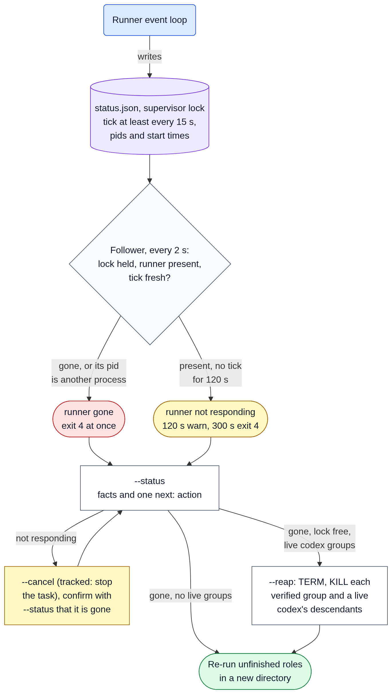

*d30-liveness — Runner liveness and recovery. Source:
[d30-liveness.mmd](docs/diagrams/d30-liveness.mmd).*

**How it works.** The launch publishes `RUNDIR/status.json` (mode 0600,
replaced atomically) on every role transition and at least every 15 s from
its event loop: the runner's pid and start identity, its state (`running`,
then `done`, `interrupted`, or `aborted` with the exit code), a tick
(sequence and time), and per role the state (`queued`, `active`,
`retry-wait`, `settled`), attempt, live codex pid and process group with the
leader's start identity, last-output time, and outcome. A process identity
is the pid plus its `ps -o lstart=` start time, read in the C locale and UTC
by one `ps` call bounded to 2 s; the same pid with another start time is
another process. A `ps` that fails or times out means "cannot tell", never
"gone". Readers ignore unknown fields and treat a field of the wrong type as
unknown.

After dispatch the follower checks every 2 s. A runner whose pid is gone, or
now belongs to another process, with no terminal line gives one
`[codex-council-follow] runner gone: pid=<pid>; unfinished=<ids>; live codex groups=<pgids or none>; run --status`
line and exit 4. A runner that is present but has published no tick for
120 s gives one `runner not responding` line (and `runner responding again`
on recovery), and exit 4 at 300 s. A wall-clock jump far beyond the
monotonic time between polls is treated as a system suspend and restarts
the tick age. The follower also exits 5 when its own parent disappears.

`--status RUNDIR` prints about ten lines of facts and exits 0: the runner's
state (`running`, `not responding`, `gone`, `done`, `interrupted`,
`aborted`, or `unknown`) with its pid and tick age, the settled count, one
line per unfinished role with its state, attempt, quiet seconds, and codex
pid, the live codex groups when the runner is gone, and one `next:` action.
Quiet seconds count from the last output recorded at the latest status
tick, so they can read up to 15 s high; the heartbeat in `err.log` uses the
live value.
`--reap RUNDIR` acts only when the runner is gone: it sends SIGTERM, then
SIGKILL, to each recorded group whose leader still has the recorded start
identity, reports and leaves alone every other group (and never its own),
and never touches saved threads, replies, or other files. Otherwise it
refuses with exit 1. Claude then re-runs the unfinished roles in a new
directory.

**Key decisions and why.**

- *Facts, not health.* A fresh tick shows the runner's event loop is
  turning; `quiet=Ns` shows time since the last output byte (in `--status`,
  as of the latest tick). Neither shows that a role is making progress, so
  no command claims health.
- *Identity, never command-line matching.* A pid alone can be reused, and a
  command line can be imitated; a pid plus its start time cannot.
- *Recovery stays with Claude.* A supervisor process would need its own
  supervision; the follower already watches the run, and `--reap` is an
  explicit, verified action.

**Limits.**

- A SIGKILLed runner cannot clean up by itself; its codex groups keep
  running until `--reap` ends them.
- A runner killed within milliseconds of starting a codex process can leave
  a group it never recorded.
- `--status` lists only the recorded codex process groups; `--reap` also
  ends the tool sessions a still-running codex started, but not a process
  that was already reparented away from the codex process tree.
- `--reap` leaves alone a group whose leader has exited, even if other
  members remain, because it cannot verify them.
- Liveness checks need a `ps` that supports `-A` and `-o pid,pgid,stat,lstart`;
  without one, commands report "unknown" instead of guessing.

## Testing and supported behavior

The suite needs no Codex install and no network. `tests/fake_codex.py` puts
a scripted `codex` (app-server and exec) with synthetic model ids on `PATH`,
and `tests/council_testlib.py` holds the shared helpers. Test modules follow
the concerns above: runner internals and the documentation contract
(`test_codex_council.py`), the CLI end to end (`test_codex_council_cli.py`),
discovery (`test_model_discovery.py`), selection (`test_model_selection.py`),
reply files and overrides (`test_replies_and_overrides.py`), liveness
(`test_liveness.py`), and the module layout (`test_module_layout.py`).
`tests/liveness_scenarios.py` runs the liveness scenarios end to end against
the real CLI and prints a verdict and the follower's line count for each: the
happy path, a descendant holding codex's output open, a SIGKILLed runner, a
stopped runner, a follower whose parent dies, a role that is silent for a
while and then succeeds, and a role whose stdout carries lines no JSON
parser accepts while its stderr keeps printing.

The documentation tests check behavior, not prose: every runner command a
document shows parses with the runner's own parser; every example of
discovery output, preflight plans, `err.log` lines, report lines, and failure
messages is regenerated from the runner and compared; every diagram a
document embeds exists with its Mermaid source; and SKILL.md stays in
workflow order and inside its compaction budget.

CI runs the suite on Python 3.12, 3.13, 3.14, and 3.15 and a pinned ruff.
`tests/test_live_codex.py` holds opt-in smoke tests against a real, signed-in
Codex (`CODEX_COUNCIL_LIVE_TESTS=1`). `scripts/build-docs.sh` rebuilds
`docs/codex-council.pdf` and, with `--diagrams`, re-renders the PNGs from
their `.mmd` sources.

## Non-goals

- **No role catalog, default role count, model roster, or model ranking.**
- **No peer messaging between roles** and no steering of a running role.
- **No worktree isolation.** Roles share the working tree.
- **No run-level deadline and no partial cancellation.**
- **No runner model-hopping.** After `[model-rejected]`, or a `[quota]` for
  one model's usage limit, the runner neither substitutes a model nor
  replays the role; Claude re-runs only that role in a new directory or asks
  the user.
- **No `codex debug models` fallback.** It is a second, experimental catalog
  format that cannot observe layered configuration, managed defaults, or the
  account, so it would add weaker evidence without closing a gap.
- **No post-run `thread/read` telemetry.** Its model and effort fields
  describe current or persisted configuration, not what served a turn.
- **No cross-run cache.** Each run discovers fresh evidence.
- **No profile forwarding.** The app-server refuses `--profile`, so discovery
  could not describe a profiled worker, and flattening a profile into `-c`
  overrides would change provenance.
- **No recommended-default routing.** The catalog's default marker is shown
  as `recommended` and never picked automatically.
- **No supervisor process.** Liveness is published by the runner and read by
  the follower and `--status`.
