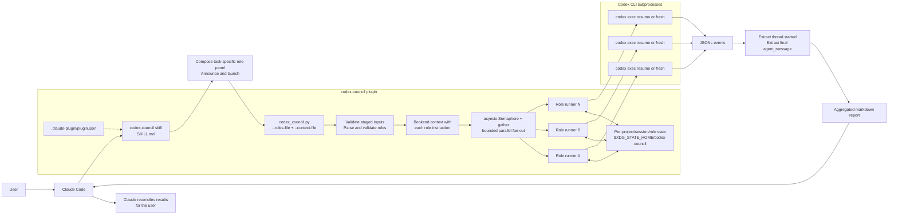
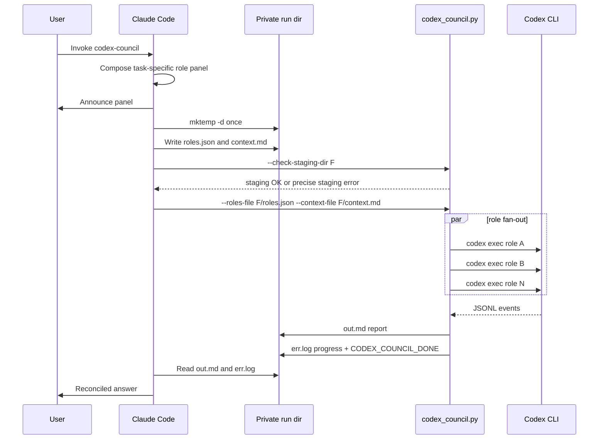
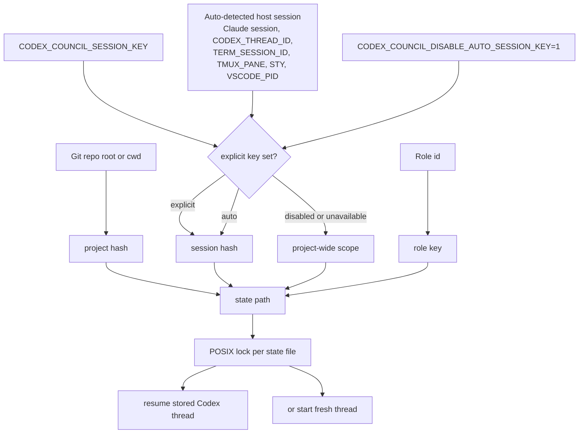

# codex-council

An adaptive, context-driven Claude Code plugin that coordinates **N role-framed
OpenAI Codex agents** around one shared goal. It is general-purpose with a
programmatic center of gravity—project implementation, computer science,
software and ML/AI engineering, DevSecOps, debugging/testing, and technical
research—while adapting beyond those domains. Agents investigate, build,
diagnose, research, challenge, or review from distinct lenses; Claude
reconciles their contributions into one coherent outcome.

## Prerequisites

- [Claude Code](https://claude.ai/code) — authenticated (`claude` in terminal)
- [OpenAI Codex CLI](https://developers.openai.com/codex/cli) — authenticated (`codex` in terminal)

Both must be logged in and working in your terminal before using this plugin.

## Install

```bash
claude plugins marketplace update
claude plugins marketplace add ehzawad/codex-council
claude plugins install codex-council@codex-council
```

Persists across sessions — no flags needed.

> Iterating on the plugin itself? See [For development](#for-development) for the author dev loop (symlink + SessionStart hook).

## Usage

```
/codex-council:codex-council
```

Claude reconstructs the live task model before composing roles: the problem and
project being implemented, what the user has edited or asked, in-flight files,
modules, objects, drafts, queries, tests, deployments, and research, active
bugs/errors and hypotheses, known unknowns and blind spots, unstated or possibly
wrong assumptions, and whether the work is converging or still exploratory.
It answers those contextual questions from conversation and workspace evidence,
asks the user only when a missing choice materially changes the work, announces
the resulting panel, and launches without a manual approval gate.

Strong natural-language triggers are:

```
ask codex council
codex council review
ask the codex coterie
codex coterie review
ask the codex team
reconcile with the codex team
```

The slash command or any of those three names means Codex Council. Nearby terms
such as "agent team," "subagents," "council review," or "fan out to agents"
are interpreted from the surrounding conversation rather than rejected by a
missing-string rule. Only genuinely ambiguous requests prompt a choice, with
`codex-council (Recommended)` first and `Claude dynamic workflow (ultracode)`—
Claude Code's built-in Agent subagents—second.

There is **no built-in role catalog**. Claude composes the panel on-the-fly per
invocation from the live problem, evidence, trajectory, uncertainty, and work
ownership—drafting role IDs, labels, and instructions tailored to what the user
is actually doing, then passing them to the script via `--roles-file`
(a path to the panel JSON) and `--context-file` (a staged context file
in the same private per-run directory). The script is a pure runner:
it reads those staged inputs, validates them before
launch, fans out bounded-parallel `codex exec` subprocesses, and aggregates
the replies. It imposes no size ceiling on the panel, role IDs, labels,
instructions, staged context, stdin, or composed prompts, and it never
truncates them. Actual model/provider context windows and available machine
memory remain external constraints and are surfaced as downstream failures.

Collaboration is shared-context and Claude-mediated: parallel roles do not
secretly chat with one another, so Claude reconciles each round and can feed
material findings into a focused follow-up round. For implementation in one
workspace, one executor/integrator owns writes by default while other roles
inspect, test, research, or propose; multiple writers require isolated
worktrees or serialized phases.

For long Claude Code sessions, "full context" means a decision-complete
working set rather than a raw transcript dump: the project/problem and current
trajectory; in-flight modules, artifacts, tests, errors, hypotheses, and
research; recent work in high fidelity; live primary evidence; known unknowns,
blind spots, assumptions, and provenance; plus older still-relevant history
summarized with its decisions, rejected paths, and invariants.

**General-purpose, with honest capability bounds.** The council uses an
AGI-style adaptive collaboration pattern: Claude derives roles from the actual
work instead of selecting from a domain catalog. Its strongest lean is complex
programmatic problem-solving—implementation, software/ML systems, DevSecOps,
testing, diagnosis, and evidence-based technical research—but the role synthesis
remains situational across other work. This is not a claim that the underlying
models are proven AGI; results still depend on the active Codex model, tools,
evidence, and task.

The JSON role spec, retries, and panel-proposal flow are documented in
[`plugins/codex-council/skills/codex-council/SKILL.md`](plugins/codex-council/skills/codex-council/SKILL.md).

## Architecture



## Launch Flow



## State Scope



## State

Council state lives at
`$XDG_STATE_HOME/codex-council/{project-hash}-{session-hash}__{role-key}.json`
when the runner can detect a stable host-session id. It auto-detects common
values such as Claude session ids, `CODEX_THREAD_ID`, `TERM_SESSION_ID`,
`TMUX_PANE`, `STY`, and `VSCODE_PID`, so separate terminal tabs/panes in the
same repo do not normally share role threads (except multiple integrated
terminals in the **same VS Code window**, which share `VSCODE_PID`; set
`CODEX_COUNCIL_SESSION_KEY` to isolate those). Follow-up calls from the same
host session still resume the same per-role thread. Long role IDs use a
deterministic hashed filename key, while the full ID is preserved in reports,
prompts, and state metadata; this avoids filesystem filename-length failures
without imposing an ID-length limit.

`CODEX_COUNCIL_SESSION_KEY` remains an explicit override for custom scoping
per branch or task. Set `CODEX_COUNCIL_DISABLE_AUTO_SESSION_KEY=1` only if you
want the older project-wide state file shape:
`{project-hash}__{role-key}.json`.

## Security

Codex runs with `--dangerously-bypass-approvals-and-sandbox` — no
approval prompts, no filesystem sandbox. This gives every Codex
sub-agent full read/write access to your machine so it can thoroughly
inspect the project. Do not use this plugin on untrusted projects or
with untrusted input — a prompt injection inside reviewed content can
steer all N agents.

The same bypass applies when reviewing any non-code material — a
prompt injection inside a Markdown draft, a CSV column header, or a
research excerpt is just as effective as one inside a code diff, and
non-code content has historically been less hardened against injection
than code review flows. Be deliberate about what you pipe in.

## Configuration

The script uses your Codex CLI defaults — model, reasoning effort, and
other settings come from `~/.codex/config.toml`. No model is hardcoded.
Sandbox and approval settings are overridden by the plugin (see
Security above).

Active role concurrency defaults to 6, matching the current
[Codex configuration default](https://learn.chatgpt.com/docs/config-file/config-reference#configtoml)
for `agents.max_threads`. If a positive user-level `agents.max_threads` is present,
the runner uses it as a conservative local concurrency signal; set
`CODEX_COUNCIL_MAX_PARALLEL` to a positive integer for an explicit council-only
override. Panels may be larger than active concurrency: excess roles queue in
the runner rather than being rejected or launched simultaneously. Because this
plugin launches separate `codex exec` processes, Codex's in-process agent
setting is a useful local preference, not a provider-capacity guarantee.

No wall-clock timeout is enforced — neither the council nor `codex
exec` imposes a run-level deadline, so a role runs as long as Codex
takes, hours or days. An actively-working role streams continuously,
so codex's per-request stream-idle guard never applies to it; that
guard only covers a stalled connection (and is retried). To widen it
for very long quiet stretches, raise
`model_providers.<id>.stream_idle_timeout_ms` and the retry counts in
your own `~/.codex/config.toml`. Ctrl+C tears down every codex process
group. While work remains, the runner writes a 30-minute status heartbeat to
the staged `err.log`; the skill uses Claude Code's native
[background-task mechanism](https://code.claude.com/docs/en/interactive-mode)
and, where available, [session-cron state](https://code.claude.com/docs/en/hooks)
to surface progress without a shell polling loop.

## For development

```bash
git clone https://github.com/ehzawad/codex-council.git
cd codex-council
claude plugins marketplace add ehzawad/codex-council    # skip if already added
claude plugins install codex-council@codex-council       # skip if already installed
./scripts/dev-link.sh
# restart Claude Code once
```

`scripts/dev-link.sh` does three things:

1. Creates a symlink at `~/.claude/plugins/cache/codex-council/codex-council/<version>/` → this repo's working tree, so edits are live at runtime.
2. Rewrites `~/.claude/plugins/installed_plugins.json` so the harness's `installPath` and `version` fields point at the symlinked version.
3. Prunes any stale sibling entries in the cache dir for other versions, so bumping `plugin.json` and re-running dev-link doesn't leave old directories or symlinks behind.

Step 2 is load-bearing: the harness loads whichever `installPath` the manifest declares, **not** whichever symlinks exist in the cache. Without the manifest rewrite, bumping the version in `plugin.json` and re-running dev-link creates a new symlink that the harness will happily ignore.

After the one-time restart, edits to `plugins/codex-council/**` are live on the next `/codex-council:codex-council` invocation. **SKILL.md caveat:** the Claude Code harness's skill-content caching behavior is not documented, so `SKILL.md` edits may still require a session restart; the script and the rest of the plugin files update live.

**Startup-overwrites-symlink caveat.** Claude Code re-validates the plugin cache on every session start and **replaces the symlink with a freshly-fetched copy from origin**. The documented "symlinks are preserved" property applies to runtime resolution, not startup validation. Two ways to handle it:

1. **Manual:** re-run `./scripts/dev-link.sh` after every Claude Code restart, any `claude plugins update`, any version bump in `plugin.json` (the cache path changes with the version), or any cache wipe.
2. **Automatic (recommended):** add a `SessionStart` hook to `~/.claude/settings.json` so the symlink is re-established on every session:

```json
{
  "hooks": {
    "SessionStart": [
      {
        "matcher": "",
        "hooks": [
          {
            "type": "command",
            "command": "bash -lc 'mkdir -p \"$HOME/.claude/logs\"; log=\"$HOME/.claude/logs/codex-council-dev-link.log\"; \"/absolute/path/to/codex-council/scripts/dev-link.sh\" >>\"$log\" 2>&1; rc=$?; if [ \"$rc\" -ne 0 ]; then printf \"%s dev-link failed exit=%s\\n\" \"$(date -u +%Y-%m-%dT%H:%M:%SZ)\" \"$rc\" >>\"$log\"; fi; exit 0'"
          }
        ]
      }
    ]
  }
}
```

Failures remain fail-open (`exit 0`) so a missing repo or broken dev-link script
never blocks session startup, but diagnostics are logged to
`~/.claude/logs/codex-council-dev-link.log`. Keep this fail-open behavior limited
to the development startup hook; council launch/context pipelines in `SKILL.md`
should fail closed with `set -euo pipefail`. Merge into your existing
`hooks.SessionStart` array if you already have one (don't replace it).

## License

MIT
