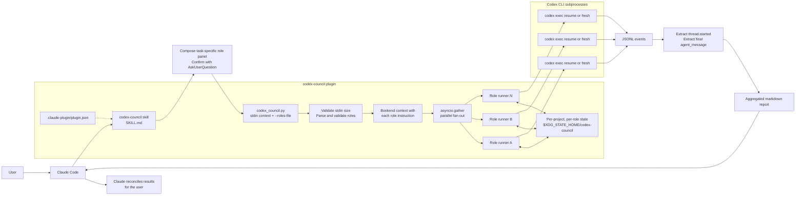

# codex-council

A Claude Code plugin that fans out the same context to **N parallel OpenAI
Codex sub-agents**, each framed with a role you decide per call. You,
Claude, and a council of Codex perspectives in the loop. Install once;
invoke from any Claude Code project.

## Prerequisites

- [Claude Code](https://claude.ai/code) — authenticated (`claude` in terminal)
- [OpenAI Codex CLI](https://developers.openai.com/codex/cli) — authenticated (`codex` in terminal)

Both must be logged in and working in your terminal before using this plugin.

## Install

```bash
claude plugins marketplace update
claude plugins marketplace add ehzawad/codex-council
claude plugins install codex-council@codex-council
```

Persists across sessions — no flags needed.

> Iterating on the plugin itself? See [For development](#for-development) for the author dev loop (symlink + SessionStart hook).

## Usage

```
/codex-council:codex-council
```

Claude looks at the current task, the relevant files or artifacts in
flight, and the judgment the user actually needs, composes a tailored
2–4 agent panel, and asks you to confirm via Claude Code's
`AskUserQuestion` tool. One click runs the panel as proposed;
alternatively you can adjust the count or roles. Each role keeps its
own Codex thread per project, so framings accumulate across calls if
you reuse role IDs.

Auto-trigger phrases (natural language) are restricted to:

```
ask codex council
codex council review
reconcile with codex team
codex team reconciliation
```

Broader phrases like "agent team," "agents in parallel," "subagents,"
"council review," "panel review," "codex agent team," "codex panel,"
or "fan out to codex agents" do **not** trigger this skill — they
route to Claude Code's built-in `Agent` tool (Claude subagents, a
different mechanism). The skill's SKILL.md enforces this with a
disambiguation gate.

There is **no built-in role catalog**. Claude composes the panel
on-the-fly per invocation — ultrathinking about the task, drafting
role ids, labels, and instructions tailored to what the user is
actually doing, then passing them to the script via `--roles-file`
(a path to the panel JSON). The script is a pure orchestrator: it
reads that JSON, fans out parallel `codex exec` subprocesses, and
aggregates the replies.

**Note on fit.** Codex is strongest where the task has technical,
structured, or evidence-checking surfaces. For tasks where a single
Claude pass is likely as good or better than a Codex council, don't
force a council — say so.

The JSON role spec, retries, and panel-proposal flow are documented in
[`plugins/codex-council/skills/codex-council/SKILL.md`](plugins/codex-council/skills/codex-council/SKILL.md).

## Architecture



## State

Council state lives at
`$XDG_STATE_HOME/codex-council/{project-hash}__{role-id}.json` (or
`{project-hash}-{session-hash}__{role-id}.json` when
`CODEX_COUNCIL_SESSION_KEY` is set). Set `CODEX_COUNCIL_SESSION_KEY`
before launching Claude Code to scope state per branch or task.

## Security

Codex runs with `--dangerously-bypass-approvals-and-sandbox` — no
approval prompts, no filesystem sandbox. This gives every Codex
sub-agent full read/write access to your machine so it can thoroughly
inspect the project. Do not use this plugin on untrusted projects or
with untrusted input — a prompt injection inside reviewed content can
steer all N agents.

The same bypass applies when reviewing any non-code material — a
prompt injection inside a Markdown draft, a CSV column header, or a
research excerpt is just as effective as one inside a code diff, and
non-code content has historically been less hardened against injection
than code review flows. Be deliberate about what you pipe in.

## Configuration

The script uses your Codex CLI defaults — model, reasoning effort, and
other settings come from `~/.codex/config.toml`. No model is hardcoded.
Sandbox and approval settings are overridden by the plugin (see
Security above).

No wall-clock timeout is enforced — neither the council nor `codex
exec` imposes a run-level deadline, so a role runs as long as Codex
takes, hours or days. An actively-working role streams continuously,
so codex's per-request stream-idle guard never applies to it; that
guard only covers a stalled connection (and is retried). To widen it
for very long quiet stretches, raise
`model_providers.<id>.stream_idle_timeout_ms` and the retry counts in
your own `~/.codex/config.toml`. Ctrl+C tears down every codex process
group.

## For development

```bash
git clone https://github.com/ehzawad/codex-council.git
cd codex-council
claude plugins marketplace add ehzawad/codex-council    # skip if already added
claude plugins install codex-council@codex-council       # skip if already installed
./scripts/dev-link.sh
# restart Claude Code once
```

`scripts/dev-link.sh` does three things:

1. Creates a symlink at `~/.claude/plugins/cache/codex-council/codex-council/<version>/` → this repo's working tree, so edits are live at runtime.
2. Rewrites `~/.claude/plugins/installed_plugins.json` so the harness's `installPath` and `version` fields point at the symlinked version.
3. Prunes any stale sibling entries in the cache dir for other versions, so bumping `plugin.json` and re-running dev-link doesn't leave old directories or symlinks behind.

Step 2 is load-bearing: the harness loads whichever `installPath` the manifest declares, **not** whichever symlinks exist in the cache. Without the manifest rewrite, bumping the version in `plugin.json` and re-running dev-link creates a new symlink that the harness will happily ignore.

After the one-time restart, edits to `plugins/codex-council/**` are live on the next `/codex-council:codex-council` invocation. **SKILL.md caveat:** the Claude Code harness's skill-content caching behavior is not documented, so `SKILL.md` edits may still require a session restart; the script and the rest of the plugin files update live.

**Startup-overwrites-symlink caveat.** Claude Code re-validates the plugin cache on every session start and **replaces the symlink with a freshly-fetched copy from origin**. The documented "symlinks are preserved" property applies to runtime resolution, not startup validation. Two ways to handle it:

1. **Manual:** re-run `./scripts/dev-link.sh` after every Claude Code restart, any `claude plugins update`, any version bump in `plugin.json` (the cache path changes with the version), or any cache wipe.
2. **Automatic (recommended):** add a `SessionStart` hook to `~/.claude/settings.json` so the symlink is re-established on every session:

```json
{
  "hooks": {
    "SessionStart": [
      {
        "matcher": "",
        "hooks": [
          {
            "type": "command",
            "command": "bash -c '/absolute/path/to/codex-council/scripts/dev-link.sh >/dev/null 2>&1 || true'"
          }
        ]
      }
    ]
  }
}
```

Failures are swallowed (`|| true`) so a missing repo or broken script never blocks session startup. Merge into your existing `hooks.SessionStart` array if you already have one (don't replace it).

## License

MIT
