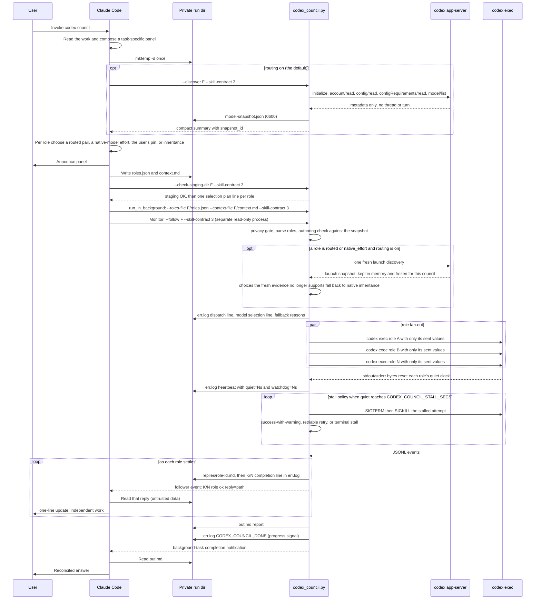
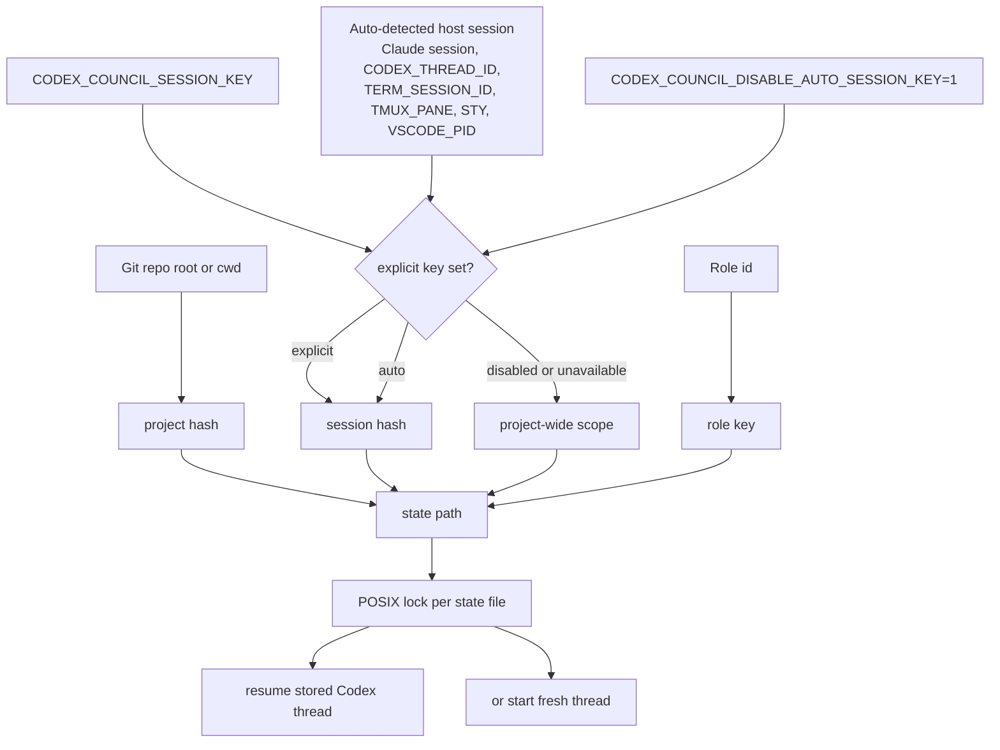

# codex-council

Independent cross-model verification and collaboration for Claude Code.
Claude identifies the claims, decisions, and results worth checking,
supplies the requirements and evidence, and briefs **one or more role-framed
OpenAI Codex agents** to challenge them from task-specific lenses. Roles can
also investigate, reproduce, test, research, or implement authorized work.
Claude checks their evidence, reconciles their contributions into one
result, and stays responsible for it.

The plugin is general-purpose with a programmatic center of gravity—project
implementation, computer science, software and ML/AI engineering, DevSecOps,
debugging/testing, and technical research—while adapting beyond those
domains. Each Codex role runs on a model and reasoning effort discovered at
runtime for its lens, or on your native Codex configuration. Claude itself
keeps the host session's model and effort; council routing controls only the
external Codex workers.

## Prerequisites

- [Claude Code](https://claude.ai/code) — authenticated (`claude` in terminal)
- [OpenAI Codex CLI](https://learn.chatgpt.com/docs/codex/cli) — authenticated (`codex` in terminal)
- Python 3.10 or later on macOS or Linux (the runner uses only the standard
  library and POSIX process groups)

Both CLIs must be logged in and working in your terminal before using this
plugin. Model discovery was verified against codex-cli 0.157.1. If a Codex
build cannot answer it, discovery reports itself unavailable and roles
inherit your native configuration unless you pinned a model or effort.

## Install

```bash
claude plugins marketplace update
claude plugins marketplace add ehzawad/codex-council
claude plugins install codex-council@codex-council
```

Persists across sessions — no flags needed.

> Iterating on the plugin itself? See [For development](#for-development) for the author dev loop (symlink + SessionStart hook).

## Usage

```
/codex-council:codex-council
```

The plugin ships a single skill (no separate `commands/` directory), so the
slash form relies on Claude Code exposing plugin skills as slash commands — a
capability of current Claude Code releases whose exact minimum version is not
documented in the changelog. If the slash command is not available on your
version, invoke the skill with the natural-language triggers below instead;
they work on any plugin-capable release.

Claude reads the live work before composing roles: what the user is trying to
achieve, what is in flight, what is failing or uncertain, and which
assumptions might be wrong. For a verification role it names the claim to
check, the failure modes that would disprove it, the evidence the role needs,
and when to stop, and it never presents a role's review of its own
implementation as independent verification. It asks the user only when a
missing choice materially changes the work, announces the resulting panel,
and launches without a manual approval gate.

The panel is sized to the work, with no default count. A focused bug, a single
review, or one research question usually gets one role; two separable concerns
get two or three; broad work with several independent tracks gets four, five,
or more. A role is added only when it brings a lens the others would not.

Strong natural-language triggers are:

```
ask codex council
codex council review
ask the codex coterie
codex coterie review
ask the codex team
reconcile with the codex team
```

The slash command or any of those three names means Codex Council. Nearby terms
such as "agent team," "subagents," "council review," or "fan out to agents"
are interpreted from the surrounding conversation rather than rejected by a
missing-string rule. Only genuinely ambiguous requests prompt a choice, with
`codex-council (Recommended)` first and `Claude dynamic workflow (ultracode)`—
Claude Code's native orchestration, with built-in Agent subagents or an
ultracode dynamic workflow—second. In a non-interactive host such as
`claude -p`, Claude states the ambiguity instead of asking.

There is **no built-in role catalog**. Claude composes the panel on-the-fly per
invocation from the live problem, evidence, trajectory, uncertainty, and work
ownership—drafting role IDs, labels, and instructions tailored to what the user
is actually doing, then passing them to the script via `--roles-file`
(a path to the panel JSON) and `--context-file` (a staged context file
in the same private per-run directory). The script is a pure runner:
it records the run's model snapshot when asked, reads the staged inputs,
validates them before launch, fans out bounded-parallel `codex exec`
subprocesses, and aggregates the replies. It imposes no size ceiling on the
panel, role IDs, labels, instructions, staged context, stdin, or composed
prompts, and it never truncates them. Actual model/provider context windows
and available machine memory remain external constraints and are surfaced as
downstream failures.

Each role also gets a model and effort decision. Claude runs a bounded,
metadata-only discovery for the run, then gives each role a model and effort
pair from that run's catalog, an effort adjustment on your proven native
model, or plain native inheritance, and pins exactly what the user asked for
when the user names a model or effort. Adaptive routing is the default and can
be turned off; see [Configuration](#configuration).

Collaboration is shared-context and Claude-mediated: roles do not chat with one
another during a run, so Claude reconciles each round and can feed material
findings into a focused follow-up round. Each role's reply is written to
`replies/<role>.md` in the run directory the moment that role settles (long
ids are hashed; use the path printed after `reply=`), and Claude follows the
run with the read-only `codex_council.py --follow` command (one Claude Code
Monitor event per progress line). Claude can therefore read a
finished role, update the user, and act on independent work while slower
roles continue; the final verdict and anything that crosses roles still wait
for the full report. When several roles share one workspace, one role owns
writes while the others inspect, test, research, or propose; multiple writers
need serialized phases.

For long Claude Code sessions, "full context" means a decision-complete
working set rather than a raw transcript dump. It leads with the objective,
the acceptance criteria, and the question to verify; labels Claude's own
conclusions as claims, with the evidence against them; and then covers the
project/problem and current trajectory, in-flight modules, artifacts, tests,
errors, hypotheses, and research, recent work in high fidelity, live primary
evidence, known unknowns, blind spots, assumptions, and provenance, plus older
still-relevant history summarized with its decisions, rejected paths, and
invariants.

**General-purpose, with honest capability bounds.** Claude derives roles from
the actual work instead of selecting from a domain catalog. The strongest lean
is complex programmatic problem-solving—implementation, software/ML systems,
DevSecOps, testing, diagnosis, and evidence-based technical research—but role
synthesis stays situational across other work. Results depend on the Codex
model and effort each role runs on, its tools, the evidence, and the task.

The JSON role spec and launch flow are documented in
[`plugins/codex-council/skills/codex-council/SKILL.md`](plugins/codex-council/skills/codex-council/SKILL.md);
panel sizing, model and effort choice, context assembly, following a run, and
recovery live in its `references/` directory.

## Architecture


```mermaid
flowchart LR
    User["User"] --> Claude["Claude Code"]
    Claude --> Skill["codex-council skill<br/>SKILL.md"]
    Skill --> Panel["Read the work, size the panel: 1..N roles<br/>choose each role's model and effort or inherit<br/>announce and launch"]
    Panel --> Discover["codex_council.py --discover RUNDIR<br/>metadata only, bounded to 20s"]
    Panel --> Script["codex_council.py<br/>--roles-file + --context-file"]

    subgraph Plugin["codex-council plugin"]
        Manifest[".claude-plugin/plugin.json"] -.-> Skill
        Discover --> Snapshot["RUNDIR/model-snapshot.json<br/>native configuration, catalog,<br/>routing eligibility"]
        Snapshot -.->|"catalog descriptions"| Panel
        Script --> Validate["Launch-side privacy gate<br/>validate staged inputs<br/>parse roles and selections"]
        Validate --> Select["Resolve each role's selection<br/>authoring check against the snapshot (exit 2)<br/>one launch discovery if a role is automatic<br/>native, user, routed, native_effort, or fallback"]
        Snapshot --> Select
        Select --> Prompt["Bookend context with<br/>each role instruction"]
        Prompt --> Fanout["asyncio.Semaphore + gather<br/>bounded parallel fan-out"]

        Fanout --> RoleA["Role runner A"]
        Fanout --> RoleB["Role runner B"]
        Fanout --> RoleN["Role runner N"]

        RoleA <--> State["Per-project/session/role state<br/>$XDG_STATE_HOME/codex-council"]
        RoleB <--> State
        RoleN <--> State

        RoleA --> Live["Liveness layer per subprocess<br/>incremental stdout/stderr readers<br/>output-inactivity watchdog<br/>CODEX_COUNCIL_STALL_SECS"]
        RoleB --> Live
        RoleN --> Live
    end

    subgraph Codex["Codex CLI"]
        AppServer["codex app-server over stdio<br/>read-only metadata methods<br/>no thread or turn"]
        Live --> ExecA["codex exec [-m model] [-c effort]<br/>only the values the decision sends<br/>resume or fresh"]
        Live --> ExecB["codex exec [-m model] [-c effort]<br/>only the values the decision sends<br/>resume or fresh"]
        Live --> ExecN["codex exec [-m model] [-c effort]<br/>only the values the decision sends<br/>resume or fresh"]
    end

    Discover <--> AppServer
    Select <--> AppServer
    ExecA --> JSONL["JSONL events"]
    ExecB --> JSONL
    ExecN --> JSONL
    JSONL --> Parse["Extract thread.started<br/>Extract final agent_message<br/>Classify failures"]
    Parse --> Replies["Per-role reply files<br/>replies/role-id.md as each settles<br/>then K/N completion line in err.log"]
    Parse --> Report["Aggregated markdown report<br/>out.md, with what each role was sent"]
    Replies --> Follow["--follow via Monitor<br/>relays progress lines<br/>drops reply= paths outside replies/"]
    Follow --> Early["Claude reads each reply as it lands<br/>acts on independent work"]
    Report --> Done["Background-task completion<br/>notification"]
    Early --> Reconcile["Claude checks the evidence<br/>and reconciles results for the user"]
    Done --> Reconcile
```

## Launch Flow


```mermaid
sequenceDiagram
    participant U as User
    participant C as Claude Code
    participant F as Private run dir
    participant S as codex_council.py
    participant A as codex app-server
    participant X as codex exec

    U->>C: Invoke codex-council
    C->>C: Read the work and compose a task-specific panel
    C->>F: mktemp -d once
    opt routing on (the default)
        C->>S: --discover F --skill-contract 3
        S->>A: initialize, account/read, config/read, configRequirements/read, model/list
        A-->>S: metadata only, no thread or turn
        S->>F: model-snapshot.json (0600)
        S-->>C: compact summary with snapshot_id
    end
    C->>C: Per role choose a routed pair, a native-model effort, the user's pin, or inheritance
    C->>U: Announce panel
    C->>F: Write roles.json and context.md
    C->>S: --check-staging-dir F --skill-contract 3
    S-->>C: staging OK, then one selection plan line per role
    C->>S: run_in_background: --roles-file F/roles.json --context-file F/context.md --skill-contract 3
    C->>S: Monitor: --follow F --skill-contract 3 (separate read-only process)
    S->>S: privacy gate, parse roles, authoring check against the snapshot
    opt a role is routed or native_effort and routing is on
        S->>A: one fresh launch discovery
        A-->>S: launch snapshot, kept in memory and frozen for this council
        S->>S: choices the fresh evidence no longer supports fall back to native inheritance
    end
    S->>F: err.log dispatch line, model selection line, fallback reasons
    par role fan-out
        S->>X: codex exec role A with only its sent values
        S->>X: codex exec role B with only its sent values
        S->>X: codex exec role N with only its sent values
    end
    X-->>S: stdout/stderr bytes reset each role's quiet clock
    S->>F: err.log heartbeat with quiet=Ns and watchdog=Ns
    loop stall policy when quiet reaches CODEX_COUNCIL_STALL_SECS
        S->>X: SIGTERM then SIGKILL the stalled attempt
        S->>S: success-with-warning, retriable retry, or terminal stall
    end
    X-->>S: JSONL events
    loop as each role settles
        S->>F: replies/role-id.md, then K/N completion line in err.log
        S-->>C: follower event: K/N role ok reply=path
        C->>F: Read that reply (untrusted data)
        C->>U: one-line update, independent work
    end
    S->>F: out.md report
    S->>F: err.log CODEX_COUNCIL_DONE (progress signal)
    S-->>C: background-task completion notification
    C->>F: Read out.md
    C->>U: Reconciled answer
```

## State Scope


```mermaid
flowchart TD
    Project["Git repo root or cwd"] --> ProjectHash["project hash"]
    Role["Role id"] --> RoleKey["role key"]

    Explicit["CODEX_COUNCIL_SESSION_KEY"] --> Scope{"explicit key set?"}
    Auto["Auto-detected host session<br/>Claude session, CODEX_THREAD_ID,<br/>TERM_SESSION_ID, TMUX_PANE, STY, VSCODE_PID"] --> Scope
    Disable["CODEX_COUNCIL_DISABLE_AUTO_SESSION_KEY=1"] --> Scope

    Scope -->|"explicit"| SessionHash["session hash"]
    Scope -->|"auto"| SessionHash
    Scope -->|"disabled or unavailable"| ProjectOnly["project-wide scope"]

    ProjectHash --> StatePath["state path"]
    SessionHash --> StatePath
    ProjectOnly --> StatePath
    RoleKey --> StatePath

    StatePath --> Lock["POSIX lock per state file"]
    Lock --> Resume["resume stored Codex thread"]
    Lock --> Fresh["or start fresh thread"]
```

## State

Council state lives at
`$XDG_STATE_HOME/codex-council/{project-hash}-{session-hash}__{role-key}.json`
when the runner can detect a stable host-session id. It auto-detects common
values such as Claude session ids, `CODEX_THREAD_ID`, `TERM_SESSION_ID`,
`TMUX_PANE`, `STY`, and `VSCODE_PID`, so separate terminal tabs/panes in the
same repo do not normally share role threads (except multiple integrated
terminals in the **same VS Code window**, which share `VSCODE_PID`; set
`CODEX_COUNCIL_SESSION_KEY` to isolate those). Follow-up calls from the same
host session still resume the same per-role thread. Long role IDs use a
deterministic hashed filename key, while the full ID is preserved in reports,
prompts, and state metadata; this avoids filesystem filename-length failures
without imposing an ID-length limit.

`CODEX_COUNCIL_SESSION_KEY` remains an explicit override for custom scoping
per branch or task. Set `CODEX_COUNCIL_DISABLE_AUTO_SESSION_KEY=1` only if you
want the older project-wide state file shape:
`{project-hash}__{role-key}.json`.

State records a role's Codex thread id and bookkeeping (role id, project
path, session key, update time), never a model, effort, or selection, so a
routed choice never becomes a role's default for a later run.

## Security

Codex runs with `--dangerously-bypass-approvals-and-sandbox` — no
approval prompts, no filesystem sandbox. This gives every Codex
sub-agent full read/write access to your machine so it can thoroughly
inspect the project. Do not use this plugin on untrusted projects or
with untrusted input — a prompt injection inside reviewed content can
steer every agent.

The same bypass applies when reviewing any non-code material — a
prompt injection inside a Markdown draft, a CSV column header, or a
research excerpt is just as effective as one inside a code diff, and
non-code content has historically been less hardened against injection
than code review flows. Be deliberate about what you pipe in.

Model discovery only reads metadata. It keeps the account type and whether
OpenAI sign-in is required, never an email address, plan, account id,
workspace routing, or token, and it treats catalog text as data: the summary
Claude reads quotes every description, and all catalog-derived text is kept
on single lines in logs and reports.

## Configuration

### Native configuration in the worker's execution context

A role that omits `model`, `effort`, and `selection` inherits Codex's native
configuration. The runner then sends no `-m` and no
`-c model_reasoning_effort=...`, and Codex resolves the model and effort
itself, as it would for a `codex exec` started in the same place. No model is
hardcoded, and the plugin never sends a placeholder such as `inherit` or
`default` as a model id. Sandbox and approval settings are overridden by the
plugin (see Security above).

Codex resolves configuration from layers, highest precedence first (see
[Config basics](https://learn.chatgpt.com/docs/config-file/config-basic)):

1. CLI flags and `--config` overrides — for a council worker, the only
   model-related ones are the per-role `-m` and `-c model_reasoning_effort`
   values the runner sends;
2. project `.codex/config.toml` files, from the project root down to the
   working directory, in trusted projects only;
3. a profile file selected with `--profile` (see
   [Advanced configuration](https://learn.chatgpt.com/docs/config-file/config-advanced));
   the runner never passes one;
4. your user configuration, `$CODEX_HOME/config.toml` (`CODEX_HOME` defaults
   to `~/.codex`);
5. cloud-managed `config.toml` defaults for your signed-in workspace;
6. system configuration, `/etc/codex/config.toml`;
7. built-in defaults.

Organizations can add
[managed configuration](https://learn.chatgpt.com/docs/enterprise/managed-configuration):
enforced `requirements.toml` constraints, and managed new-thread defaults
(`[models.new_thread]`) that take priority over user and project defaults
for new threads. Per the
[configuration reference](https://learn.chatgpt.com/docs/config-file/config-reference),
an explicit override of **either** the model **or** the reasoning effort
makes Codex ignore **both** of those managed defaults, so pinning only an
effort can change the model too. Legacy managed defaults
(`managed_config.toml` or macOS managed preferences) take precedence even over
CLI `--config` overrides, so on a machine that uses them a value the council
sends may not be the one that runs.

**Where workers run.** Every worker runs as `codex exec -C <root>`, where
`<root>` is the Git top level of the directory the council was launched from,
or that directory itself outside Git. Workers use the `codex` found on `PATH`
and inherit the runner's working directory and environment, including
`CODEX_HOME` and any credentials. The runner forwards no `--profile`, so a
profile selected in another Codex session does not apply to the council.
Discovery spawns the app-server the same way and reads the configuration
Codex resolves for that same root, so a `.codex/config.toml` in a
subdirectory below the root is not part of the council's baseline. Launch the
council from the project whose Codex configuration you want it to use.

**`CODEX_API_KEY`.** `codex exec` honors `CODEX_API_KEY`, but the app-server
does not (see
[environment variables](https://learn.chatgpt.com/docs/config-file/environment-variables)
and [authentication](https://learn.chatgpt.com/docs/auth)). When it is set,
discovery records only that it is present, and automatic routing and
native-model effort adjustment are unavailable, because the catalog could
describe a different account than the one workers use.

### Runtime model routing

Per-role routing is the skill's default. Before writing `roles.json`, Claude
runs discovery on the private run directory:

```bash
python3 "${CLAUDE_PLUGIN_ROOT}/skills/codex-council/scripts/codex_council.py" \
  --discover 'ABS_RUNDIR' --skill-contract 3
```

Discovery talks to the installed Codex through
[`codex app-server`](https://learn.chatgpt.com/docs/app-server) over stdio
and asks for five things only: the handshake, the account type, the
configuration Codex resolves for the project root, managed requirements, and
the model catalog (`initialize`, `account/read`, `config/read`,
`configRequirements/read`, `model/list`). It never starts a thread or a turn,
never logs in, and is bounded to 20 seconds. It writes
`ABS_RUNDIR/model-snapshot.json` (mode 0600) and prints a compact summary:
the native model and effort and the kind of layer each came from, managed
new-thread defaults, whether routing is eligible, whether effort can be
adjusted on the native model, and each advertised model with its description
and advertised efforts. Hidden models are listed by name only, for explicit
pins. There is no cross-run cache: every run directory gets its own snapshot.
`--discover` exits 0 even when discovery is unavailable or `codex` is missing;
the summary then says that roles must inherit.

Routing is eligible only when routing is on, discovery completed, the catalog
is complete and well-formed, you are signed in, the configured provider is the
default OpenAI one with no managed provider or model-catalog override,
`CODEX_API_KEY` is not set, and no managed new-thread defaults are present.
The summary lists every reason that fails. Adjusting only the effort on the
native model has its own proof: discovery completed, no managed new-thread
defaults, a matching provider, no `CODEX_API_KEY`, a configured model, and a
well-formed catalog entry for exactly that model (a hidden one counts), so its
efforts are known. Available models, efforts, and defaults depend on the
client and the account, so the catalog is evidence of what is advertised to
you, not a guarantee of access. Its recommended marker is never treated as
your configured model.

Claude picks per role from this ladder:

1. a routed model and effort pair from this run's snapshot, when the catalog's
   model and effort descriptions fit the role's demands;
2. otherwise the proven native model with only the effort adjusted;
3. otherwise native inheritance of both.

It matches the role to the catalog's descriptions, never to ids, version
numbers, catalog order, the recommended marker, or remembered reputations. It
keeps the role carrying the hardest judgment on a strong setting and avoids an
effort whose description changes how Codex executes, such as automatic
delegation, unless the role calls for it. Sparse or conflicting evidence means
step 2 or step 3.

Each role declares where its values came from in a `selection` object:

| Role JSON | What the runner sends | Checked against |
|---|---|---|
| no `model`, `effort`, or `selection` | nothing (native inheritance) | nothing |
| `model` and/or `effort` with `"selection": {"mode": "user"}` | the pin, unchanged | nothing; advisory notes only |
| `model` and `effort` with `"selection": {"mode": "routed", "snapshot_id": ..., "reason": ...}` | `-m <model>` and the effort | this run's snapshot, then launch discovery |
| `effort` only, with `"selection": {"mode": "native_effort", "snapshot_id": ..., "reason": ...}` | `-m <proven native model>` and the effort | this run's snapshot, then launch discovery |

`snapshot_id` is the id `--discover` printed for this run, and `reason` is a
non-empty single line. For example, one role object (synthetic ids; real
values are copied from your snapshot):

```json
{
  "id": "boundary-checks",
  "label": "Boundary checks",
  "instruction": [
    "Verify the claim that every parser path rejects an empty header.",
    "If nothing material falls in your lens, say so clearly.",
    "Thoroughness beats speed."
  ],
  "model": "future-vega-2033",
  "effort": "brisk",
  "selection": {
    "mode": "routed",
    "snapshot_id": "0ddc08d1899d8bb5",
    "reason": "narrow bounded check; the catalog describes this model for fast checks"
  }
}
```

**Preflight.** `--check-staging-dir` runs no discovery. It checks each
automatic selection against `ABS_RUNDIR/model-snapshot.json` and prints the
plan, one line per role:

```
[codex-council] staging OK: ABS_RUNDIR (4 roles; max parallel 6) version=1.0.0
[codex-council] selection plan: inherited-lens: native inheritance
[codex-council] selection plan: boundary-checks: routed (model future-vega-2033, effort brisk); revalidated at launch
[codex-council] selection plan: design-judgment: native-model effort (effort adaptive-v2 on native model future-orion-2032); revalidated at launch
[codex-council] selection plan: user-pinned: explicit override (model acme/future-review-2034:rev2); unverified: not in the discovered catalog; forwarded unchanged
```

With routing on, an automatic selection the snapshot does not support is an
authoring defect: the preflight and the launch exit 2 before any worker
starts, with the usual whole-file rewrite recovery. That covers a missing,
unreadable, or malformed snapshot, a `snapshot_id` that is not this run's,
routing unavailable (for a routed pair), a model that is not an advertised
execution id (a catalog's picker id or display name is not what `-m`
receives, and the message names the right id), a hidden model or one whose
advertised retirement has passed, an effort that model does not advertise,
and native-model effort when the native model is not proven.

**Launch revalidation.** When a role is `routed` or `native_effort` and
routing is on, the launch runs one fresh discovery after validating its inputs
and before any worker starts, and uses it for the whole council. The planning
snapshot is never overwritten. A choice the fresh evidence no longer supports
falls back to native inheritance with the reason logged, instead of failing
the run. That covers discovery now unavailable, routing now ineligible for a
routed pair, a model that is gone, hidden, or retired, an effort no longer
advertised, or a native model no longer proven. `native_effort` pins the
native model that launch discovery proves. A council of only inherited and
explicit roles runs no launch discovery at all.

**`CODEX_COUNCIL_MODEL_ROUTING`.** Unset, empty, or `auto` keeps routing on.
`off` turns automatic selection off: `routed` and `native_effort` roles
resolve to native inheritance and no launch discovery runs, while explicit
pins still apply. Any other value is a usage error (exit 2) in preflight,
launch, and `--discover`.

**Explicit pins.** A model or effort the user asked for is declared
`"selection": {"mode": "user"}` (optionally with a single-line `reason`) and
is forwarded unchanged. It is never replaced, never routed around, and never
rejected for being absent from the catalog, so custom-provider model ids keep
working. Discovery only annotates a pin: a model not in the catalog, or an
effort the catalog does not advertise for that model, gets an "unverified"
note in the preflight plan and the report. Pinning only one of model and
effort while managed new-thread defaults are present or unknown gets a
"partial pin" note, because Codex then ignores both managed defaults.

**Overrides are per invocation.** A role's values are sent on every
invocation, fresh and resume alike (`-m` and `-c` sit before the `resume`
subcommand), and are never sticky. With codex-cli 0.157.1, a resumed thread
that sends none runs on the current native configuration, not on the model
the thread was recorded with, and Codex's own advisory about that change is
kept verbatim as a role warning (`codex reported: ...`).

**What reports claim.** `codex exec` reports neither the model nor the effort
that served a turn, so the council reports what it sent. In `err.log`, the
dispatch line is followed by
`[codex-council] model selection: routing=<auto|off>; discovery=<ok|unavailable|not-run>...`
with a count per provenance (`native`, `user`, `routed`, `native_effort`,
`fallback`), and one
`[codex-council:<id>] routing fell back to native inheritance: <reason>` line
per fallback. In `out.md`, each Summary line notes what the role sent, a
`Model selection:` paragraph follows the Summary, and every role section
opens with a `_Model selection: ..._` line. Reply-file headers carry
`selection=` plus the sent `model=` and `effort=`, and a fallback also names
the `requested_model=` and `requested_effort=`.

**Model and quota failures.** When Codex rejects the model for an
invocation—a structured `model_not_found`, or Codex's own complete rejection
sentence—the role fails as `[model-rejected]`. That failure is terminal. It
is not retried, no substitute model is tried, it never clears a saved thread,
and the message quotes Codex and names one next step: re-run the role with
`model`, `effort`, and `selection` omitted (automatic choices), change or
remove the pin (user pins), or update the Codex configuration or pin an
available model (native inheritance). A usage, quota, or credit limit fails
as `[quota]`, which is terminal and never retried, even when the provider
reports it as HTTP 429.

### Other settings

Codex CLI 0.156.0 deprecated the `personality` setting (it no longer selects
a response style), so a `personality = ...` line in your Codex `config.toml`
is inert. You can leave it or remove it.

Active role concurrency defaults to 6. If a positive user-level
`agents.max_threads` is set in `$CODEX_HOME/config.toml`, the runner uses it
as a conservative local concurrency signal (current Codex documentation lists
that key as a legacy alias of `agents.max_concurrent_threads_per_session`,
which the runner does not read); set `CODEX_COUNCIL_MAX_PARALLEL` to a
positive integer for an explicit council-only override. Panels may be larger
than active concurrency: excess roles queue in the runner rather than being
rejected or launched simultaneously. Because this plugin launches separate
`codex exec` processes, Codex's in-process agent setting is a useful local
preference, not a provider-capacity guarantee.

The council has no total elapsed-time or run-level deadline. A role may run
indefinitely while its codex subprocess continues producing output bytes, and
a council call takes as long as its slowest role. Only the host bounds it:
Claude Code ends its background tasks when it exits, so keep the session (and,
under `claude -p`, the turn) open until the council's task has ended.
Separately, each codex subprocess has an **output-inactivity watchdog** based
only on the time since its most recent stdout/stderr byte: after
`CODEX_COUNCIL_STALL_SECS` seconds
of council-visible silence (default 1800; positive integer override; 0
disables), the runner terminates that attempt and applies the stall policy —
retried as `[retriable:stall]` when no tool work had begun,
success-with-warning when the turn had already completed, terminal `[stall]`
otherwise. Setting 0 may again permit an indefinitely silent role. Byte
silence is not proof of a wedge: current codex `exec --json` suppresses
agent-message/reasoning deltas, so a healthy role can be byte-silent for long
stretches — the heartbeat's `quiet=Ns` measures bytes, not progress. Codex's
own per-provider stream-idle guard
(`model_providers.<id>.stream_idle_timeout_ms`) remains a separate,
provider-scoped control in your own Codex configuration. Ctrl+C tears down
every codex process group. While work remains, the runner writes a status
heartbeat to the staged `err.log` — cadence adapts to the watchdog
(`stall_secs / 3`, bounded 300–1800s; every 600s at the default watchdog,
every 1800s when disabled) and each line carries per-role `quiet=Ns` (or
`retry-wait` during backoff), the `watchdog=` threshold, and the plugin
`version=`. Each completion line ends with `reply=<path>` pointing at that
role's reply file. The skill follows the run with a Claude Code Monitor on
`codex_council.py --follow <run dir>`, re-armed whenever a monitor expires
while the background task is still running, and falls
back to a one-shot session-cron wake-up or the native
[background-task mechanism](https://code.claude.com/docs/en/interactive-mode)
when Monitor is unavailable, so progress surfaces without a shell polling loop.

## 1.0.0 changes

- **Runtime model discovery.** `codex_council.py --discover RUNDIR` records
  this run's native configuration and model catalog in
  `RUNDIR/model-snapshot.json`, using metadata only.
- **Per-role selection.** Role objects accept a `selection` object next to
  the optional `model` and `effort`: `user` for an explicit pin, `routed` or
  `native_effort` for a choice grounded in this run's snapshot. Omitting all
  three inherits native configuration. Adaptive routing is on by default and
  `CODEX_COUNCIL_MODEL_ROUTING=off` turns it off.
- **Launch revalidation.** Automatic choices are checked again by one fresh
  discovery at launch and fall back to native inheritance, with the reason
  logged, when the evidence changed.
- **Honest reporting.** `err.log`, the report, and reply-file headers say
  what each role was sent and why; nothing claims which model ran.
- **New failure tags.** `[model-rejected]` and `[quota]` are terminal and
  never retried, and a model rejection never clears a saved thread.
- **Verifier framing.** The collaboration brief tells each role it is an
  independent cross-model check: the user's requirements are authoritative,
  Claude's account of the work is a set of claims to verify, and verified
  evidence stays separate from inference.
- **No model roster.** The skill and its references name no models and carry
  no effort tables; capability comes from discovery.
- **Skill contract epoch 3.** The SKILL templates pass `--skill-contract 3`.

### Migration notes for direct CLI users upgrading from v0.10.0

- A role file without `--skill-contract` keeps working: a `model` or `effort`
  with no `selection` is still an explicit user pin, and a role without them
  still inherits.
- With `--skill-contract 3`, every `model` or `effort` must declare a
  `selection` object. The previous epoch is refused as a stale SKILL/script
  pair.
- `model` and `effort` share one grammar,
  `^[A-Za-z0-9][A-Za-z0-9._:/@+-]*$`, with case preserved. Effort values are
  no longer limited to lowercase letters (`High` and `x-high` are accepted),
  and model values may contain `@` and `+`. `inherit` and `default`, in any
  case, are refused as model values; omit the keys to inherit.
- A key repeated at any level of `roles.json`, or a `NaN` or `Infinity`
  value, is rejected (exit 2).
- A quota or credit failure that carries HTTP 429 is now `[quota]` and is not
  retried; before, it could be retried once as `[retriable:rate-limit]`.
- Each role section in `out.md` and in its reply file now starts with a
  `_Model selection: ..._` line, the report adds a `Model selection:`
  paragraph after the Summary, and reply-file headers add `selection=`. Their
  `model=` and `effort=` fields mean the values sent.
- Unchanged since v0.9.0: every on-disk input's parent directory must be a
  private (0700), user-owned, non-symlink directory at launch as well as at
  preflight, for example one created by `mktemp -d`. A public or symlinked
  parent is refused with an abandon-this-directory recovery.

## For development

```bash
git clone https://github.com/ehzawad/codex-council.git
cd codex-council
claude plugins marketplace add ehzawad/codex-council    # skip if already added
claude plugins install codex-council@codex-council       # skip if already installed
./scripts/dev-link.sh
# restart Claude Code once
```

`scripts/dev-link.sh` does three things:

1. Creates a symlink at `~/.claude/plugins/cache/codex-council/codex-council/<version>/` → this repo's working tree, so edits are live at runtime.
2. Rewrites `~/.claude/plugins/installed_plugins.json` so the harness's `installPath` and `version` fields point at the symlinked version.
3. Prunes any stale sibling entries in the cache dir for other versions, so bumping `plugin.json` and re-running dev-link doesn't leave old directories or symlinks behind.

Step 2 is the one that matters: the harness loads whichever `installPath` the manifest declares, **not** whichever symlinks exist in the cache. Without the manifest rewrite, bumping the version in `plugin.json` and re-running dev-link creates a new symlink that the harness will happily ignore.

Two skew guards help here. The runner prints `version=<plugin version>` in the
preflight "staging OK" line, the dispatch line, the heartbeat, and the
`CODEX_COUNCIL_DONE` sentinel, and the model snapshot records
`plugin_version` — postmortem **visibility** into which plugin version
actually ran, not skew prevention. And `SKILL.md`'s command templates pass
`--skill-contract 3`: if the linked script's contract epoch differs, the
invocation is refused (exit 2) as a stale SKILL/script pair — re-run
`scripts/dev-link.sh` (or reinstall the plugin) and restart the session.

After the one-time restart, edits to `plugins/codex-council/**` are live on the next `/codex-council:codex-council` invocation. **SKILL.md caveat:** the Claude Code harness's skill-content caching behavior is not documented, so `SKILL.md` edits may still require a session restart; the script and the rest of the plugin files update live.

**Startup-overwrites-symlink caveat.** Claude Code re-validates the plugin cache on every session start and **replaces the symlink with a freshly-fetched copy from origin**. The documented "symlinks are preserved" property applies to runtime resolution, not startup validation. Two ways to handle it:

1. **Manual:** re-run `./scripts/dev-link.sh` after every Claude Code restart, any `claude plugins update`, any version bump in `plugin.json` (the cache path changes with the version), or any cache wipe.
2. **Automatic (recommended):** add a `SessionStart` hook to `~/.claude/settings.json` so the symlink is re-established on every session:

```json
{
  "hooks": {
    "SessionStart": [
      {
        "matcher": "",
        "hooks": [
          {
            "type": "command",
            "command": "bash -lc 'mkdir -p \"$HOME/.claude/logs\"; log=\"$HOME/.claude/logs/codex-council-dev-link.log\"; \"/absolute/path/to/codex-council/scripts/dev-link.sh\" >>\"$log\" 2>&1; rc=$?; if [ \"$rc\" -ne 0 ]; then printf \"%s dev-link failed exit=%s\\n\" \"$(date -u +%Y-%m-%dT%H:%M:%SZ)\" \"$rc\" >>\"$log\"; fi; exit 0'"
          }
        ]
      }
    ]
  }
}
```

Failures remain fail-open (`exit 0`) so a missing repo or broken dev-link script
never blocks session startup, but diagnostics are logged to
`~/.claude/logs/codex-council-dev-link.log`. Keep this fail-open behavior limited
to the development startup hook; council launch/context pipelines in `SKILL.md`
should fail closed with `set -euo pipefail`. Merge into your existing
`hooks.SessionStart` array if you already have one (don't replace it).

The test suite needs no Codex install or network: `tests/fake_codex.py`
puts a scripted `codex` (app-server and exec) on `PATH` with synthetic model
ids. CI runs it on Python 3.10, 3.12, and 3.14, plus a pinned ruff:

```bash
python3 -m unittest discover -s tests -p 'test_*.py'
uvx --from 'ruff==0.15.21' ruff check .
```

`tests/test_live_codex.py` holds opt-in smoke tests against your real,
signed-in Codex. They are skipped unless `CODEX_COUNCIL_LIVE_TESTS=1` and
then spend a handful of real turns on trivial prompts:

```bash
CODEX_COUNCIL_LIVE_TESTS=1 python3 -m unittest tests.test_live_codex -v
```

## License

MIT
